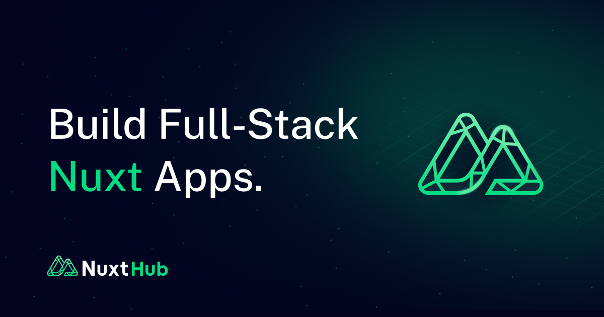

[](./packages/content/README.md)

# Ginko Content

[![npm version][npm-version-src]][npm-version-href]
[![npm downloads][npm-downloads-src]][npm-downloads-href]
[![License][license-src]][license-href]

Filesystem-first content for Nuxt 4. Write Markdown and data files in
`content/`, define collections once in `content.config.ts`, then use those
collection handles for pages, lists, navigation, search, i18n, and sitemap
output.

Use Ginko when you want content files to stay simple, but your Nuxt app still
needs explicit APIs for route resolution, typed frontmatter, localized content,
and server-side reads.

- The current release candidate is `0.4.0-rc.1`; install it from npm's `next`
  channel. The stable line remains `0.3` until the RC is promoted.
- [Getting started](./docs/content/docs/1.get-started/1.quickstart.md)
- [Package README](./packages/content/README.md)
- [Contributing](./CONTRIBUTING.md)
- [Basic playground](./playground/ginko-basic)
- [i18n playground](./playground/ginko-i18n)
- [Search playground](./playground/ginko-search)

## Quick Start

Install the module:

```bash
npx nuxi module add @lupinum/ginko-content@0.4.0-rc.1
```

Define a collection:

```ts
// content.config.ts
import { defineCollection, defineContentConfig } from '@lupinum/ginko-content/config'

export const pages = defineCollection({
  type: 'page',
  source: '**/*.md'
})

export default defineContentConfig({
  collections: {
    pages
  }
})
```

Create `content/index.md`:

```md
---
title: Welcome
---

# Welcome

This file renders at `/`.
```

Render route-backed content:

```vue
<!-- pages/[...slug].vue -->
<script setup lang="ts">
import { pages } from '~~/content.config'

definePageMeta({ key: route => route.path })

const { page } = await useContentPage(pages)

if (!page.value) {
  throw createError({ statusCode: 404, statusMessage: 'Page not found', fatal: true })
}
</script>

<template>
  <ContentRenderer v-if="page" :value="page" />
</template>
```

## What You Get

- Collection definitions as the source of truth for content shape and source
  files.
- Markdown and MDC rendering, plus YAML, JSON, and CSV ingestion.
- Route-aware page loading with `useContentPage(handle)`.
- Server reads through `one`, `many`, `paginate`, `resolveOne`, `navigation`,
  and `surround`.
- Route and search composables, plus one-shot async client query functions for other
  reads.
- Locale-aware content routing with explicit fallback behavior.
- Search helpers for MiniSearch, Pagefind, and provider-owned search.
- Sitemap integration for public content routes.

## I18n, Sitemap, and Prerender Ownership

Localized apps should not keep a duplicate route table for sitemap or prerender
output. Static Nuxt page paths belong in Nuxt I18n `i18n.pages`; content paths
belong in Ginko collection routes and content files; XML output belongs to
`@nuxtjs/sitemap`.

Ginko registers the content sitemap source and contributes content prerender
routes. Use `@nuxtjs/sitemap >= 8.0.15 < 9` when Nuxt I18n translated static page
slugs need correct sitemap alternates.

## Integration Dependencies

MiniSearch, Shiki, and built-in Shiki transformer support are runtime
dependencies of `@lupinum/ginko-content`. Apps that use Pagefind install the
optional `pagefind` peer. Apps that use Nuxt locale routing install
`@nuxtjs/i18n`; apps that publish sitemap XML install `@nuxtjs/sitemap`. Apps
that enable the opt-in `math` or `mermaid` Markdown plugins install `katex` or
`beautiful-mermaid` respectively. Markdown plugins are never enabled
implicitly.

## Scope

Ginko Content is the content engine and default filesystem provider. It is not
a CMS UI, Studio, admin panel, or MCP workflow host. Advanced CMS or database
sources should integrate through the provider contract instead of changing the
app-facing API.

## Workspace

This repository is a pnpm workspace centered on one package:

- `@lupinum/ginko-content` in [`packages/content`](./packages/content)

Development apps and fixtures also live in the workspace:

- `docs`
- `playground/ginko-basic`
- `playground/ginko-i18n`
- `playground/ginko-search`
- `test/fixtures/quickstart`
- `examples/*/*`
- `test/fixtures/typecheck`

## Credits

Ginko Content is an independently maintained fork derived from
[Nuxt Content](https://content.nuxt.com/). It has substantially diverged while
retaining upstream-derived parser, MDC, and rendering foundations. Credits to
[Nuxt UI](https://ui.nuxt.com/), and [Comark](https://comark.dev/), the
successor to the previous MDC work.

## 💻 Development

- Clone repository
- Install dependencies using `pnpm install`
- Prepare using `pnpm dev:prepare`
- Try playground using `pnpm dev`
- Start docs using `pnpm docs`
- Build packages using `pnpm build:packages`
- Build docs using `pnpm docs:build`
- Build maintained examples using `pnpm examples:build`
- Test using `pnpm test`
- Typecheck using `pnpm typecheck`
- Run the full verification pipeline using `pnpm verify`
- Leave `pnpm run release:verify` to the exact final release SHA in CI
- Before publishing or changing public API behavior, follow [MAINTAINING.md](./MAINTAINING.md)

Run a specific example directly from the workspace with `pnpm --dir examples/<group>/<name> dev` or use `pnpm example <group>/<name>`.

## License

[MIT](./LICENSE)  

[npm-version-src]: https://img.shields.io/npm/v/@lupinum/ginko-content/latest.svg?style=flat&colorA=18181B&colorB=28CF8D
[npm-version-href]: https://npmjs.com/package/@lupinum/ginko-content

[npm-downloads-src]: https://img.shields.io/npm/dm/@lupinum/ginko-content.svg?style=flat&colorA=18181B&colorB=28CF8D
[npm-downloads-href]: https://npm.chart.dev/@lupinum/ginko-content

[license-src]: https://img.shields.io/github/license/lupinum-dev/ginko-content.svg?style=flat&colorA=18181B&colorB=28CF8D
[license-href]: https://github.com/lupinum-dev/ginko-content/blob/main/LICENSE
