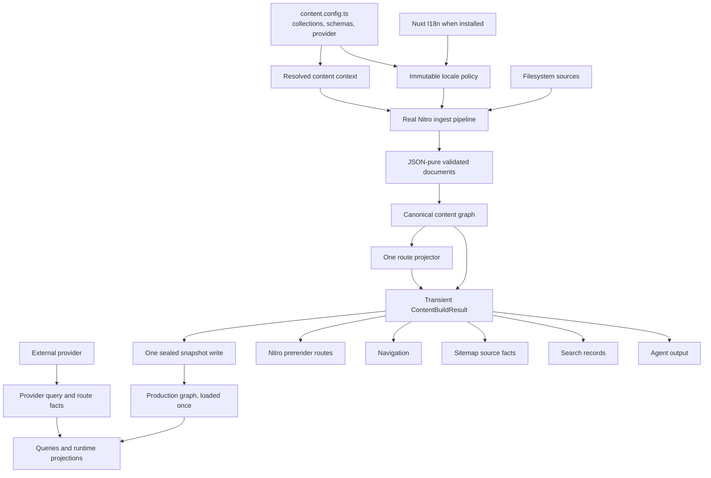

# Ginko Content 0.3 — VNext implementation specification

Status: **implementation candidate**

Review note: Fable synthesis plus Ginko CMS audit integrated; CMS-driven
provider-v2 amendments require final maintainer review.

Target release: **0.3.0**

Current reviewed baseline: **0.2.1**

Audience: implementers, reviewers, provider authors, documentation authors, and release maintainers

Scope owner: Ginko Content

First-class reference provider: the sibling `../ginko-cms` repository

This document is the canonical implementation specification for the coordinated
Ginko Content 0.3 cutover. It converts the completed product and architecture
review into work that can be implemented by a junior engineer and reviewed by a
senior maintainer without requiring the original review transcript.

This is intentionally detailed. The 0.3 work crosses the public value model,
query types, route projection, localization, provider contract, build pipeline,
Nuxt integration, generated declarations, documentation, fixtures, and release
artifacts. Implementing only one part would leave the package less coherent than
it is today.

The post-synthesis Ginko CMS audit amended three previously assumed details
with new repository evidence: pagination capability cannot be operators-only;
provider route projection must cover every route-bearing method; and deleting
provider `page()` needs an explicit redirect-target migration. Those amendments
are normative in this draft and are called out for final review rather than
being hidden as implementation details.

## Document map

- [Decision, scope, and compatibility](#2-executive-decision)
- [Design rules and architecture](#6-design-principles-and-merge-rules)
- [Ownership and invariants](#8-ownership-matrix)
- [Target public API](#10-target-public-api)
- [Canonical values](#11-canonical-value-model)
- [Localization and routes](#12-localization-and-route-facts)
- [Provider contract](#13-provider-contract)
- [Ginko CMS compatibility contract](#138-ginko-cms-first-class-compatibility-contract)
- [Build/runtime lifecycle](#14-canonical-build-and-runtime-lifecycle)
- [Artifacts, consumers, and caches](#15-derived-artifacts-consumers-and-caches)
- [HTTP boundary and configuration](#16-http-query-boundary)
- [Types and public metadata](#18-types-generated-declarations-and-public-metadata)
- [Phases 0 and 1](#19-phase-0--make-the-repository-tell-the-truth)
- [Canonical primitive phases](#21-phase-2a--canonical-json-primitives)
- [BuildResult phase](#25-phase-3--canonical-buildresult-and-consumer-migration)
- [Public-cut phases](#26-phase-4a--query-types-operations-and-http-validation)
- [Deletion register](#30-deletion-register)
- [Migration guide blueprint](#31-migration-guide-blueprint)
- [Verification matrix](#32-test-plan-and-verification-matrix)
- [Implementation and review workflow](#33-implementation-order-and-pull-request-boundaries)
- [Risks and deferred work](#35-risk-register)
- [Completion checklist](#38-completion-criteria-for-03)
- [Affected-code map](#39-affected-code-map)
- [Cross-repository implementation map](#40-ginko-cms-cross-repository-implementation-map)

## 1. How to use this document

Read sections 2–13 before changing code. They define the destination and the
non-negotiable invariants. Then implement sections 14–29 in order.

Each implementation work package contains:

- the problem and current implementation;
- the required target shape;
- files likely to change or be deleted;
- ordered implementation steps;
- tests and documentation changes;
- acceptance criteria;
- dependencies and prohibited shortcuts.

The exact internal filename may change when a better existing home is found.
The behavior, ownership boundary, public shape, deletion requirements, and
acceptance criteria may not change without updating this document and recording
the decision in an ADR or changelog entry.

The words **must**, **must not**, **should**, and **may** are normative:

- **must**: required for 0.3 completion;
- **must not**: prohibited architecture or behavior;
- **should**: expected unless repository evidence justifies another approach;
- **may**: optional and not release-blocking.

Do not mark a work package complete because its new path works while its old
path remains. A hard cutover is complete only when the old implementation,
exports, tests, docs, fixtures, generated declarations, and configuration have
been removed or migrated.

## 2. Executive decision

Ginko Content 0.3 is a coordinated pre-1.0 hard cutover, not a rewrite and not a
stabilization-only release.

The end state is:

> Ginko Content is Nuxt's typed content-domain layer: files or a provider in,
> one validated canonical content graph out, with every derived surface—queries,
> routes, navigation, search, sitemap, prerender, and agent output—projected from
> that graph by exactly one implementation of each rule.

The governing product rule is:

> Ginko derives facts; it never silently chooses application policy.

Ginko owns facts such as canonical identity, concrete variants, projected
content paths, visibility inputs, fallback resolution, and route candidates.
The application owns policies such as throwing a 404, writing head tags,
redirecting a fallback URL, rendering unavailable locale choices, and choosing
whether fallback content should be indexed.

The v0.2 foundation remains:

- collection and schema definitions;
- canonical content graph;
- public query grammar and compiler;
- closed provider query plan and wire versioning;
- sealed filesystem snapshot;
- filesystem provider;
- renderer and MDC integration;
- provider fixture and conformance suite;
- release verification and packed-consumer tests.

The 0.3 work removes duplicate sources of truth around that foundation.

Ginko CMS is the first-class external provider used to prove that the provider
contract is real. “CMS-neutral” does not mean “CMS-untested”: a target contract
that the maintained Ginko CMS + Convex provider cannot implement without
unbounded reads, duplicate route policy, or false capability claims is not an
acceptable 0.3 contract. Conversely, CMS workflow, Studio, publishing, Convex
tables, and authoring policy remain owned by the Ginko CMS repository and must
not move into Ginko Content.

## 3. Product positioning after 0.3

The preferred description is:

> Collection- and schema-driven Nuxt content, using a sealed filesystem
> snapshot instead of an application database, with provider-neutral queries
> and first-class integrations for Ginko CMS, Nuxt I18n, and Nuxt Sitemap.

Documentation and marketing must not claim:

- that Ginko implements sitemap XML;
- that every Nitro deployment preset is proven;
- that filesystem production preview supports live content overlays;
- that Pagefind is bundled;
- that every Nuxt I18n strategy or domain-routing combination is proven;
- that provider-backed prerender works without a provider route enumeration;
- that `Date` instances are part of the document model.

The honest claims are:

- Ginko provides content routes and assertions to `@nuxtjs/sitemap`;
- Ginko is tested on Node SSR and static generation;
- other Nitro presets are design targets until named canaries prove them;
- Pagefind is an optional peer selected explicitly;
- the filesystem production model is an immutable snapshot deployed with the
  application;
- production preview is provider-owned;
- Ginko CMS + Convex is the maintained first-class external provider, verified
  through the same public provider contract rather than a private bridge.

## 4. Scope

### 4.1 Included in 0.3

- canonical JSON document values;
- string-valued `fields.date()` and `fields.datetime()`;
- a post-schema JSON-purity gate;
- one immutable resolved locale policy per collection;
- Nuxt I18n authority and content-only localization support;
- one route projector and one alternate synthesizer;
- the new document `route` and `resolution` facts envelope;
- one core visibility implementation above the provider boundary;
- Nitro-produced, atomic `ContentBuildResult`;
- independent sitemap and prerender filtering over shared route facts;
- provider `routes()` enumeration and canonical identity requirements;
- provider operation support inferred from method presence;
- semantic provider capabilities for operators and pagination modes;
- offset and cursor pagination with honest provider support;
- one raw provider route-fact vocabulary for documents, navigation,
  surroundings, search, and route enumeration;
- preservation of provider redirect/normalization facts without provider-owned
  redirect policy;
- operator capability parity and conformance execution;
- selection-aware query return types;
- closed HTTP query validation;
- the final query operation names;
- removal of verb-shaped Vue wrappers;
- removal of head mutation and default 404 policy;
- configuration single-sourcing and search opt-in;
- public export-map reduction and generated declaration cleanup;
- deletion of redundant persisted artifacts and caches;
- corrected docs, examples, fixtures, ADRs, skills, and migration guides;
- one explicit 0.2-to-0.3 migration guide;
- release and packed-consumer verification of the final surface;
- a coordinated Ginko CMS provider and contract migration, verified against
  packed 0.3 artifacts before release.

### 4.2 Explicitly not included in 0.3

- a new database or alternate filesystem persistence model;
- a CMS, Studio, admin UI, workflow engine, or MCP implementation;
- a public `useContentPreview` composable;
- filesystem production preview overlays;
- provider/H3 decoupling;
- removal of the builder-params IR in favor of plan-only internals;
- locale literal unions unless already cheap after the handle-carrier refactor;
- operand-aware query operator typing;
- batch populate;
- broad Nitro preset certification;
- sitemap XML generation;
- a second provider prerender method;
- new compatibility aliases or feature flags for the 0.3 surface;
- speculative caches, adapters, route tables, or service layers.

The Ginko CMS companion changes listed in this document are integration work,
not a transfer of CMS ownership. They change the provider adapter, public read
functions, Content-derived collection contract, module integration, tests, and
peer range in the CMS repository. They do not move Convex or Studio code into
this repository.

### 4.3 Candidates for later versions

These are described in section 36 and are not implied commitments:

- a public provider-preview workflow;
- named Cloudflare, Vercel, or Netlify canaries;
- locale literal unions;
- operand-aware operators;
- batch populate;
- params-IR removal;
- provider transport decoupling from H3;
- additional agent customization backed by real integrator needs.

## 5. Compatibility and release policy

Version 0.2.1 is released. Its documented exports, package subpaths, provider
wire, configuration, generated declarations, and document shapes are real
compatibility obligations even though the package is pre-1.0.

Version 0.3 may break them because this is an intentional minor-version
breaking release under 0.x semver. It must do so with discipline:

1. Every released breaking change appears in `CHANGELOG.md` and the 0.3
   migration guide.
2. Every removal has a before/after example or an explicit statement that no
   replacement exists.
3. Provider authors receive a complete contract migration section.
4. No compatibility alias, deprecated duplicate path, hidden fallback, feature
   flag, or dual implementation ships merely to soften the cut.
5. Generated declarations and `meta/public-surface.json` are migrated in the
   same commit as their source facade.
6. Packed pnpm and npm consumers test the actual tarball.
7. The Ginko CMS provider is a release-blocking first-class consumer, not an
   informal external compatibility check. Its exact target branch must pass the
   0.3 provider conformance suite and packed package E2E before release.
8. `@lupinum/ginko-cms` must update its Ginko Content peer range from `^0.2.1`
   to `^0.3.0` only in the coordinated CMS release; Ginko Content must not claim
   compatibility with an unmodified CMS 0.1.3 provider.

Internal paths that were never released should be treated as greenfield. Delete
the old implementation as soon as the new invariant passes.

## 6. Design principles and merge rules

### 6.1 One source of truth

Every important fact has one canonical owner:

- collection definitions: `content.config.ts`;
- provider selection: `content.config.ts`;
- document identity: canonical graph;
- locale/default/strategy with Nuxt I18n installed: Nuxt I18n;
- locale/default without Nuxt I18n: Ginko content i18n config;
- fallback and translated-slug policy: Ginko content i18n config;
- content route projection: one core projector;
- sitemap XML: `@nuxtjs/sitemap`;
- prerender execution: Nitro;
- application head, redirect, 404, and UI behavior: the application;
- production filesystem state: sealed snapshot.

Derived data is allowed only when it is rebuilt from canonical input and an
invariant proves that rebuild path.

### 6.2 Hard-cutover merge criteria

No merged state may contain:

- two route projectors;
- two document value models;
- both `neighbors` and `surround`;
- both `tree` and `navigation` as public operations;
- both old and new locale-result envelopes;
- both `sitemapEntries()` and provider `routes()`;
- both readable phantom handle properties and the symbol carrier;
- old wrapper composables alongside their documented replacements;
- old and new module configuration channels;
- duplicate generated type augmentations;
- a new cache while the stale cache it replaces remains.

A pull request may introduce private primitives before their consumer cutover,
but it must not expose two public ways to express the same concept.

### 6.3 Deletion test

Before adding a table, projection, cache, adapter, registry, or wrapper, answer:

1. Can an existing path be deleted instead?
2. Can the canonical graph or snapshot answer the question directly?
3. Is the state rebuildable, and what revision invalidates it?
4. Which acceptance criterion requires the new machinery?

If no revision source exists, do not add a TTL. Remove the cache.

## 7. Target architecture



### 7.1 Layer responsibilities

| Layer | Owns | Must not own |
|---|---|---|
| `core/` | JSON-safe documents, identity, graph, query plan, visibility facts | Nuxt composables, H3 transport, app policy |
| `features/` | route/localization/navigation/search/sitemap/agent projections | persistence, alternate sources of identity |
| `storage/` | snapshot and development source access | public query grammar, permanent derived indexes |
| `integrations/nitro/` | event/runtime/storage binding and ingest orchestration | domain rules duplicated from core/features |
| `runtime/server/` | HTTP and provider transport, runtime loading | provider-specific visibility semantics |
| `runtime/app/` | two app workflows and transport calls | route guessing, head mutation, default 404s |
| `module/` | Nuxt setup, validation, generated assets, Nitro hooks | parsing content a second time |
| `public/` | deliberately classified facades only | implementation conveniences |

### 7.2 Allowed dependency direction

The architecture test must enforce an acyclic allowed-edge graph, not only a
list of forbidden imports. The intended direction is:

```text
types/core
  -> features
  -> storage and provider implementations
  -> Nitro/Vue integrations
  -> public facades and Nuxt module wiring
```

CMS contracts and CMS import helpers remain runtime-neutral and may depend on
shared types or parsers, but runtime content code must not depend back on CMS
tooling. Agent rendering may consume canonical query/route facts; query and
route core must not depend on agent output.

## 8. Ownership matrix

| Concept | Canonical owner after 0.3 | Derived consumers |
|---|---|---|
| Collection name, kind, source, schema | `content.config.ts` | ingest, types, provider context |
| Active provider | `content.config.ts` | runtime provider registry |
| Document `id` | parser/provider normalization | graph, query results |
| Cross-locale identity | `canonicalKey` in graph | alternates, resolution, provider routes |
| Locale list/default/strategy with Nuxt I18n | Nuxt I18n resolved options | Ginko locale policy |
| Locale list/default without Nuxt I18n | `content.i18n` | Ginko locale policy |
| Fallback graph and translated slugs | `content.i18n` | resolver/projector |
| Concrete content variants | graph `byCanonical` | alternates, queries, sitemap |
| Content route path | canonical route projector | every route-consuming surface |
| Provider route source fact | provider record `contentPath` before locale prefix | core projector only |
| Draft state | document/route record fact | core visibility policy |
| Sitemap opt-out/metadata | collection/document fact | sitemap filter only |
| Navigation opt-out | collection/document fact | navigation filter only |
| Search opt-out/config | search config/document fact | search filter only |
| Prerender route set | BuildResult route facts + prerender filter | Nitro |
| Sitemap XML | `@nuxtjs/sitemap` | deployment artifact |
| 404/head/redirect policy | application | Nuxt response/head APIs |
| Filesystem production content | sealed snapshot | process graph |

## 9. Non-negotiable invariants

These invariants are release blockers. Each must have a focused automated test.

1. Every emitted alternate resolves through the canonical route resolver to the
   same `canonicalKey` as the document that emitted it.
2. A fallback alternate carries `source: 'fallback'` and `resolvedLocale`; a
   concrete variant carries `source: 'variant'` and no `resolvedLocale`.
3. No fallback alternate is emitted when fallback is disabled for the
   operation or when round-trip identity cannot be proven.
4. Custom transformers and parse hooks affect query documents and prerender
   routes identically—or neither.
5. Schema, JSON-purity, graph, or route validation failure publishes no new
   snapshot. A published snapshot implies the full build succeeded.
6. `sitemap: false` at collection or document level never changes prerender
   enumeration, for filesystem or external providers.
7. Providers return structurally valid route candidates. Core alone applies
   draft visibility, sitemap inclusion, prerender inclusion, and request-mode
   policy.
8. Post-schema documents are JSON-pure. Dev, prerender, static, and Node SSR
   expose identical value types for the same content.
9. Runtime projection keys and selection-aware TypeScript results agree,
   including guaranteed identity/envelope fields and populated fields.
10. An authenticated production preview request against the filesystem
    provider fails explicitly before querying content.
11. Content-only localization builds and generates without `@nuxtjs/i18n`.
    Installing Nuxt I18n while also declaring Ginko locale/default authority
    fails setup with an actionable error.
12. Only `useContentPage` owns page-workflow flash suppression. No composable
    mutates head state or throws a default 404.
13. Every HTTP query is validated against a closed transport shape before plan
    lowering or provider invocation. Unknown keys, excessive depth/size,
    invalid operator operands, and non-finite or negative pagination fail with
    HTTP 400.
14. All consumers derive route identity, locale, and path from the same
    projector. A document included by multiple consumers has identical facts
    in each; each consumer then applies only its documented inclusion policy.
15. The architecture boundary test validates the entire allowed-edge graph and
    rejects cycles.
16. `meta/public-surface.json` covers every package export, public facade value
    and type, generated auto-import, CLI bin, and supported HTTP endpoint.
17. Provider operator declarations, public operator types, filesystem support,
    HTTP validation, and conformance probes are identical sets.
18. Production loads a valid sealed snapshot once per process. Preview never
    silently bypasses or pretends to overlay that snapshot.
19. Every provider-originated route-bearing value—document, route candidate,
    navigation node, surround item, or search result—crosses the provider seam
    as `canonicalKey` + `locale` + `contentPath`. Providers never return a
    route-ready `href` or application `path`; core projects it once.
20. Provider query pagination is honest. Offset pagination is dispatched only
    to providers advertising `offset`; cursor pagination is dispatched only to
    providers advertising `cursor`. Cursor providers are never required to
    manufacture an exact total by collecting an unbounded result set.
21. A provider route lookup that resolves an internal redirect or normalized
    path returns the resolved target document. Core preserves requested and
    resolved paths as facts; neither provider nor composable executes the
    redirect policy.
22. The maintained Ginko CMS provider passes the same packaged conformance
    suite as the reference provider. It may advertise only operators and
    pagination modes that its Convex implementation actually executes.
23. Ginko Content and Ginko CMS use one resolved locale/routing contract in an
    integrated app. CMS may retain authoring locale labels and workflow
    settings, but conflicting locale codes, default locale, localized mounts,
    fallback policy, or translated-slug mode fail setup.

## 10. Target public API

### 10.1 Package exports

The final package has exactly 11 export-map entries plus one CLI bin:

```text
@lupinum/ginko-content
@lupinum/ginko-content/config
@lupinum/ginko-content/client
@lupinum/ginko-content/server
@lupinum/ginko-content/provider
@lupinum/ginko-content/agent
@lupinum/ginko-content/cms-contract
@lupinum/ginko-content/cms-import
@lupinum/ginko-content/testing/provider-contract
@lupinum/ginko-content/testing/provider-fixture
@lupinum/ginko-content/transformers
```

CLI bin:

```text
ginko-content
```

Delete these export-map entries:

```text
@lupinum/ginko-content/transformers/markdown
@lupinum/ginko-content/transformers/yaml
@lupinum/ginko-content/transformers/json
@lupinum/ginko-content/transformers/csv
```

`/transformers` exports the extension contract, including
`ContentTransformer`, but not built-in implementation modules.

The root module entry must stop duplicating helpers whose canonical home is
`/config`. `/server` contains server query operations and cache helpers but not
provider-authoring helpers. `/provider` is the provider-authoring contract.
`/agent` is trimmed to render/index extension points; route parsing and site
generation internals are not public.

Do not expose `dist/types/*` imports or augment them in generated declarations.

Facade responsibilities are:

| Facade | Audience and contents |
|---|---|
| `.` | Nuxt module default export plus module-level types intentionally needed by app setup |
| `/config` | collection/config builders, field builders, references, slug helpers, and their types |
| `/client` | seven query operations, two workflows, pure route/site-data/TOC helpers, app-facing result types |
| `/server` | event-first query operations and generic cache helpers |
| `/provider` | provider wire, provider/result/cache-envelope/document-normalization contracts and errors |
| `/agent` | intentionally supported serializer/render/index extension seam only |
| `/cms-contract` | runtime-neutral CMS schema/contract helpers |
| `/cms-import` | runtime-neutral import tooling already released from this package |
| `/testing/provider-contract` | conformance assertions for provider authors |
| `/testing/provider-fixture` | reusable provider scenario fixture |
| `/transformers` | custom transformer definition function and `ContentTransformer` type |

No facade re-exports another facade merely for convenience. A symbol has one
documented public home unless the root Nuxt-module entry technically requires
it.

### 10.2 Query operations

The public query surface is six verbs plus `navigation()`:

```ts
one(collection, options)
many(collection, options)
paginate(collection, options)
resolveOne(collection, options)
surround(collection, options)
backlinks(collection, options)
navigation(collection, options?)
```

Client use:

```ts
import {
  backlinks,
  many,
  navigation,
  one,
  paginate,
  resolveOne,
  surround,
} from '@lupinum/ginko-content/client'
```

Server use has the same operation vocabulary and option shapes, with the H3
event first:

```ts
const page = await one(event, docs, {
  locale: 'de',
  by: { route: '/de/leitfaden/einstieg' },
  fallback: true,
})
```

Hard removals:

- `neighbors` becomes `surround`;
- `tree` is absorbed by `navigation`;
- `variants()` is deleted because alternates live on resolved documents;
- no alias ships for any removed operation.

Use one vocabulary inside the remaining option/result shapes:

```ts
const { previous, next } = await surround(docs, {
  by: { route: '/docs/intro' },
  select: ['title'],
})

const related = await backlinks(authors, {
  by: { ref: 'author.ada' },
  from: posts,
  via: ['author'],       // relation fields used to find the backlink
  select: ['title'],     // fields returned from matching documents
})

const tree = await navigation(docs, {
  select: ['title', 'badge'],
})
```

- `previous`, never `prev`, is used in surround and pagination result names;
- pagination uses `hasPrevious` and `previousPage` alongside `hasNext` and
  `nextPage`;
- `select` always means returned projection;
- `via` in `backlinks` names the relation field or per-source relation-field
  map used to traverse back to the target;
- operation-specific `fields` projection options are deleted in favor of
  `select`.

The options-object grammar remains. `by` identifies one document; `where`
filters a set. Collection handles are preferred. Generated string collection
names remain for dynamic/plugin code.

#### Pagination modes

The first-class Convex provider proves that one offset-only provider contract
is not neutral: Convex exposes bounded cursor pages, while an exact total for
an arbitrary filtered query would require an unbounded collect or a second
materialized count model. Do not hide that mismatch behind a false `total`.

`paginate()` therefore supports two explicit semantic modes:

```ts
const offsetPage = await paginate(posts, {
  mode: 'offset',
  page: 2,
  limit: 20,
})

const cursorPage = await paginate(posts, {
  mode: 'cursor',
  after: previousEndCursor,
  limit: 20,
})
```

For source compatibility, omitting `mode` while supplying `page` means
`mode: 'offset'`. The migration guide should recommend writing the mode
explicitly in new code. The two result shapes are discriminated and must not
invent fields the backend cannot know:

```ts
interface OffsetPaginationResult<T> {
  mode: 'offset'
  data: T[]
  page: number
  limit: number
  total: number
  pageCount: number
  hasNext: boolean
  hasPrevious: boolean
  nextPage: number | null
  previousPage: number | null
}

interface CursorPaginationResult<T> {
  mode: 'cursor'
  data: T[]
  limit: number
  endCursor: string | null
  hasNext: boolean
}
```

Cursor results intentionally have no `total`, `pageCount`, `page`,
`hasPrevious`, or `previousPage`. Forward-only cursor semantics are the common
contract proven by Ginko CMS. A later bidirectional cursor contract requires a
real provider and separate evidence.

`many({ skip })` is an offset operation and requires provider `offset`
support. `many({ limit })` without `skip` remains valid for either mode. The
client/server operation must fail before provider dispatch with an actionable
unsupported-pagination error when the selected semantics are not advertised.
Filesystem supports both modes; its cursor is opaque even if internally it
encodes an offset. Applications must never parse provider cursors.

Rejected alternatives:

- keeping the current CMS `total: entries.length` is incorrect whenever another
  cursor page exists;
- forcing Convex to collect arbitrary matches for an exact total is unbounded;
- adding a CMS-only pagination API breaks the provider-neutral query promise;
- declaring `paginate()` wholly unsupported for the maintained first-class CMS
  discards an existing bounded Convex capability.

The discriminated two-mode API is the smallest honest shared contract.

### 10.3 Selection-aware return types

Runtime selection and TypeScript selection must agree. The conceptual result
type is:

```ts
type GuaranteedDocumentKeys =
  | 'id'
  | 'collection'
  | 'canonicalKey'
  | 'route'
  | 'resolution'

type SelectedDocument<
  Document,
  Selected extends keyof Document,
  Populated extends keyof Document,
> = Pick<Document, Selected | Populated | GuaranteedDocumentKeys>
```

The implementation may use conditional helpers to preserve the current
no-`select` full-document case and optional route applicability, but it must
meet these observable rules:

- without `select`, return the complete inferred document;
- with a const selection, return only selected fields plus guaranteed fields;
- populated fields survive even when not selected explicitly;
- `one` remains nullable;
- `many` and pagination item types use the same projection helper;
- `resolveOne().doc` uses the same helper;
- `surround` and `backlinks` preserve their operation-specific guaranteed
  fields;
- runtime projection must not leak arbitrary unselected frontmatter keys;
- type-fixture compile time may increase by at most 20 percent from the recorded
  baseline. If it exceeds that budget, simplify the conditional types rather
  than adding a generated parallel type model.

### 10.4 Canonical document facts envelope

Resolved route-backed documents expose:

```ts
export type ContentAlternate =
  | {
      locale: string
      path: string
      source: 'variant'
    }
  | {
      locale: string
      path: string
      source: 'fallback'
      resolvedLocale: string
    }

export interface ContentDocumentRoute {
  requestedPath?: string
  resolvedPath: string
  alternates: ContentAlternate[]
}

export interface ContentDocumentResolution {
  requested: {
    locale?: string
  }
  resolved: {
    locale: string
  }
  usedFallback: boolean
}
```

Do not add `canonicalPath`. `canonicalKey` is opaque identity, not a URL. Do not
duplicate `canonicalKey`, paths, or the caller's selector inside `resolution`.
Do not echo `requested.by`; diagnostics remain available from
`resolveOne().explain`.

Delete the old overlapping shapes:

- top-level `variants`;
- top-level `localePaths`;
- `resolved.variantPaths`;
- `resolved.availableLocales`;
- old route-shape downconversion;
- `variants()` and `useContentVariants`;
- `useContentSwitchLocalePath`.

### 10.5 Application workflows

The public composable surface is exactly:

```ts
useContentPage(collection, options?)
useContentSearch(options?)
```

`useContentPage` owns the route-aware Nuxt workflow:

- current route and locale tracking;
- SSR payload integration;
- stable async-data keying;
- route-watch behavior;
- suppression of stale-page flashes during navigation;
- returning the resolved page facts.

It must not:

- throw a default 404;
- accept a `notFound` option;
- mutate head tags;
- choose redirect or fallback indexing policy.

Application example:

```vue
<script setup lang="ts">
import { docs } from '~/content.config'

const { page } = await useContentPage(docs)

if (!page.value) {
  throw createError({
    statusCode: 404,
    statusMessage: 'Page not found',
  })
}

useHead(() => ({
  link: page.value
    ? page.value.route.alternates
        .filter(alternate => alternate.source === 'variant')
        .map(alternate => ({
          rel: 'alternate',
          hreflang: alternate.locale,
          href: alternate.path,
        }))
    : [],
}))
</script>

<template>
  <ContentRenderer v-if="page" :value="page" />
</template>
```

`useContentSearch` remains because search is a real multi-backend app workflow.
It absorbs the index/navigation loading of `useContentSearchData` and the
reactive result state of `useContentSearchResults`; both are then deleted. The
internal `navigation` result alias is also deleted, with `searchNavigation` as
the sole name. This is a hard cut in Phase 4B, not an implementation-time
decision.

Preview token/session plumbing stays internal. There is no public
`useContentPreview` in 0.3.

### 10.6 Replacing removed wrappers

Delete:

- `useContentOne`;
- `useContentMany`;
- `useContentPagination`;
- `useContentBacklinks`;
- `useContentResolveOne`;
- `useContentVariants`;
- `useContentTree`;
- `useContentNavigation`;
- `useContentNeighbors`;
- `useContentToc`;
- `useContentHead`;
- `useContentSwitchLocalePath`.

Document ordinary Nuxt composition instead:

```ts
import { many } from '@lupinum/ginko-content/client'
import { posts } from '~/content.config'

const locale = ref('en')
const filters = reactive({ featured: true })

const { data: items } = await useAsyncData(
  'featured-posts',
  () => many(posts, {
    locale: locale.value,
    where: { featured: filters.featured },
  }),
  { watch: [locale, () => filters.featured] },
)
```

Rules for migration docs:

- show an explicit key when a page has repeated calls;
- show `watch` for reactive parameters;
- do not claim pure query functions track refs automatically;
- do not add a generic replacement wrapper to recreate the deleted layer;
- reserve flash suppression for `useContentPage` only.

### 10.7 Head, 404, and redirects

`useContentHead` is deleted. It previously mixed URL policy with a Vue side
effect and could produce self-canonical fallback pages or query-bearing URLs.

Documentation must teach:

- Nuxt `useHead` for explicit application head policy;
- Nuxt I18n head integration where applicable;
- filtering `route.alternates` by `source` according to application policy;
- explicit `createError` for 404s;
- explicit `navigateTo`/route middleware for redirects;
- inspecting `resolution.usedFallback` when policy depends on fallback.

Provider-backed route normalization and CMS redirects use the same facts. A
document whose requested and resolved paths differ is still returned; the app
chooses what to do:

```ts
const { page } = await useContentPage(docs)

if (
  page.value?.route.requestedPath &&
  page.value.route.requestedPath !== page.value.route.resolvedPath &&
  !page.value.resolution.usedFallback
) {
  await navigateTo(page.value.route.resolvedPath, {
    redirectCode: 301,
  })
}
```

This example is a policy recipe, not automatic behavior. Applications may
render normalized paths, use a temporary redirect, or distinguish known CMS
redirect metadata in their own route middleware if they have a separate CMS
API reason to do so.

A pure `toContentHead()` may appear as a documentation recipe, not a required
0.3 library export.

### 10.8 Auxiliary client and server surfaces

The seven query operations and two app workflows do not require deleting every
useful pure helper. Retain these three pure helpers with the stated contracts:

- `getCollectionPath` as a pure facade over the canonical route projector;
- `querySiteData` as the pure provider/site-data request;
- `extractContentToc` as pure derivation from a rendered body.

Delete `useContentToc`; applications can wrap `extractContentToc` in `computed`
when reactivity is needed. Do not count pure helpers as composables merely
because they are callable in Vue.

The final app function auto-import list is exactly:

```text
useContentPage
useContentSearch
```

`useContentSearch` is newly added to that list. `getCollectionPath`,
`querySiteData`, query operations, and every deleted wrapper are removed from
app auto-imports and imported explicitly from `/client`. `ContentRenderer` and
`ContentRendererInline` remain separately auto-registered Nuxt components.

The final server auto-import list is exactly:

```text
one
many
paginate
resolveOne
surround
backlinks
navigation
getCollectionPath
queryCollectionsSitemapEntries
```

`#content/server` remains the supported generated server auto-import contract
and reflects exactly this list. Generic cache helpers remain explicit `/server`
imports rather than generated server auto-imports.

`/server` retains:

- event-first query operations;
- `getCollectionPath` as the canonical public route helper;
- `contentCacheHeaders`, `noopContentCache`, `headersContentCache`,
  `clearContentCacheHint`, `collectContentCacheHint`, and
  `getContentCacheHint`.

Move retained provider-authoring helpers out of `/server`; `/provider` is their
only public home. The overlap removed from `/server` is exactly
`PROVIDER_QUERY_VERSION`, `toContentProviderQuery`,
`toContentProviderNavigationQuery`, `withContentCache`,
`createContentProviderError`, `normalizeProviderDocument`,
`shapeProviderDocument`, `ProviderDocumentInput`, and
`ShapeProviderDocumentOptions`. Do not leave forwarding exports in `/server`.

Of that inventory, `shapeProviderDocument` and
`ShapeProviderDocumentOptions` are deleted entirely under section 13.2. The
`/provider` facade exports the retained helpers plus
`ContentProviderRouteFact`, `ContentProviderVariantFact`,
`ContentRouteRecord`, pagination-mode/request/response types, and their runtime
validators. It exports `withContentCache` and
`isContentProviderResult` so first-class providers and their tests never copy
or spell the private result marker. Event-aware unwrapping/collection remains a
runtime-internal consumer responsibility.

`contentProviderResultMarker` is removed from the public facade. Its string is
an implementation detail, not a provider-authoring primitive. Providers create
envelopes with `withContentCache`; tests narrow them with
`isContentProviderResult`.

The config-time agent helpers `agentMetadataFields`, `defineAgentAppPage`,
`defineAgentMarkdownPolicy`, `defineAgentMetadataFields`, and
`defineAgentSection` live only in `/config`. They are removed from the root
module entry and do not move to the runtime `/agent` facade.

Retain the generic header/no-op adapters listed above. Delete
`vercelContentCache`; it is a vendor-specific path-only adapter and the agreed
target does not retain it. Document migration to the generic cache adapter
contract or application-owned Vercel integration.

### 10.9 Field builder vocabulary

Keep one canonical name for each existing alias pair:

```text
fields.richtext  (delete fields.markdown)
fields.select    (delete fields.enum)
fields.boolean   (delete fields.toggle)
```

Delete the seven bare hoisted builder aliases from `/config`:

```text
image
asset
file
relation
relations
richtext
text
```

Authors use `fields.image()`, `fields.relation()`, and so on. This keeps field
metadata and schema construction under one visible namespace. Record each
released removal in the migration guide; do not ship deprecated aliases.

## 11. Canonical value model

### 11.1 JSON is the public document model

Every post-schema document value must be JSON-compatible and must retain the
same observable type through development, snapshot serialization, static
generation, and Node SSR.

Allowed values:

- `null`;
- strings;
- booleans;
- finite numbers;
- arrays containing allowed values with no holes;
- plain objects with string keys and allowed values.

Rejected values include:

- `Date`;
- invalid or valid `Map`, `Set`, `RegExp`, typed arrays, class instances, and
  other non-plain objects;
- `undefined` values;
- array holes;
- `NaN`, `Infinity`, and `-Infinity`;
- `bigint`, functions, and symbols;
- enumerable symbol-keyed properties;
- circular structures.

The error must name the collection, document/source identity, offending value
path, and migration action. Collect multiple offenders where practical so an
author does not need one build per field.

The gate runs after schema parsing and before graph insertion. It is not only a
snapshot check: development must reject the same document that production
would reject.

### 11.2 Field helpers

Target behavior:

```ts
fields.date()      // output: string in YYYY-MM-DD form
fields.datetime()  // output: normalized UTC ISO string
```

`fields.date()` must validate a real calendar date and preserve the normalized
`YYYY-MM-DD` text. It must not accept `2026-02-31`.

`fields.datetime()` may accept supported date-like input, but its schema output
must be `new Date(value).toISOString()`. Invalid input fails validation. The
inferred TypeScript output is `string`, never `Date` or `string | Date`.

User schemas such as `z.coerce.date()` remain possible Zod code, but their
`Date` output must fail the post-schema JSON gate with a message recommending
`z.string().datetime({ offset: true }).transform(...)` or the Ginko helper.

Query sorting and comparison operate on canonical strings. ISO datetime
lexicographic ordering is safe because values are normalized to UTC. Date-only
ordering is safe because the format is fixed-width year-month-day.

### 11.3 Snapshot behavior

The snapshot builder must assert JSON purity; it must not silently normalize a
different value model than development. `JSON.stringify`/`JSON.parse` may be
used as a final serialization proof only after the explicit validator has
accepted the values.

Increase the snapshot wire version if the on-disk contract changes. A version
or integrity mismatch must fail with a rebuild instruction, never be accepted
as partial content.

## 12. Localization and route facts

### 12.1 Locale authority

When `@nuxtjs/i18n` is installed:

- Nuxt I18n owns locales, default locale, and route strategy;
- declaring `content.i18n.locales` or `content.i18n.defaultLocale` is a setup
  error;
- Ginko does not union, ignore, or silently override conflicting values;
- Ginko content config carries fallback chains and translated-slug policy.

The initially supported Nuxt I18n routing strategy for 0.3 is
`prefix_except_default`, because that is the strategy currently backed by the
route model and fixtures. Additional strategies may be admitted in 0.3 only if
Phase 1 adds build, generate, route, fallback, and alternate proofs for each.
Otherwise module setup must reject them with an actionable message.

Without Nuxt I18n:

- `content.i18n.locales` and `content.i18n.defaultLocale` remain supported;
- Ginko owns the content-only route-prefix behavior;
- a maintained end-to-end fixture must prove build, generate, route goldens,
  queries, alternates, and fallback behavior.

The resolved per-collection locale policy is immutable and computed once from
the authoritative sources. Query, route, navigation, search, sitemap,
prerender, and agent code receive that policy; they do not reconstruct it.

Conceptual internal type:

```ts
interface ResolvedCollectionLocalePolicy {
  localized: boolean
  locales: readonly string[]
  defaultLocale?: string
  fallback: Readonly<Record<string, readonly string[]>>
  translatedSlugs: boolean
  routeMounts: Readonly<Record<string, string>>
}
```

Do not expose this exact internal type merely because it exists. Expose only
public facts that application code needs.

### 12.2 One route projector

One pure projector must map canonical document facts plus locale policy to a
public route path. It must handle:

- collection route mounts;
- localized route mounts;
- default-locale prefix behavior;
- translated numeric slug identity;
- path case policy;
- normalized leading/trailing slashes;
- content-only localization;
- Nuxt I18n-supported prefix strategy.

All consumers call this projector or consume records produced by it. The
module, sitemap, navigation, agent, search, and client layers must not prepend
locales or mounts independently.

`packages/content/src/module/derived-route-discovery.ts` must be deleted. It
cannot be upgraded into the canonical projector because it reparses files
outside the real Nitro ingest pipeline and cannot see mounted storage,
transformer virtual modules, or Nitro parse hooks.

### 12.3 Alternate synthesis

Alternates are synthesized from graph facts, not by relabeling the current
`localePaths` output.

For one canonical document:

1. Emit one `source: 'variant'` alternate for every concrete graph variant.
2. For each configured locale without a concrete variant, stop if fallback is
   disabled for this operation.
3. Walk that locale's ordered fallback chain.
4. Select the first available source variant.
5. Project that variant's content path into the requested locale using the
   canonical route projector.
6. Resolve the candidate path through the canonical route resolver as the
   requested locale.
7. Emit a fallback alternate only when the resolver returns the original
   `canonicalKey`.
8. Set `resolvedLocale` to the actual source variant locale.
9. Emit no candidate when projection or identity is ambiguous.
10. Sort alternates in canonical locale order for deterministic artifacts.

Expected complexity is bounded by documents × locales × fallback-chain length.
Measure it on a 1,000-document localized fixture before considering an index or
cache. Do not optimize before the benchmark fails an agreed budget.

### 12.4 Requested and resolved paths

`route.requestedPath` is present only when the operation began from a route
request and the requested path is useful to explain fallback or normalization.
`route.resolvedPath` is the route of the resolved document variant.

Neither is called canonical. A fallback-request URL, a concrete source-variant
URL, and an application's chosen canonical SEO URL are different concepts. The
application selects SEO policy using these facts.

## 13. Provider contract

### 13.1 Operation support

Infer optional operation support from method presence. Delete boolean
capabilities such as:

- `routeBackedCollections`;
- `dataCollections`;
- `localizedRoutes`;
- `translatedSlugs`;
- `navigation`;
- `surroundings`;
- `searchSections`;
- `sitemap`;
- query `limit`, `skip`, and `count` booleans. Replace the real paging semantic
  difference with the `offset`/`cursor` union below.

Retain only capabilities that describe semantic variation which method
presence cannot express. Query operator and pagination-mode support are the
two required examples:

```ts
type ContentProviderPaginationMode = 'offset' | 'cursor'

interface ContentProviderCapabilities {
  query: {
    operators: readonly ContentQueryOperator[]
    pagination: readonly ContentProviderPaginationMode[]
  }
}
```

`ContentProviderCapabilities` contains only these query-semantic declarations
in 0.3. Pagination uses a string union, not `skip`, `count`, and `cursor`
booleans: `offset` guarantees skip plus exact-total offset pages; `cursor`
guarantees opaque forward cursor pages without an exact total. Any future
semantic capability requires a concrete provider difference that method
presence cannot express. No boolean duplicates an optional method.

An operator declaration means the provider genuinely executes that operator
for the field/operator cases documented by the provider; it does not authorize
advertising a parsed-but-rejected branch. Providers with indexed-field or sort
restrictions, including Ginko CMS, document those restrictions and return the
typed `unsupported_query_shape`/`unsupported_sort` error with the field path.
The conformance runner
accepts provider-owned positive/negative probe fixtures so it reaches real
supported fields instead of testing a fictitious universal schema. Do not add a
second runtime capability registry for every schema field.

The provider query wire version increments to `v: 2`. The v2 plan contains one
of the following paging requests:

```ts
type ContentProviderPaging =
  | { mode: 'offset'; skip: number; limit: number }
  | { mode: 'cursor'; after?: string | null; limit: number }
```

The v2 route selector also removes the provider-side `path` versus `route`
ambiguity. Core resolves a public `by.route` through locale prefix and
collection mounts before dispatch. Providers receive exactly one of:

```ts
type ContentProviderVariantSelector =
  | {
      by: 'route'
      requestedLocale: string
      candidates: readonly {
        locale: string
        contentPath: string
      }[]
    }
  | {
      by: 'ref'
      ref: string
      requestedLocale: string
      localeChain: readonly string[]
    }
```

For route lookup, `candidates` is ordered requested locale first, then the
resolved fallback chain. Core projects the route remainder through each
locale's collection mount before dispatch. This matters for a request under
`/dokumentation` that falls back to a source under `/docs`; sending the same
path for both locales would be wrong. For ref lookup, the opaque ref is stable
and only the ordered locale chain changes.

Core retains the caller's original public route and requested locale for the
result explanation. Providers execute the exact candidate/ref lookups in order;
they never strip Nuxt locale prefixes, guess collection mounts, or rebuild the
fallback graph. A translated-slug route candidate that cannot be projected
unambiguously is omitted by core and therefore cannot resolve accidentally to
another canonical key.

The response is correspondingly closed and discriminated:

```ts
type ContentProviderListResponse<T> =
  | {
      mode: 'offset'
      result: T[]
      skip: number
      limit: number
      total: number
    }
  | {
      mode: 'cursor'
      result: T[]
      limit: number
      pageInfo: {
        endCursor: string | null
        hasNext: boolean
      }
}
```

The existing count terminal, while it remains in the deferred builder/plan IR,
is available only for an `offset`-capable provider and returns the closed
`{ result: number }` envelope. Core preflights it as offset semantics. Cursor-
only providers never receive a count plan. Offset `paginate()` normally uses
the exact `total` in its list response and must not issue a redundant count
request.

Do not retain v1/v2 dual dispatch in runtime code. This is the coordinated
provider hard cut. The migration guide and wire-version error explain the
required upgrade.

The complete 0.2 provider method inventory has this normative 0.3 disposition:

| 0.2 method | 0.3 disposition |
|---|---|
| `query` | Retained and required. It remains the versioned plan execution boundary for `one`, `many`, `paginate`, `resolveOne`, backlinks, and document loading used by core-derived features. |
| `navigationQuery` and `navigation` | Merged into one optional `navigation(event, query, options?)` method using the current versioned `ContentProviderQuery` plus `ContentProviderNavigationOptions` signature. Presence means provider navigation support. The old collection/options convenience signature is deleted. |
| `surroundings` | Retained as the optional provider operation backing public `surround()`. Its existing provider name remains unchanged. Its path argument is the resolved raw `contentPath`, not a locale-prefixed public route. |
| `searchSections` | Deleted. Core loads the required document fields through `query` and derives search sections/records with the one search implementation. |
| `search` | Retained as the optional backend operation used only by `content.search.engine: 'provider'`. |
| `siteData` | Retained as the optional operation backing `querySiteData`. |
| `page` | Deleted. `useContentPage`, agent rendering, and other page reads use `one`/`resolveOne` through `query`. |
| `routeMeta` | Deleted. Route and resolution facts come from the canonical document envelope and provider `routes()` records. |
| `sitemapEntries` | Deleted and replaced by `routes()` as specified below. |
| `invalidate` | Retained as the optional provider-owned cache/revalidation operation. |

The final method set is therefore `query` plus optional `navigation`,
`surroundings`, `search`, `siteData`, `routes`, and `invalidate`. Every optional
method must have a named runtime consumer and a conformance branch. No provider
method survives only because it existed in 0.2.

The final `ContentProviderNavigationOptions` contains normalized locale/fallback
inputs only. Selection lives in the versioned query plan. Delete the old
`fields` and `canonical` options. Providers return raw route facts, so asking
them to choose canonical-versus-localized output would recreate the projector
at the boundary; carrying selection in both plan and options would create a
precedence rule with no benefit.

### 13.2 Raw provider route facts and document normalization

Every provider-originated value that can become a link uses one raw fact shape:

```ts
export interface ContentProviderRouteFact {
  collection: string
  canonicalKey: string
  locale: string
  contentPath: string
}
```

`contentPath` has one exact meaning: a normalized, leading-slash content route
for the concrete locale before Nuxt locale-prefix strategy is applied. It
includes the locale-specific collection mount and translated slug. For example,
the CMS may return `/dokumentation/inhaltsrouting` for the German variant; core
projects `/de/dokumentation/inhaltsrouting` under
`prefix_except_default`. Providers must not return `href`, a locale-prefixed
application path, or an absolute URL in its place.

The 0.3 provider document input is raw content plus those facts:

```ts
export interface ContentProviderVariantFact {
  locale: string
  contentPath: string
}

export interface ProviderDocumentInput extends Record<string, unknown> {
  id?: string
  collection: string
  canonicalKey: string
  locale: string
  contentPath: string
  routeVariants?: readonly ContentProviderVariantFact[]
  type?: 'markdown' | 'yaml' | 'json' | 'csv'
  body: ParsedContent['body']
}
```

Rules:

- `canonicalKey` is required for localized providers and for every Ginko CMS
  document. Do not derive it from a translated path.
- `id` may be derived only where the existing normalization rule is stable and
  unambiguous; Ginko CMS supplies its public entry id explicitly.
- `routeVariants` contains concrete variants only, including the resolved
  variant, and contains no synthesized fallback entry.
- every variant shares the document `canonicalKey`; duplicate locales or
  invalid paths fail provider result validation;
- provider selection/projection must preserve `id`, `collection`,
  `canonicalKey`, `locale`, `contentPath`, and `routeVariants` even when the
  application selects fewer user fields;
- request facts do not travel in `ProviderDocumentInput`. Core already knows
  the requested selector, route, and locale from the query it dispatched and
  derives the public `route`/`resolution` envelope after validation;
- `routeVariants` is consumed at the provider boundary and is not exposed as
  the deleted public top-level `variants` field.
- provider document data passes the same JSON-purity validator before public
  shaping. The cache envelope is validated separately and is not part of that
  document walk.

`normalizeProviderDocument` remains the public validation/normalization helper
in `/provider`. `shapeProviderDocument` and `ShapeProviderDocumentOptions` are
deleted. Their need to accept provider-supplied locales, default locale, and
route mounts is itself a second locale/projector source. Core performs shaping
after `provider.query()` using the one resolved collection policy.

Provider auxiliary methods use the same fact, not preprojected paths:

```ts
interface ContentProviderNavigationItem {
  title: string
  route?: ContentProviderRouteFact
  children?: ContentProviderNavigationItem[]
  [selectedField: string]: unknown
}

interface ContentProviderSurroundItem {
  title: string
  route: ContentProviderRouteFact
  [selectedField: string]: unknown
}

interface ContentProviderSearchResult {
  title: string
  excerpt?: string
  score: number
  route: ContentProviderRouteFact
}
```

Navigation group/control nodes may omit `route`; linkable nodes, surround
items, and search results may not. Core validates each fact and creates the
public route-ready `path`. Provider results containing route-bearing `path`,
`href`, `localePath`, or hand-built alternates are rejected so that old and new
projection paths cannot coexist.

### 13.3 `routes()`

Replace provider `sitemapEntries()` with:

```ts
interface ContentSitemapMetadata {
  lastmod?: string
  images?: readonly ContentSitemapImage[]
}

interface ContentRouteRecord extends ContentProviderRouteFact {
  draft?: boolean
  sitemap?: false | ContentSitemapMetadata
}

interface ContentProvider {
  // existing required query contract and optional operations
  routes?: (
    event: H3Event,
  ) => Promise<MaybeContentProviderResult<ContentRouteRecord[]>>
}
```

`ContentSitemapMetadata` is the route-record metadata source. Reuse the existing
`ContentSitemapImage` item type and fold any equivalent internal document
metadata type into this one. `lastmod` is a normalized UTC ISO string. Do not
put `loc`, alternates, `_sitemap`, absolute URLs, or consumer include/exclude
policy in this record; core/Nuxt Sitemap derive those later.

Contract semantics:

- providers enumerate structurally valid content route candidates;
- data-only documents, partials, and navigation control files never appear;
- `navigationFile` and `partial` are not route-record fields;
- drafts remain route candidates, so `draft` travels as a fact;
- document and collection sitemap metadata travel as facts;
- the method accepts no `include`, `exclude`, `includeDrafts`, sitemap, or
  prerender policy parameters;
- records carry `contentPath`, never `path`, `href`, or an absolute site URL;
- core validates content path, locale, collection, mount, and identity;
- core groups records by `canonicalKey` and derives alternates;
- core applies visibility once;
- sitemap and prerender then apply separate filters.

The short name `routes()` is correct only under those semantics. If an
implementation needs to return raw documents and expects core to determine
whether they structurally represent routes, it is implementing the wrong
contract.

### 13.4 Stable provider identity

For multilingual or translated-route providers, `canonicalKey` is required,
stable, locale-agnostic, and opaque. Core must not guess cross-locale identity
from translated paths.

Provider normalization may derive identity only for simple single-locale cases
where the derivation is unambiguous. Module/provider validation must reject a
localized provider configuration that cannot supply stable identity.

### 13.5 Redirect and normalized-route facts

The provider `page()` deletion must not delete a real CMS capability. Ginko CMS
currently returns a redirect status when a stable-id or old route resolves to a
different public content path. The v2 query contract preserves that fact
without adding provider-owned redirect policy:

1. a route-resolution query that reaches an internal redirect resolves the
   redirect target;
2. the provider returns the target `ProviderDocumentInput`, including its real
   `contentPath` and concrete `routeVariants`;
3. core retains the caller's route as `route.requestedPath` and projects the
   target as `route.resolvedPath`;
4. core derives locale fallback separately from requested versus resolved
   locale;
5. `useContentPage` returns the document and does not call `navigateTo`;
6. the application compares the paths and chooses redirect, render, status, and
   permanence policy.

The provider must not return `null` merely because the target was reached via
redirect; that loses the only facts the application needs. Ginko CMS may make
a second bounded public read to load the target document when its existing
Convex `page` result contains only `redirectTo`. A redirect whose target cannot
be resolved returns a typed provider integrity error, not a fabricated page.

Fallback and redirect/normalization can coexist. `resolution.usedFallback`
speaks only about locale fallback. Path inequality speaks only about requested
versus resolved route. No single `redirect: true` flag conflates them.

### 13.6 Visibility boundary

Providers return content and facts. Core applies app-facing visibility.

There must be one core visibility predicate or policy object used by queries,
navigation, search, sitemap, prerender, and agent output. It receives explicit
environment and caller policy; it does not read scattered global state.

Structural route eligibility remains distinct from publication visibility:

- data, partial, and navigation files are structurally not public page routes;
- draft is a visibility fact and may be visible in development;
- `sitemap: false` is a sitemap policy input only;
- `navigation: false` is a navigation policy input only;
- search opt-outs affect search only.

Do not put this logic in provider examples, app composables, or individual
artifact generators.

### 13.7 Provider conformance

The conformance suite must:

- verify required and optional method shapes;
- infer operation support from method presence;
- validate every route record at runtime;
- reject structural non-routes in `routes()` results;
- prove drafts reach core unfiltered;
- prove sitemap opt-out does not remove prerender routes;
- execute every advertised query operator with a positive and negative case;
- reject operators not advertised by the provider;
- execute every advertised pagination mode and reject unadvertised modes
  before provider dispatch;
- verify cursor pages retain opaque cursors and do not contain synthetic
  totals;
- verify offset pages contain exact totals;
- verify raw route facts from documents, navigation, surroundings, search, and
  `routes()` all pass through the same core projector;
- reject provider-returned `href` and preprojected route paths;
- verify redirect/normalization lookup returns a resolved document whose
  requested and resolved paths differ without executing redirect policy;
- prove stable cross-locale canonical identity;
- verify cache envelopes where returned;
- execute the maintained provider reference example, not merely typecheck it;
- run the same suite from the packed Ginko CMS provider package with only the
  branches it advertises enabled.

The provider guide and reference example must use the same exported types and
must be part of the conformance lane.

### 13.8 Ginko CMS first-class compatibility contract

This subsection is normative. It records the repository evidence that changed
the abstract provider design and the exact boundary the two repositories must
implement.

#### Verified 0.2 integration state

The maintained CMS adapter is
`../ginko-cms/packages/cms/src/nuxt-provider.mjs`.
It currently:

- imports `normalizeProviderDocument` and `shapeProviderDocument` from Ginko
  Content;
- reimplements the private provider-result marker and `withContentCache`;
- reconstructs locale/default/route-mount state from several runtime objects;
- computes localized `href` values itself;
- emits the old `variants`, `localePaths`, `variantPaths`, and
  `availableLocales` envelope;
- implements both old navigation methods, `page`, `routeMeta`, and
  `sitemapEntries`;
- advertises skip/count/operator capabilities separately from what the Convex
  query executor actually supports.

The Convex public read model in
`packages/convex/src/public.ts` and
`packages/convex/src/publicReadAdapter.ts` already exposes most required facts:

- `stableId` provides stable cross-locale identity;
- `route.path` is the locale-specific content path before locale prefix;
- `route.href` is a CMS-projected public URL and must stop crossing the Ginko
  Content provider boundary;
- translations contain concrete locale/path pairs;
- published timestamps are ISO strings at the CMS public contract boundary;
- public list reads use `continueCursor`/`endCursor`, not offset plus exact
  total;
- page reads can return `status: 'redirect'` with a target path.

The CMS public projection tables are intentionally published-only:
`publicEntries` is the active per-entry/locale public truth and `publicRoutes`
is its route lookup. Drafts live outside that projection. Therefore CMS
`routes()` may legitimately return no draft records in 0.3. The contract keeps
`draft?` because other providers and a future authenticated provider-preview
workflow can enumerate structurally valid drafts; it does not require every
provider to possess them.

Concrete audit anchors:

| Repository anchor | Verified current behavior | 0.3 consequence |
|---|---|---|
| `packages/cms/src/nuxt-provider.mjs`: `supportedQueryOperators`, `assertSupportedPlanOperator`, `collectPlanFilter` | advertised operators exceed executable compare/logical cases | derive the advertised constant from tested executor cases |
| same file: `assertPortableListPlan` | rejects `skip > 0` and count | CMS advertises cursor only; offset/count preflight in core |
| same file: query list response | writes `skip: 0`, `total: entries.length`, and extra `pageInfo` | replace with the v2 cursor envelope; never fake totals |
| same file: `canonicalFromRoute`, `hrefFor`, `toContentEntry` | strips prefixes, applies locale prefixes, and overrides shaped paths | core lowers input to `contentPath` and projects every output |
| same file: `providerResultMarker`, local `withContentCache` | copies Content's result-envelope implementation | import public constructor/predicate; hide marker |
| same file: `page`, `routeMeta`, `sitemapEntries` | carries behavior being removed from the provider method set | migrate redirects to query and public routes to `routes()` before deleting |
| `packages/convex/src/public.ts`: `page`, `list`, `sitemap` | page can redirect; list/sitemap are cursor-paged | preserve target facts and use cursor-complete enumeration |
| `packages/convex/src/publicReadAdapter.ts`: `PublicProjectionEntry`, `toGinkoPageResult` | exposes stable id, content path, href, translations, and redirect status | map stable id/path/translations; stop forwarding href |
| `packages/cms/src/module/content-contract.ts`: `applyGlobalTranslatedSlugs` | mutates loaded Content collection definitions | pass resolved policy to `buildCmsContract()` without mutation |
| `packages/cms/src/module.ts`: `assertGinkoContentSearchBoundary` | requires search engine `cms` | migrate to `provider` and fail legacy config |
| same file: CMS `nitro:config` prerender hook | separately injects CMS routes | remove/gate when Content owns routes through provider `routes()` |
| `packages/cms/package.json` | peer range is `@lupinum/ginko-content: ^0.2.1` | coordinated CMS release and exact packed 0.3 test are mandatory |

#### Boundary ruling

Ginko Content owns:

- provider wire types and runtime validation;
- provider-result/cache-envelope helpers;
- resolved locale policy for website content;
- public route projection and alternate synthesis;
- public query/composable result shapes;
- common visibility and consumer inclusion policy;
- provider conformance.

Ginko CMS owns:

- Convex public projections and bounded reads;
- stable CMS entry identity;
- publication/workflow state and authoring locale metadata;
- translated slugs and hierarchy as stored content facts;
- CMS search scoring/snippets;
- CMS cache tags and invalidation inputs;
- resolving CMS redirects to a target record;
- Studio, auth, preview-of-operations, publishing, and MCP behavior.

The adapter translates CMS facts into Ginko Content's neutral provider shapes.
It must not copy Ginko Content's provider marker, locale projector, envelope
shaper, or query validator. Ginko Content must not import CMS or Convex types.

#### Required CMS provider capabilities

The first 0.3 CMS provider advertises:

```ts
capabilities: {
  query: {
    operators: cmsActuallyImplementedOperators,
    pagination: ['cursor'],
  },
}
```

It may add `offset` only if a bounded implementation returns a provably exact
total for arbitrary supported filters. Fetching and counting all matching
Convex documents is prohibited. It may advertise `$in`, `$nin`, `$contains`,
or logical operators only after positive and negative conformance probes reach
the real plan executor. The current adapter's advertised set is not evidence;
the implementation and tests are.

The CMS provider must implement the final method set as follows:

| Method | Ginko CMS 0.3 implementation |
|---|---|
| `query` | Required; v2 wire, raw provider documents, cursor pages, actual operator subset |
| `navigation` | Retained; versioned query/options input, raw route facts on linkable nodes |
| `surroundings` | Retained; raw route facts for previous/next items |
| `search` | Retained for `engine: 'provider'`; CMS owns score/snippet, core owns projected path |
| `siteData` | Retained unchanged except shared cache helper use |
| `routes` | New bounded enumeration of published structural route candidates |
| `invalidate` | Optional; add only if the CMS adapter has a real consumer and implementation |
| `page`, `routeMeta`, `sitemapEntries`, `navigationQuery` | Deleted after their consumers migrate |

#### CMS `routes()` source

Add one Convex public function that enumerates the published structural route
facts required by `routes()`. It must page over the public projection and the
adapter must exhaust the cursor internally because the Content provider method
returns one complete route fact set for build/sitemap integration.

For each route-backed published locale row return enough data to construct:

```ts
{
  collection: entry.collection,
  canonicalKey: `${entry.collection}:${entry.stableId}`,
  locale: entry.locale,
  contentPath: entry.route.path,
  sitemap: entry.sitemapIncluded === false
    ? false
    : { lastmod: new Date(entry.lastPublishedAt).toISOString() },
}
```

The exact stable-id source may be the CMS collection slug plus `stableId`, but
it must match query documents. If an old row lacks required stable identity,
the public function fails with a migration/reprojection instruction; it must
not fall back to locale-specific path identity.

The enumeration must include `sitemap: false` entries so core can still
prerender them. It must exclude data-only entries because those never have
`publicRoutes` rows. It must not accept `includeDrafts`, sitemap filters,
prerender filters, locale-prefix strategy, or absolute-site options.

When Ginko Content is the website integration, delete/disable the CMS module's
separate `publicContent.prerender` route injection path. `provider.routes()` →
core prerender filtering → Nitro is the one route source. A standalone CMS
public API may retain its own opt-in prerender utility only when Ginko Content
is not the route owner; an integration test must prove the two paths cannot run
together.

#### CMS query document conversion

Replace `toContentEntry(..., { shape })` with one raw conversion function that
returns `ProviderDocumentInput`:

- `canonicalKey` is `${collection}:${stableId}`;
- `contentPath` comes from `entry.route.path`, never `route.href`;
- `routeVariants` comes only from published translations with a valid path;
- body/data asset resolution remains CMS-owned;
- old public route envelope fields are not constructed;
- request route/default locale/collection mounts are not read by the
  converter;
- cache metadata remains outside the document JSON-purity check.

All query projections retain the provider identity fields even when the query
selects user fields. Core strips the private `contentPath`/`routeVariants`
carrier after building the public document envelope.

For CMS redirect results, resolve `redirectTo` to its target entry and return
that target raw document. The original route remains known to core from the
query plan. Add a focused test proving the public result contains the target
document, `route.requestedPath` is the original path,
`route.resolvedPath` is the target, and no redirect side effect occurs.

#### Locale and collection contract single-sourcing

The current CMS integration reads `content.config.ts` through
`packages/cms/src/module/content-contract.ts`, then
`applyGlobalTranslatedSlugs()` mutates collection definitions before calling
`buildCmsContract()`. Delete that mutation.

`buildCmsContract()` must accept the authoritative resolved translated-slug
policy as a build option or consume a resolved contract artifact. It may derive
CMS `slugMode`, localized path prefixes, singleton paths, and fields, but it
must not rewrite Ginko Content collection config.

The existing `content:providers` registration hook remains a supported typed
integration seam in 0.3 even though the module `providers` option is deleted.
The concepts are distinct: the hook registers implementations; provider
selection remains solely in `content.config.ts`.

The existing `content:context` hook becomes a read-only resolved-context
notification called after locale/default/fallback/translated-slug and
collection route policy are finalized. Integrations must not mutate it. Ginko
CMS uses it to validate exact agreement between:

- CMS authoring locale codes/default;
- Ginko Content resolved website locale codes/default;
- Nuxt I18n resolved locale codes/default when installed;
- localized collection mounts/singleton paths;
- translated-slug mode.

CMS can retain labels and workflow-specific fallback metadata for Studio. It
cannot union missing locales into Ginko Content or silently configure a
different website route policy. In content-only mode, Ginko Content's resolved
locale policy remains authoritative for the website; the CMS configuration
must agree.

#### Shared helper and contract discipline

The CMS adapter imports `withContentCache` and `isContentProviderResult` from
`/provider`; it does not spell
`__ginkoContentProviderResult`. Provider cache metadata such as
`lastModified: Date` remains an out-of-band cache envelope and is not rejected
by the document JSON gate.

`@lupinum/ginko-content/cms-contract` remains runtime-neutral. Changes to field
date output do not rename CMS semantic field types: a CMS date/datetime field
still describes an authoring control, while sample/runtime values become
strings. The CMS fixture currently using `z.coerce.date()` must migrate because
that schema emits a `Date` and will correctly fail 0.3 ingest.

The CMS vendor-sync/parity mechanism may continue only for Convex-runtime files
that cannot import the package directly. Generated headers, sync command, and
parity tests must point to the 0.3 canonical source. Hand-copied provider
helpers or route projection code are not part of that exception.

## 14. Canonical build and runtime lifecycle

### 14.1 Why the producer is Nitro-side

The canonical build cannot happen during ordinary Nuxt module setup. Real
ingest depends on the compiled Nitro application, generated transformer module,
mounted storage, content hooks, provider/runtime configuration, and Nitro event
context.

The producer is therefore the prerendered cache/build endpoint after Nitro
compilation. Module-time route discovery must not parse files itself.

`ContentBuildResult` is the filesystem build product. Provider-backed static
generation runs in the same compiled-Nitro lifecycle but obtains route facts
from `provider.routes()` and does not manufacture or persist a filesystem
snapshot. Both paths normalize into the same core `ContentRouteRecord` and
projector/filter consumers.

### 14.2 `ContentBuildResult`

`ContentBuildResult` is a transient, validated in-memory result, not a second
persisted manifest.

Conceptual shape:

```ts
interface ContentBuildResult {
  snapshot: ContentSnapshot
  graph: ContentGraph
  routes: readonly ContentRouteRecord[]
  navigation: readonly {
    collection: string
    locale?: string
    items: readonly ContentNavigationItem[]
  }[]
  counts: {
    documents: number
    routesByCollection: Readonly<Record<string, number>>
    sitemapByCollection: Readonly<Record<string, number>>
  }
}
```

Navigation is explicitly keyed by both collection and locale through each
entry. A non-localized collection omits `locale`. Counts may use a different
equally explicit representation if it avoids repeated ingest. The required
properties are:

- every field derives from the same validated document set and graph;
- the snapshot contains every validated page/data document and structural
  metadata needed to rebuild the graph, not only documents that produce public
  routes;
- all validation and derivation finishes before persistence;
- only the sealed snapshot is durable canonical state;
- route, navigation, count, sitemap, search, and agent data are rebuildable
  views;
- no persisted `BuildResult`, route manifest, navigation file, or metadata file
  becomes a second source of truth.

### 14.3 Build sequence

The endpoint must execute this sequence:

1. Resolve the authoritative content and locale context.
2. Enumerate source ids through mounted storage.
3. Ingest each source through the real transformer and parse-hook pipeline.
4. Run collection schema parsing.
5. Run the post-schema JSON-purity gate.
6. Validate source completeness.
7. Build and validate the canonical graph.
8. Resolve immutable per-collection locale policies.
9. Produce canonical route records with the one projector.
10. Validate route uniqueness and alternate round trips.
11. Derive navigation and counts needed by the active build consumers.
12. Construct and validate the snapshot.
13. Perform one durable `snapshot.json` write.
14. Return route/count facts needed by the Nitro build hooks.

Do not use “has a route path” as the snapshot inclusion test. Snapshot
eligibility and route eligibility are different. A valid data document belongs
in the snapshot and graph even though it produces no `ContentRouteRecord`.

If steps 1–12 fail, step 13 must not run. The current ordering in
`runtime/server/api/cache.ts`, which persists the snapshot before navigation
and graph work completes, must be replaced.

Do not introduce an elaborate transaction abstraction. The simplest correct
implementation builds everything in memory and calls the storage write only
after success. If the storage driver cannot make one item write atomic, document
and test the driver requirement rather than adding a general transaction API.

### 14.4 Nitro route injection

Nitro's cache/build route must run early enough during `nuxi generate` for its
returned content routes to enter the prerender route set after the prerender
server is compiled.

This lifecycle coupling must be protected by a real generate fixture. A unit
test of hook callbacks is insufficient.

Acceptance behavior:

- a mounted collection route appears in generated HTML;
- a custom transformer changes both generated page content and route
  discovery;
- a parse hook adding or changing path metadata affects both query and
  prerender;
- disabling sitemap does not remove generated page routes;
- a failed build leaves no new snapshot artifact;
- the post-generation snapshot verification still detects a missing snapshot.

### 14.5 Production runtime

Production filesystem runtime loads the sealed snapshot once per process,
validates version and integrity, and builds the process-scoped graph once.

It must not:

- read individual source files per request;
- consult stale `_manifest.json`, `_nav.json`, or `_meta.json` artifacts;
- rebuild different visibility or route indexes in each endpoint;
- pretend to merge preview storage into the sealed graph.

Development continues to re-ingest watched files, but it must pass through the
same schema, JSON, graph, locale, route, and visibility rules.

## 15. Derived artifacts, consumers, and caches

### 15.1 Shared facts, independent filters

Query, navigation, search, sitemap, prerender, and agent output consume the
same document identity and route facts. They do not necessarily contain the
same documents.

Each consumer may apply only its own documented filter after common visibility:

| Consumer | Additional filter examples |
|---|---|
| Query | caller `where`, selection, locale/fallback |
| Navigation | collection/document navigation opt-out |
| Search | search enabled, selected collections, search filter |
| Sitemap | sitemap enabled, collection/document sitemap opt-out |
| Prerender | route candidate, prerender-specific opt-out if one exists |
| Agent | agent feature enabled and documented agent inclusion |

The cross-artifact golden must verify intersection consistency and intentional
divergence. It must not compare final sets for equality.

### 15.2 Sitemap

Ginko produces relative content entries and alternates for Nuxt Sitemap. Nuxt
Sitemap owns absolute URL composition, XML, indexes, locale splitting, and
robots integration.

Required changes:

- provider `routes()` replaces `sitemapEntries()` as the fact source;
- sitemap filtering happens in core after route enumeration;
- `content.sitemap.include`/`exclude`, document `sitemap: false`, draft policy,
  images, and other sitemap metadata affect sitemap only;
- enabling `content.sitemap` without `@nuxtjs/sitemap` emits an actionable
  module warning;
- `queryCollectionsSitemapEntries` is retained as the supported `/server` and
  server-auto-import Nuxt Sitemap integration helper; its
  `QueryCollectionsSitemapEntriesOptions` becomes a core-side projection option
  type after provider `sitemapEntries()` is deleted. Core-side `include`,
  `exclude`, and `includeDrafts` policy is correct here—the no-policy-parameters
  rule applies only to provider `routes()`;
- public claims say “content source and assertions for Nuxt Sitemap.”

### 15.3 Prerender

Prerender route discovery is always independent of `content.sitemap`. It uses
route candidates and core production visibility, then its own prerender policy.

Delete every conditional that returns no prerender routes because sitemap is
disabled. Delete the entire module-time `derived-route-discovery.ts` pipeline.

Provider-backed static generation requires `provider.routes()`. If a provider
does not implement it, runtime queries may still work, but generate must fail
with an actionable unsupported-operation error when it needs provider routes.
Do not silently generate an incomplete site.

### 15.4 Navigation

Navigation derives from the canonical graph/snapshot. Delete the persisted
`_nav.json` artifact and single-entry navigation cache.

`navigation()` is the single public query concept. It must return deterministic
route-ready nodes built with the canonical projector. Search UI may consume
navigation internally, but no second public tree vocabulary exists.

The one public result type is:

```ts
export type ContentNavigationItem<
  Document,
  Selected extends keyof Document = never,
> = {
  id: string
  title: string
  path?: string
  children?: Array<ContentNavigationItem<Document, Selected>>
} & Pick<Document, Exclude<Selected, 'id' | 'title' | 'path' | 'children'>>
```

`path` is required for page nodes and absent for structural grouping nodes.
`id` is always present and deterministic. `children` is omitted when empty.
Selected document fields are projected with the same `select` vocabulary as
other query operations. This replaces both the old `ContentTreeItem` result and
the wrapper-only `ContentNavigationNode` normalization.

For providers, `navigation()` returns `ContentProviderNavigationItem` raw route
facts. Core applies the projector and emits the public type above. Provider and
filesystem navigation therefore share public route behavior without forcing
core to derive a CMS-specific hierarchy.

### 15.5 Search

Search defaults to disabled. Users opt in with a search configuration.

Rename:

```text
engine: 'cms' -> engine: 'provider'
```

Delete the module-level/process LRU whose entries have no content revision
source. Recompute from the canonical graph or use the snapshot/build artifact
appropriate to the selected engine.

Provider search owns retrieval, ranking, snippets, and highlights. It returns
`ContentProviderSearchResult.route` as a raw route fact; core projects the
public result path. This division preserves CMS search quality without allowing
the CMS adapter to become a second route projector.

Keep backend-specific facts honest:

- MiniSearch uses the generated JSON index;
- Pagefind requires its optional peer and static output;
- provider search calls the active provider's search operation;
- one public `useContentSearch` workflow normalizes app-facing behavior;
- search fields have one configuration source rather than separate extra,
  indexed, and stored lists that can drift. Where MiniSearch requires distinct
  index/store concepts, derive them from one documented configuration object.

### 15.6 Agent output

Agent output consumes canonical route facts and documents. It may not maintain
its own route parsing rules.

Trim `/agent` to extension points needed by integrators, such as component
serializers, render functions, and public index rendering. Hide path parsers,
raw-slug conversion, route collectors, site generation orchestration, and other
functions used only by Ginko's own routes.

Agent output is opt-in and rebuildable. It does not justify a permanent agent
manifest or route cache.

### 15.7 Cache and artifact deletions

Delete:

- persisted `_nav.json`;
- persisted `_meta.json`;
- persisted `_manifest.json`;
- navigation single-entry cache;
- redundant parsed-content/list memoization layers once graph/snapshot access
  replaces them;
- search process LRU;
- caches without revision or invalidation ownership.

For the current development contents path, collapse the three overlapping
request memo layers deliberately:

- retain the per-source `inflightContents` single-flight used to prevent two
  concurrent parses of the same `(storageId, hash)`;
- retain one request-scoped `memoizeRuntimeValue` for a complete contents-list
  load;
- delete the separate `contents` map, `getCachedContents`,
  `setCachedContents`, and `inflightContentsList` layer.

This leaves one memo for the list and one narrowly scoped parse single-flight,
with no long-lived derived list cache.

Retain only caches with a demonstrated role:

- development parse cache keyed by content hash;
- production snapshot loaded once per process;
- provider cache hints/adapters where the provider supplies a real revision or
  invalidation contract;
- single-flight protection where it prevents duplicate work for the same
  canonical load without becoming long-lived state.

Do not replace deleted caches with TTLs.

### 15.8 Preview and revalidation

Preview modes are explicit:

| Environment/provider | Supported behavior |
|---|---|
| Development + filesystem | re-ingest authoring sources and expose draft changes |
| Production + filesystem | sealed snapshot only; preview request is rejected |
| Production + external provider | provider-owned; token is forwarded through supported transport |

Make `shouldUseSnapshot(event)` or its replacement express that table honestly.
A valid preview token on filesystem production must fail before query execution
with an actionable typed error such as “production preview requires a content
provider.” It must never silently return sealed content as if preview succeeded.

Revalidation may invalidate provider/application caches. It does not mutate a
filesystem production snapshot in place. Filesystem content changes ship by
rebuild/redeploy.

Tests must cover invalid token, valid development token, valid production
filesystem token, provider token forwarding, and proof that filesystem
production query dispatch did not run for the unsupported case.

## 16. HTTP query boundary

The HTTP transport is internal to the client query API but is still an
untrusted runtime boundary. Parsing JSON is not validation.

### 16.1 Closed request shape

The validator must reject unknown keys at every closed object level. It must
validate:

- provider wire version where applicable;
- collection name shape and maximum length;
- query mode;
- filter tree structure;
- field path strings;
- sort entries;
- selection arrays;
- populate structure;
- pagination mode, limit, skip, page, and opaque cursor operands;
- selector XOR shape;
- locale and fallback values;
- operation-specific options.

Use the existing public/query plan vocabulary as the source of truth. Do not
create an unrelated HTTP grammar that must be translated field by field.

### 16.2 Resource bounds

Define named constants and tests for:

- maximum request body bytes;
- maximum filter nesting depth;
- maximum `$and`/`$or` members;
- maximum selection/sort/populate entries;
- maximum string and array operand sizes;
- maximum opaque cursor byte length;
- maximum page/limit values where public limits already exist.

Limits must be documented as transport safety limits, not provider
capabilities. Reuse current public limit constants where they already express
the same rule.

### 16.3 Numbers and operators

Pagination operands must be finite integers and non-negative. Clamping occurs
only after validation and only where documented. `NaN`, infinity, numeric
strings, fractions, and negative values fail with 400 unless the public API
explicitly accepts and normalizes them.

Offset and cursor paging shapes are mutually exclusive. An offset request may
not contain `after`; a cursor request may not contain `page` or `skip`.
Provider cursors must be strings or null, stay below the named byte limit, and
remain opaque through HTTP encode/decode. Validate provider capability before
dispatch.

Validate every operator name and its operand shape before lowering. `$nin` must
be present or absent consistently across constants, public types, filesystem
execution, provider capabilities, HTTP validation, docs, and tests.

### 16.4 Error behavior

Invalid requests return a typed 400 response with an actionable path and
reason. Provider code must not run. Lowering must not run. Do not leak internal
stack traces or echo the entire untrusted request.

The tests must use a spy provider/lowerer to prove the rejection ordering.

## 17. Configuration target

### 17.1 `content.config.ts`

This file is the only home for:

- collections;
- collection schemas;
- provider selection;
- provider-specific content model configuration.

Example:

```ts
import {
  defineCollection,
  defineContentConfig,
  fields,
} from '@lupinum/ginko-content/config'

export const docs = defineCollection({
  type: 'page',
  source: 'docs/**/*.md',
  i18n: true,
  route: '/docs',
  schema: {
    publishedAt: fields.datetime().optional(),
  },
})

export default defineContentConfig({
  provider: 'filesystem',
  collections: { docs },
})
```

### 17.2 Nuxt module options

Module options retain runtime/integration behavior:

```ts
export default defineNuxtConfig({
  modules: [
    '@nuxtjs/i18n',
    '@nuxtjs/sitemap',
    '@lupinum/ginko-content',
  ],
  content: {
    i18n: {
      fallback: { de: ['en'] },
      translatedSlugs: true,
    },
    search: false,
    sitemap: true,
    navigation: true,
    markdown: {},
    cache: false,
    preview: false,
    revalidate: false,
  },
})
```

Delete from module options:

- `collections`;
- `provider`;
- `providers`;
- `contentHead`;
- `experimental.stripQueryParameters`;
- `i18n.enabled`;
- the `ginkoContent` escape hatch or duplicate configuration channel;
- every per-collection `translatedSlugs` option. Translated-slug policy is
  global and resolved once.

Search defaults to `false`. Rename search engine `cms` to `provider` with no
alias.

### 17.3 Validation behavior

Module setup must fail early and clearly when:

- no content config or no valid collections exist where required;
- module options attempt to set collections/provider;
- Nuxt I18n and Ginko both claim locale/default authority;
- locale fallback references an unknown locale;
- translated slugs are enabled without valid identity conventions;
- provider configuration lacks required identity/operation support;
- an unsupported Nuxt I18n route strategy would produce incorrect paths.

Warnings are appropriate for optional integrations, such as sitemap enabled
without Nuxt Sitemap. Invalid sources of truth are errors, not warnings.

### 17.4 Context finalization

Resolve module/content configuration once into an immutable content context.
Hooks and templates consume that context; they do not mutate it or merge late
escape-hatch state.

Keep the two existing Nuxt integration hooks, with deliberately different
semantics:

- `content:providers` remains a mutable setup registry called before provider
  selection is validated. Ginko CMS uses it to register implementation name
  `cms`. This hook is not the deleted module `providers` option.
- `content:context` becomes a read-only notification called only after the
  content context is fully resolved. Its type is
  `Readonly<ResolvedContentContext>`. Integrations may validate or derive their
  own artifacts from it; they may not mutate collections, locales, provider
  selection, or routing policy.

Changing the timing and mutability of `content:context` is a released
integration break and belongs in the provider/CMS migration guide. Add one
module contract test proving a registered provider exists before validation
and another proving context observers see finalized default locale, fallback,
translated-slug mode, and route mounts.

`module/context-finalization.ts` may remain as the implementation home if it is
reduced to a direct resolver. Delete lifecycle branches that existed only to
combine module `collections`/`provider` fields, Nuxt I18n unions, or
`ginkoContent` agent overrides. Tests should prove that hook registration order
does not change the resolved context.

Freeze the resolved context in development to expose accidental mutation.
Production may omit recursive freezing if measurement shows a meaningful
cost, but its types and ownership remain immutable.

## 18. Types, generated declarations, and public metadata

### 18.1 Handle carrier

`ContentCollectionHandle` must stop claiming readable `__schema` and `__i18n`
properties that do not exist at runtime.

Replace them with a private `unique symbol`-keyed carrier used only for
conditional inference. The carrier must preserve:

- schema output inference;
- collection name inference;
- locale-required option inference;
- generated collection map inference;
- no runtime property requirement;
- no public symbol export unless TypeScript declaration mechanics make that
  unavoidable. If exported for declaration identity, classify it as internal
  type machinery and do not document it as application API.

Type fixtures must prove parity before deleting the old properties.

### 18.2 Generated augmentation

Generate one supported augmentation path for collection maps. Delete:

- global duplicate collection maps when module augmentation is sufficient;
- `@lupinum/ginko-content/dist/types/query` augmentation;
- `@lupinum/ginko-content/dist/types/query.js` augmentation;
- other deep implementation-path augmentations.

Keep `#content/server` as the supported generated server auto-import contract.
Its values and types must match the exact server list in section 10.8; no
removed verb or provider-authoring helper remains in it.

### 18.3 Public surface inventory

Extend `meta/public-surface.json` and its contracts to classify:

- 11 export-map entries;
- CLI bin;
- `/client`, `/server`, `/provider`, `/agent`, `/config`, `/transformers`, CMS,
  and testing facade values/types;
- app and server auto-imports;
- public components;
- module hooks intended for integrators;
- supported HTTP and operational endpoints;
- opt-in agent routes.

Internal transport endpoints should be marked internal rather than taught as
application APIs. The inventory test must fail when a facade grows without a
classification.

### 18.4 Internal document fields

Remove `navigationFile` from public/root document types. It may remain a
module-private normalized-source discriminator until structural route and
navigation processing complete.

Remove field alias pairs and bare hoists that expose the same fact in multiple
places. Preserve only the canonical envelope described in this document.

### 18.5 Endpoint classification

Classify endpoints by contract rather than exposing every handler as an app API:

| Endpoint class | 0.3 status |
|---|---|
| Query HTTP route used by `/client` | internal transport; retained and closed-shape validated |
| Navigation/locale/site-data transport routes | internal transport; retain only while a public workflow/function consumes them |
| Cache/build warm route | internal build lifecycle; never an application API |
| Search/index routes | supported search product surface when search is enabled |
| Sitemap JSON source | supported Nuxt Sitemap integration contract, not general app API |
| Revalidation route | supported authenticated operational endpoint |
| `/llms.txt`, `/llms-full.txt`, `/raw/**` | supported opt-in agent output |

Remove handlers left unused by the composable/query cut. Document authentication,
request shape, error behavior, and enablement for operational endpoints. Do not
document internal query hashes/encoding as stable application contracts.

## 19. Phase 0 — make the repository tell the truth

Phase 0 can begin immediately, but target-API documentation must merge with the
public cut rather than teaching unreleased APIs on the default branch.

### 19.1 Required corrections

- Rewrite the Nuxt Content v2 migration guide, which currently teaches a
  nonexistent API.
- Add explicit `/client` imports to app-context snippets unless the name is a
  documented auto-import.
- Align the quickstart fixture with the taught route-page workflow.
- Compile documentation snippets for imports, nullability, selections, and
  composable return shapes.
- Document `populate` fully.
- Replace the invalid draft recipe that tries to query `draft` as a schema
  field through an unsupported shape.
- Correct preview docs and doctor output: filesystem preview is development
  only; production preview is provider-owned.
- Correct ADR-0007 to describe Nuxt I18n authority plus the supported
  content-only fallback mode.
- Correct ADR-0006/0009 and architecture docs to match canonical identity and
  sitemap ownership.
- Warn when sitemap integration is enabled without Nuxt Sitemap.
- Correct module metadata/compatibility claims to the verified Nuxt range.
- Narrow deployment, localization, sitemap, and Pagefind claims.
- Extend the docs-drift linter to migration pages, skills, and maintained
  fixtures.

### 19.2 Files to audit

- `README.md`;
- `packages/content/README.md`;
- `packages/content/docs/*.md`;
- `docs/content/docs/**/*.md`;
- `meta/*.md` and `meta/adr/*.md`;
- `meta/skill/references/*.md`;
- `skills/ginko-content/**/*.md`;
- `test/fixtures/quickstart`;
- all playgrounds and maintained examples;
- CLI doctor rules and tests.

### 19.3 Acceptance

- docs build and smoke pass;
- docs drift passes;
- snippet/type fixtures compile;
- quickstart prepares, typechecks, and builds;
- no page teaches a removed API as current;
- no product claim exceeds a named automated proof.

## 20. Phase 1 — land failing invariants

Phase 1 adds tests before the structural cut. These tests should fail for the
known reason on 0.2.1 and become green only through the canonical replacement.
Avoid snapshotting today's incorrect output merely to create coverage.

### 20.1 Route/build invariant fixture

Create or extend a generation fixture containing:

- a route-mounted page collection;
- at least two locales;
- translated numeric slugs;
- one missing translation with fallback;
- one draft;
- one partial;
- one navigation control file;
- one `sitemap: false` page;
- one `navigation: false` page;
- one search-excluded page if supported;
- a custom transformer;
- a `content:file:beforeParse` or equivalent parse hook that changes a route
  fact;
- sitemap enabled and disabled test variants;
- content-only localization without Nuxt I18n.

Assertions:

- generated route paths include collection mounts;
- custom transformer/hook effects appear identically in query and generated
  routes;
- sitemap opt-out does not affect prerender;
- structural non-routes never appear;
- drafts follow environment visibility;
- alternates pass round-trip identity;
- intentional per-surface exclusions are exact.

Prefer a dedicated fixture over adding more conditional flags to a large
playground. A fixture is canonical test input, not a second implementation.

### 20.2 Atomic publication test

Instrument the build storage and force failures after parsing, after schema
validation, after graph validation, and during route derivation. Assert that
`snapshot.json` is never written. Then run a successful build and assert exactly
one final write.

Do not assert internal helper call order beyond what proves publication
atomicity.

### 20.3 Alternate tests

Cover:

- concrete variants only;
- one-hop and multi-hop fallback;
- ordered fallback chains;
- translated route mounts;
- duplicate/ambiguous projected paths;
- disabled fallback;
- missing source variant;
- candidate resolving to another canonical key;
- deterministic locale order;
- `resolvedLocale` only on fallback entries.

The key assertion is a real resolver round trip, not a comparison to a
hand-built expected string alone.

### 20.4 Provider route tests

Extend provider fixtures with route records and assert:

- data/partial/navigation records are rejected or absent;
- drafts are returned to core;
- record identity is stable across locales;
- sitemap and prerender filters diverge correctly;
- no consumer-policy options are accepted by `routes()`;
- missing `routes()` produces the right static-generation failure;
- runtime-only querying remains possible where route enumeration is not needed.
- records use `contentPath`; provider `path`/`href` route fields are rejected;
- Ginko CMS published-only enumeration is valid without draft records;
- a route candidate with `sitemap: false` remains in provider prerender output.

### 20.5 Content-only localization fixture

Add a maintained Nuxt fixture with localized content and no
`@nuxtjs/i18n`. It must run:

- module setup;
- type generation;
- build;
- static generation;
- route golden;
- localized `one`/`many` queries;
- fallback resolution;
- alternate synthesis;
- navigation and sitemap source checks.

Add a paired setup-failure test with Nuxt I18n installed and duplicate Ginko
locale/default fields.

### 20.6 HTTP validation tests

Before implementation, add boundary cases for:

- unknown top-level and nested keys;
- excessive filter depth;
- excessive `$and`/`$or` members;
- unknown operator;
- wrong operand types;
- negative, fractional, non-finite, and excessively large paging numbers;
- offset/cursor mixed shapes and oversized cursors;
- unadvertised pagination modes rejected before provider dispatch;
- invalid selection/sort/populate entries;
- malformed selector XOR;
- oversized request body;
- proof that lowering and provider dispatch were not called.

### 20.7 Operator parity test

Create one source-of-truth assertion comparing:

- public operator constant/type membership;
- filesystem implementation;
- filesystem provider advertised operators;
- HTTP validator;
- provider conformance probes;
- documentation table.

The expected canonical set includes `$nin`. The test should make `$nin` drift
impossible even though its internal execution may lower to `$not` plus `$in`.

### 20.8 Provider pagination and raw-route tests

Add failing v2 contract tests for:

- filesystem `offset` and `cursor` pages;
- a cursor-only provider whose response has no total;
- `many({ skip })` rejected for that cursor-only provider;
- opaque cursor round-trip through client HTTP transport;
- v2 route fallback candidates ordered by locale with each locale's own mount;
- query documents carrying `contentPath` and concrete `routeVariants`;
- navigation group nodes without routes and linkable nodes with raw route
  facts;
- surroundings/search raw facts projected to the same public path;
- a provider redirect returning the resolved target document while preserving
  the requested path in the public envelope;
- `shapeProviderDocument` absent from the target public surface.

Add a Ginko CMS contract test on the companion branch that initially fails
because the current provider advertises unsupported operators, has cursor data
inside an offset-shaped response, hand-projects `href`, and drops redirect
targets.

### 20.9 Phase 1 completion

Phase 1 is complete when the tests fail only on the intended missing 0.3
behavior and remain small enough to diagnose one invariant at a time. Do not
merge permanently red tests into the default branch unless the repository has
an explicit skipped-test convention with linked work; preferably land each
failing test with the smallest implementation slice that turns it green.

## 21. Phase 2A — canonical JSON primitives

### 21.1 Current implementation

Relevant code includes:

- `packages/content/src/types/fields.ts`;
- `packages/content/src/storage/validation.ts`;
- `packages/content/src/core/content/snapshot.ts`;
- parsers and transformer output;
- type fixtures and docs that currently infer `Date` or `string | Date`.

The snapshot already scans some lossy values, but it currently admits valid
`Date` and `undefined` because JSON serialization transforms them. That is not
the 0.3 invariant: dev and production must share the same JSON value model
before snapshot serialization.

### 21.2 Implementation steps

1. Define a reusable JSON value type and validator in core. Keep it independent
   of Nitro and storage.
2. Make the validator report all useful offending paths with document context.
3. Run it immediately after collection schema parsing and before graph
   insertion for every provider/filesystem document entering core.
4. Tighten `buildContentSnapshot` to require already-JSON-pure documents and
   retain its defensive proof.
5. Change `fields.date()` output to normalized date strings.
6. Change `fields.datetime()` output to UTC ISO strings.
7. Update query plan tests so date operands are lowered to JSON strings and
   document values are strings.
8. Update CMS schema artifacts only if their semantic field type remains
   `date`/`datetime`; runtime sample values must be strings.
9. Update provider examples that return `Date`, including cache metadata where
   the public cache contract intentionally still allows a `Date`. Do not
   conflate content-document JSON with internal cache-hint inputs; normalize
   cache hints at their own boundary.
10. Delete type unions and docs that promise `Date`.

### 21.3 Tests

- valid and invalid calendar dates;
- timezone offsets normalize to UTC;
- date-only output remains date-only;
- schema-produced `Date` fails ingest in dev and build;
- `Map`, `Set`, undefined, bigint, non-finite numbers, class instances, symbol
  keys, cycles, and array holes fail;
- failure identifies document and property path;
- the same fixture returns identical `typeof` results in dev query, build
  endpoint, static payload, and Node SSR;
- ISO string sorting and `$gt`/`$lt` comparisons remain correct.

### 21.4 Acceptance

- no public content type includes `Date`;
- `JSON.parse(JSON.stringify(document))` deep-equals every accepted document;
- no environment performs Date revival;
- invalid content is rejected before graph state changes;
- the migration guide includes helper and custom-Zod examples.

## 22. Phase 2B — immutable locale policy

### 22.1 Current implementation

Locale/default/fallback values are currently resolved or repeated across:

- module option resolution;
- runtime config;
- collection i18n settings;
- Nuxt I18n options;
- localization path/results helpers;
- agent and sitemap code;
- generated types and playgrounds.

Some paths union values or silently prefer one source. This must end before the
new projector is built.

### 22.2 Implementation steps

1. Introduce one pure locale-policy resolver in the localization feature.
2. Define explicit inputs for Nuxt I18n installed/not installed.
3. Validate duplicate authority during module setup.
4. Validate locales, default locale, fallback targets, cycles, and collection
   opt-in.
5. Resolve route mounts and translated-slug policy into the immutable
   per-collection policy.
6. Store/pass this resolved policy in the content context rather than passing
   loose locale fields separately.
7. Replace runtime/module/agent/sitemap-specific locale reconstruction with the
   policy.
8. Update ADR-0007 and content-only fixture.
9. Delete `i18n.enabled` and any per-collection translated-slug duplicate.
10. Change `content:context` to the finalized read-only notification described
    in section 17.4 while retaining `content:providers` as the setup registry.
11. Update `buildCmsContract()` so global translated-slug policy is an explicit
    resolved input; delete the need for consumers to mutate collection config.
12. On the Ginko CMS branch, delete `applyGlobalTranslatedSlugs()` and validate
    CMS authoring locales/routes against the resolved context.

### 22.3 Validation choices

- Fallback chains are ordered.
- A locale may not fall back to itself.
- Cycles fail configuration.
- Unknown fallback targets fail configuration.
- Default locale must be in locales.
- Localized collections require a usable default locale.
- Unsupported Nuxt I18n routing strategies fail rather than projecting
  unverified paths.
- The policy object is immutable by type and at runtime in development where
  practical.

### 22.4 Tests and acceptance

- Nuxt I18n authority test;
- content-only authority test;
- duplicate authority error snapshot;
- fallback ordering/cycle tests;
- collection route mount tests;
- every route consumer accepts the same resolved policy type;
- no consumer reads raw locale fields directly after context finalization.
- the Ginko CMS content-contract fixture derives identical localized mounts
  and slug mode without mutating its loaded `content.config.ts` collections;
- a deliberate CMS/Content locale or mount mismatch fails Nuxt setup.

## 23. Phase 2C — canonical route records and projector

### 23.1 Recommended internal decomposition

Keep the implementation boring and explicit. A useful division is:

- normalization of paths/mounts;
- projection of one document variant to one route;
- resolution of a route back to graph identity;
- enumeration of concrete route records;
- alternate synthesis using projection plus resolution.

Reuse correct helpers in `core/content/path.ts` and
`features/localization/path.ts`, but select one canonical public-route function.
Delete or make private overlapping helpers once migrated.

### 23.2 Route record production

For filesystem documents:

1. Start from validated graph variants.
2. Exclude structural non-routes: data documents, partials, navigation files,
   or documents without a route path.
3. Require collection, canonical key, locale, and normalized `contentPath`
   before locale prefixing.
4. Carry draft and sitemap metadata without filtering.
5. Validate normalized paths and uniqueness.
6. Sort deterministically by collection, canonical key, locale, and
   `contentPath`.

Phase 2C introduces the canonical internal `ContentRouteRecord` type and its
runtime validator. Filesystem BuildResult consumers use that final type in
Phase 3. Phase 4C exports the same type from `/provider` and adds
`provider.routes()`; it must not introduce a second public/provider record
shape.

Introduce `ContentProviderRouteFact` beside the route record in this phase and
make the filesystem document/navigation/search/surround paths pass through it
too. The filesystem implementation may construct the fact from graph variants;
external-provider types are exported only in Phase 4C. Do not wait until the
provider cut to discover that auxiliary consumers still accept already
projected paths.

### 23.3 Resolution and collision handling

The projector and resolver must agree on:

- route mounts;
- default-locale prefix;
- translated paths;
- path case;
- trailing slash normalization;
- duplicate path errors;
- fallback request paths.

Two different canonical keys may not own the same concrete route in the same
locale. Fail with both identities and the conflicting path.

### 23.4 Alternate implementation

Implement the algorithm in section 12.3 as a pure function over graph, locale
policy, projector, and resolver. Do not call HTTP or provider methods per
alternate. Provider records must first be normalized into an in-memory route
index so round trips are local and deterministic.

### 23.5 Remove old route-result machinery

After all tests use the new envelope, delete:

- old `createLocalePaths`/fallback map functions that emit indistinguishable
  entries;
- old `createLocaleVariants` public shaping where redundant;
- `localePaths`, `variants`, `variantPaths`, and `availableLocales` types;
- downconversion in the app route composable;
- separate sitemap/agent/navigation locale-prefix logic.

### 23.6 Benchmark

Add a non-flaky benchmark or timed test fixture with approximately 1,000
documents, several locales, and multi-hop fallbacks. Record baseline route and
alternate build time. Do not make the ordinary unit suite timing-sensitive;
use a dedicated benchmark command or generous regression budget.

### 23.7 Acceptance

- all route/alternate invariants pass;
- no module-time file parser remains;
- source search shows every route consumer calls the canonical projector or
  consumes its records;
- all old envelope fields and types are absent;
- route output is deterministic across runs.

## 24. Phase 2D — visibility above providers

### 24.1 Inventory first

Before editing, list every current predicate involving `draft`, `partial`,
`navigationFile`, collection type, sitemap flags, search flags, development,
production, and preview. Classify each as:

- structural eligibility;
- common publication visibility;
- consumer-specific inclusion;
- caller query filter.

Do not blindly combine all predicates into one giant conditional.

### 24.2 Core shape

Implement one explicit core visibility decision for common publication state.
Its inputs should be plain facts, for example environment mode, authenticated
preview mode where supported, and an explicit include-drafts override. It must
not call Nuxt composables or read request cookies directly.

Transport layers derive the environment input. Consumer filters run after the
common decision.

### 24.3 Provider boundary

- provider query/route results are normalized and validated;
- core visibility applies before results reach app-facing operations;
- providers do not receive `includeDrafts` merely to implement Ginko's policy;
- conformance fixtures deliberately return drafts to prove core filters them;
- unsupported filesystem production preview errors before this query path.

### 24.4 Acceptance

- one source search location owns common draft visibility;
- filesystem and in-memory provider fixtures return the same visible set under
  the same environment;
- consumer exclusions remain independent;
- production preview does not bypass the sealed graph;
- the visibility implementation remains testable without H3.

## 25. Phase 3 — canonical BuildResult and consumer migration

### 25.1 BuildResult implementation

Refactor `runtime/server/api/cache.ts` or move its domain orchestration into a
Nitro integration function so the handler remains transport-only.

Implementation sequence:

1. Build a pure/integration `buildContentResult(event)` around the real ingest
   path.
2. Return all validated in-memory facts required by build consumers.
3. Move graph/route/navigation/count derivation before persistence.
4. Write only `snapshot.json`, once.
5. Return a small endpoint response with counts/routes required by hooks; do
   not return large documents or turn the response into a new public API.
6. Update Nitro hooks to consume returned route facts.
7. Verify generation lifecycle with the real fixture.

### 25.2 Delete module-time ingest

Delete:

- `packages/content/src/module/derived-route-discovery.ts`;
- its globby/readFile parsing code;
- translated-source-pattern duplication;
- tests that bless its parser parity rather than the real ingest pipeline;
- module context fields needed only by that parser.

Update:

- `module/integration-hooks.ts`;
- `module/static-output-routes.ts`;
- `module/static-output.ts`;
- `module/sitemap-assert.ts`;
- relevant server handlers and e2e helpers.

### 25.3 Migrate filesystem-path consumers

In this order:

1. prerender;
2. sitemap source/count assertions;
3. navigation;
4. search records;
5. agent routes/output;
6. runtime route/page query envelopes.

For each filesystem-path consumer:

- replace local path/locale derivation with route records;
- apply only its own filter;
- add intersection/divergence assertions;
- delete the old helper and tests in the same change.

### 25.4 Delete durable derivatives and stale caches

Delete writes and reads for `_nav.json`, `_meta.json`, and `_manifest.json`.
Delete the associated storage/runtime modules when no longer used. Remove the
search LRU and redundant content list memoization proven unnecessary after the
graph migration.

Run dead-code analysis after each deletion group. Do not retain a forwarding
module with no compatibility obligation.

### 25.5 Atomicity and failure recovery

If a new build fails while an older deployed snapshot exists, the failed build
must not mutate that artifact. The build process fails; it does not serve a
mixed new/old result.

Do not add rollback state inside Ginko. Deployment artifact rollback belongs to
the deployment system. Ginko's responsibility is all-or-nothing publication of
its one snapshot item.

### 25.6 Phase 3 acceptance

- Phase 1 build/route tests pass;
- `derived-route-discovery.ts` does not exist;
- no `_nav.json`, `_meta.json`, or `_manifest.json` read/write exists;
- one successful build performs one snapshot write;
- every filesystem-path consumer—prerender, sitemap counts, navigation, search
  records, agent output, and runtime envelopes—uses route records from the
  canonical projector;
- provider-backed sitemap/prerender consumers remain on `sitemapEntries()` only
  until the atomic provider method cut in Phase 4C, where `routes()` replaces
  it without a merged dual-method state;
- `nuxi build` and `nuxi generate` goldens are deliberately updated;
- no cache without revision ownership remains.

## 26. Phase 4A — query types, operations, and HTTP validation

### 26.1 Selection-aware implementation

Use the existing handle/schema inference and populate machinery. Do not create
generated per-selection types.

Implementation steps:

1. Record the current type-fixture duration with a cold and warm run.
2. Introduce one reusable selected-document helper.
3. Thread const `select` generics through `one`, `many`, `paginate`, and
   `resolveOne`.
4. Merge populated keys into the projected result type.
5. Define operation-specific result helpers for `surround`, `backlinks`, and
   `navigation` only where their result is genuinely different.
6. Confirm runtime projection always preserves identity, route, and resolution
   facts promised by types.
7. Remove full-document casts that hide projection.
8. Measure compile time. Simplify if the increase exceeds 20 percent.

Type tests must include:

- collection handle and generated string name;
- selection omitted;
- one and several selected keys;
- invalid selected key;
- populated reference selected and unselected;
- nullable `one`/`resolveOne().doc`;
- pagination items;
- offset and cursor pagination discriminants and mode-specific field absence;
- i18n locale requirement through the symbol carrier;
- exact runtime-key assertions where feasible.

### 26.2 Operation hard cut

Implement and export:

- `surround`, replacing `neighbors`;
- `navigation`, absorbing `tree`.

Delete:

- `neighbors` implementation, types, exports, auto-imports, tests, docs, and
  examples after moving their behavior;
- `tree` public operation and duplicate navigation vocabulary;
- `variants` operation and its types.

In the same hard cut:

- rename `NeighborsResult.prev` to `SurroundResult.previous`;
- rename pagination `hasPrev`/`prevPage` to
  `hasPrevious`/`previousPage`;
- rename backlinks traversal `fields` to `via`;
- rename navigation/surround projection `fields` to `select`.
- add explicit offset/cursor pagination options and result unions from section
  10.2; retain omitted-mode + `page` as the offset compatibility form;
- reject cursor-only operations for providers lacking `cursor` and offset
  operations for providers lacking `offset` before dispatch.

Do not rename the provider's established `surroundings` method unless a
separate provider-contract reason requires it. Public app vocabulary and
provider implementation vocabulary may differ when their jobs differ, but the
mapping must be direct and tested.

### 26.3 Operator parity

`$nin` is a first-class public operator. Add it to
`SUPPORTED_QUERY_OPERATORS`; its current internal normalization to
`$not`/`$in` may remain a lowering detail invisible to the public/provider
contract. The provider capability type and conformance suite consume the
canonical operator list. External-provider subsets are validated against that
list.

The parity test asserts `$nin` in public types, the canonical constant,
filesystem execution, provider capabilities, the HTTP validator, conformance
probes, and documentation. Add positive and negative provider cases.

### 26.4 HTTP validator implementation

Implement section 16 at the API boundary, preferably as a pure validator with a
small H3 adapter. Avoid using TypeScript types as a substitute for runtime
validation.

The validator must produce normalized, typed input for lowering. Lowering must
not repeatedly defend against shapes the boundary already rejected, although
core plan constructors should retain invariant assertions for non-HTTP callers.

Update the provider wire to v2 in this phase because public pagination lowering
and HTTP validation must target the final discriminated request/response. The
filesystem provider implements both modes. Do not keep a v1 normalization
branch; the external provider cut in Phase 4C lands in the same coordinated
release sequence before a releasable SHA.

### 26.5 Acceptance

- type fixtures and runtime projection tests pass;
- operation inventory is exactly six verbs plus `navigation`;
- no removed symbol appears in public-surface metadata;
- HTTP invalid cases return 400 before lowering/provider calls;
- operator parity test passes;
- offset/cursor capability and response-shape tests pass;
- compile-time budget passes.

## 27. Phase 4B — composables and document envelope

### 27.1 `useContentPage`

Keep and simplify `useContentPage` around the new `resolveOne`/route facts. It
must be the only location with route-change flash suppression.

Target return names should be deliberately small. At minimum:

```ts
const {
  page,
  status,
  error,
  refresh,
} = await useContentPage(docs)
```

The existing opt-in `surround: true` option is retained and implemented via the
`surround()` verb. When enabled, the composable additionally returns
`previous` and `next`, never `prev`. The default page load performs one request;
enabling surround performs the documented extra work.

```ts
const { page, previous, next } = await useContentPage(docs, {
  surround: {
    select: ['title'],
  },
})
```

Omitting `surround` leaves `previous` and `next` as `null` without issuing the
extra operation. Passing `true` uses the default surround projection.

Remove:

- internal default `createError` behavior;
- `notFound` option and types;
- head effects;
- old route-envelope downconversion;
- old locale-switch synchronization based on guessed paths.

Add a provider-backed route-normalization test: the provider returns the
resolved target document, `page.route.requestedPath` remains the original
request, `page.route.resolvedPath` is the target, and the composable performs no
redirect or response-status side effect.

### 27.2 `useContentSearch`

Consolidate the public search composables. Preserve backend normalization and
reactive search behavior in one workflow. Migrate any required index/navigation
loading into `useContentSearch`, then delete `useContentSearchData` and
`useContentSearchResults` after every maintained usage is migrated. Delete the
`navigation` compatibility alias while doing so; `searchNavigation` remains the
sole field name for the navigation data already used by the workflow.

Document whether it loads an index, performs provider requests, and reacts to
query refs. Do not make search enabled merely because the composable exists.

### 27.3 Delete verb wrappers

For every removed wrapper:

1. Locate all uses in source, tests, docs, meta skills, examples, playgrounds,
   and fixtures.
2. Replace with a `/client` pure operation inside `useAsyncData`.
3. Add explicit `watch` for reactive inputs.
4. Add explicit keys where collisions are possible.
5. Confirm payload hydration and error behavior.
6. Delete the wrapper export, auto-import, type, implementation, tests, and
   public-surface entry.

Do not keep a private generic wrapper that recreates the deleted API layer
unless `useContentPage` or search directly uses a narrowly scoped helper.

### 27.4 Head and locale switch migrations

Replace `useContentHead` examples with explicit `useHead` or Nuxt I18n head
composition. Replace locale switchers with `page.route.alternates` and require
the UI to choose concrete-only or fallback-inclusive behavior deliberately.

Suggested UI:

```vue
<NuxtLink
  v-for="alternate in page.route.alternates"
  :key="alternate.locale"
  :to="alternate.path"
  :aria-label="alternate.source === 'fallback'
    ? `View ${alternate.locale}; content falls back to ${alternate.resolvedLocale}`
    : `View ${alternate.locale}`"
>
  {{ alternate.locale }}
</NuxtLink>
```

### 27.5 Acceptance

- only `useContentPage` and `useContentSearch` are public composables;
- no app auto-import exists for pure query verbs unless explicitly decided and
  documented; preferred usage imports them from `/client`;
- no default 404/head side effect remains;
- all maintained wrappers usages are migrated;
- route navigation never flashes the previous document;
- SSR locale links use round-trip-verified alternates.

## 28. Phase 4C — provider contract cut

### 28.1 Types and runtime

Update:

- `packages/content/src/public/provider.ts`;
- provider query/capability types;
- provider registry and result validation;
- filesystem provider;
- provider fixture and contract packages;
- generated `#content/server` types where applicable;
- external example provider;
- provider docs and migration guide.

Steps:

1. Export from `/provider` the canonical `ContentRouteRecord` type and runtime
   validator introduced internally in Phase 2C; do not redefine them.
2. Add provider `routes()`.
3. Normalize provider records through the canonical validator/projector path
   already used by filesystem BuildResult.
4. Migrate provider build/sitemap/prerender consumers.
5. Remove `sitemapEntries()` and its provider option type.
6. Remove operation booleans from capabilities.
7. Infer optional operation support from methods.
8. Retain and validate operator capabilities; add the semantic pagination-mode
   capability and v2 query response union.
9. Lower public route selectors to v2 `contentPath`/locale selectors before
   provider dispatch; providers do not parse Nuxt route prefixes.
10. Require stable identity for localized providers.
11. Merge `navigationQuery` and the old `navigation` convenience method into
    the final versioned `navigation` method.
12. Delete `searchSections`; migrate search-index derivation to provider
    `query` plus core search-section derivation.
13. Delete `page` and `routeMeta`; migrate agent/page/route-meta consumers to
    `one`/`resolveOne`, the document envelope, and route records.
14. Retain and test `surroundings`, `search`, `siteData`, and `invalidate` under
    their exact final semantics.
15. Replace provider document shaping with raw `contentPath` and
    `routeVariants` input; delete `shapeProviderDocument` and its options.
16. Normalize navigation, surroundings, and search route facts through the
    canonical projector and reject provider-projected `href`/`path` results.
17. Preserve provider redirect targets as resolved documents.
18. Export `isContentProviderResult`, keep event-aware unwrapping internal, and
    remove copied result marker implementations from maintained providers.
19. Execute the reference provider and packed Ginko CMS provider through
    conformance.

### 28.2 Provider migration example

Before:

```ts
const provider: ContentProvider = {
  name: 'cms',
  capabilities: {
    localizedRoutes: true,
    sitemap: true,
    // many more booleans
  },
  sitemapEntries: async (event, { includeDrafts }) => {
    // provider applies Ginko publication and sitemap policy
  },
}
```

After:

```ts
const provider: ContentProvider = {
  name: 'cms',
  capabilities: {
    query: {
      operators: ['$eq', '$ne', '$prefix'],
      pagination: ['cursor'],
    },
  },
  query: async (event, request) => {
    if (request.v !== 2) {
      throw createContentProviderError(
        'unsupported_query_shape',
        'This provider requires Ginko Content provider query wire v2.',
        { expectedVersion: 2, receivedVersion: request.v },
      )
    }

    return executeCmsQuery(request)
  },
  routes: async (event) => {
    return cms.listRouteCandidates().map(entry => ({
      collection: entry.collection,
      canonicalKey: entry.translationGroupId,
      locale: entry.locale,
      contentPath: entry.path,
      sitemap: entry.noindex ? false : entry.sitemap,
    }))
  },
}
```

The operator list above is illustrative for a provider that really supports
those three operations. The final Ginko CMS example must import its actual
implemented constant and conformance must execute each member; do not copy this
list if implementation differs. The example must use the exact final metadata
types, cursor response, raw provider document shape, and cache envelope rules.

### 28.3 Acceptance

- filesystem and reference providers pass the strengthened suite;
- provider docs compile and execute;
- no capability boolean duplicates a method;
- pagination capabilities and result envelopes are truthful;
- no `sitemapEntries` symbol remains;
- no `shapeProviderDocument` or `ShapeProviderDocumentOptions` symbol remains;
- provider records are unfiltered facts;
- all provider-originated link facts are projected in core;
- provider-backed sitemap/prerender divergence test passes;
- the packed Ginko CMS provider passes conformance and package E2E before
  release.

## 29. Phase 4D — configuration, exports, docs, and release

### 29.1 Configuration cut

Delete removed module options from:

- types;
- defaults;
- option resolution/finalization;
- runtime config;
- generated schemas/declarations;
- docs and skills;
- examples/playgrounds/fixtures;
- doctor rules;
- tests.

Ensure `content.config.ts` provider/collections reach runtime through one
finalization path. Do not keep merge precedence code for deleted channels.

Change search default and engine naming in the same cut. Add migration errors
where old config is detected during setup if detection is cheap and does not
retain runtime support. An actionable hard error is allowed; an alias is not.

### 29.2 Export cut

Update `packages/content/package.json`, public facade files, build config,
`meta/public-surface.json`, package export contracts, docs, and packed consumer
fixtures together.

Required removals/consolidations:

- transformer implementation subpaths;
- root config duplicates;
- provider toolkit leakage from `/server` where `/provider` is canonical;
- internal agent functions;
- deep type augmentations;
- phantom readable fields;
- internal document fields;
- removed query/composable values and types;
- the Vercel-specific cache adapter;
- HTTP and GitHub mount drivers from the supported module path;
- dead `serverSearchContent`;
- `core/query/json.ts` after its remaining JSON lowering responsibility is
  folded into the canonical query/wire implementation.

Verify release history and public classification before each deletion. A
released symbol still gets deleted in this 0.3 cut, but it must be listed in the
migration guide and changelog. Internal unused code is deleted directly.

### 29.3 Documentation cut

Write one 0.3 migration guide that covers:

- date/datetime strings and custom Zod schemas;
- JSON-purity failures;
- selection-aware result types;
- offset versus cursor pagination and provider capability errors;
- `neighbors` to `surround`;
- `prev`/`hasPrev`/`prevPage` to `previous`/`hasPrevious`/`previousPage`;
- `backlinks.fields` to `backlinks.via`;
- navigation/surround projection `fields` to `select`;
- `tree` to `navigation`;
- removal of `variants` and use of route alternates;
- wrapper composables to `useAsyncData` plus explicit `watch` and keys;
- explicit 404 ownership;
- explicit head ownership;
- locale switch UI and labeled fallback alternates;
- locale authority/conflict validation;
- removed module options;
- search opt-in and `cms` to `provider`;
- provider `routes()`, identity, and capability changes;
- raw provider `contentPath`/`routeVariants`, core path projection, and redirect
  target behavior;
- Ginko CMS coordinated peer/config/provider migration;
- removed subpaths/exports;
- filesystem production preview behavior;
- changed generated type augmentation.

Update all reference, conceptual, migration, skill, example, and playground
content. Search the entire repository for removed symbols and config keys.

### 29.4 ADR and architecture updates

At minimum update or add decisions for:

- canonical JSON values;
- one route projector and Nitro-produced BuildResult;
- locale authority including content-only mode;
- provider route facts/core policy;
- final public surface classification;
- removal of side-effecting head/404 policy.

Historical ADRs may remain as superseded records. Do not rewrite history to
pretend old decisions were never made; mark supersession and link the new
decision.

### 29.5 Release artifacts

- Add a `0.3.0` changelog section with a prominent breaking-change notice.
- State that no compatibility aliases ship.
- Include app, schema, i18n, search, and provider migration examples.
- Update package version only through the repository's normal release process.
- Never publish from an agent session.
- Run `release:notes`, `release:verify`, inspect `.pack`, then follow
  `MAINTAINING.md` as a human release workflow.

### 29.6 Phase 4 acceptance

- target API and export inventory match sections 10 and 17;
- one migration guide is sufficient to update a representative 0.2 app and
  provider;
- every removed name has zero repository references except changelog/migration
  before examples;
- public surface contracts pass;
- docs build/smoke/drift pass;
- exact-tarball pnpm and npm consumers pass;
- full verification runs once on the final release candidate SHA.

## 30. Deletion register

This table is normative. “Delete” means implementation, export, types, tests
that assert old behavior, docs, examples, generated declarations, and public
metadata unless the row says otherwise.

| Current item | Action | Replacement/source of truth | Proof of completion |
|---|---|---|---|
| `module/derived-route-discovery.ts` | Delete | Nitro BuildResult + canonical projector | file absent; generate tests pass |
| Module-time globby/parser route path | Delete | real Nitro ingest | transformer/hook parity test |
| `_nav.json` | Delete | navigation derived from graph | no storage reads/writes |
| `_meta.json` | Delete | transient BuildResult counts/logging | no storage reads/writes |
| `_manifest.json` | Delete | process graph from snapshot | no storage reads/writes |
| persisted manifest modules | Delete | graph indexes | files/imports absent; graph tests pass |
| redundant contents/list memo layers | Delete | graph/snapshot + narrow single-flight | cache inventory review |
| navigation singleton cache | Delete | graph-derived navigation | repeated query test |
| search process LRU | Delete | canonical artifact/provider call | no module state LRU |
| `variants()` | Delete | `document.route.alternates` | public inventory/search |
| `useContentVariants` | Delete | pure resolved document facts | migration example |
| top-level `variants` | Delete | `route.alternates` | envelope type/runtime test |
| `localePaths` | Delete | labeled alternates | SSR switch test |
| `resolved.variantPaths` | Delete | labeled alternates | envelope contract |
| `resolved.availableLocales` | Delete | alternates/graph diagnostics | envelope contract |
| old route downconversion | Delete | canonical envelope | no adapter search hit |
| `useContentSwitchLocalePath` | Delete | route alternates + app policy | playground migration |
| `useContentHead` | Delete | explicit Nuxt head policy | export/docs search |
| default 404 and `notFound` | Delete | app `createError` | composable tests |
| `neighbors` | Rename hard cut | `surround` | no alias/export |
| `prev`, `hasPrev`, `prevPage` result keys | Rename hard cut | `previous`, `hasPrevious`, `previousPage` | result contract tests |
| backlinks traversal `fields` | Rename hard cut | `via` | types/runtime/docs search |
| navigation/surround projection `fields` | Rename hard cut | `select` | selection type/runtime tests |
| `tree` public operation | Delete/merge | `navigation` | operation inventory test |
| verb-shaped `useContent*` wrappers | Delete | pure function + `useAsyncData` | all call sites migrated |
| `useContentSearchData`/`Results` | Delete after behavior merge | `useContentSearch` | one public workflow |
| `useContentToc` | Delete | `extractContentToc` + app `computed` | client export/docs search |
| app auto-imports for `getCollectionPath`/`querySiteData` | Remove from auto-import only | explicit `/client` imports | final app import-spec contract |
| `useContentSearch` app auto-import | Add | sole public search workflow | final app import-spec contract |
| public `useContentPreview` proposal | Do not add | internal plumbing only | public inventory absence |
| provider `sitemapEntries()` | Delete | provider `routes()` + core filters | conformance |
| `queryCollectionsSitemapEntries` | Retain | core Nuxt Sitemap projection helper; policy options remain core-side | server export/auto-import contracts |
| provider `navigationQuery` + old `navigation` signature | Merge hard cut | one versioned provider `navigation` method | method-presence conformance |
| provider `searchSections` | Delete | provider `query` + core section derivation | provider search-index test |
| provider `page`/`routeMeta` | Delete | `one`/`resolveOne`, document envelope, route records | agent/page/sitemap tests |
| `shapeProviderDocument`/`ShapeProviderDocumentOptions` | Delete | core shapes validated raw provider facts with resolved locale policy | provider/CMS conformance |
| provider-returned route-ready `path`/`href` | Delete from provider seam | `ContentProviderRouteFact.contentPath` + core projector | cross-operation projector tests |
| copied provider-result marker/helpers | Delete from maintained providers | `/provider` `withContentCache` + `isContentProviderResult` | CMS source search/package test |
| public `contentProviderResultMarker` | Delete | `withContentCache` + `isContentProviderResult` | provider export/migration tests |
| provider operation booleans | Delete | method presence | capability tests |
| query `skip`/`count` booleans | Replace | `pagination: ('offset' \| 'cursor')[]` semantic capability | mode dispatch tests |
| provider visibility filtering | Delete | core visibility | draft fixture |
| `contentHead` option | Delete | app policy | config search |
| `experimental.stripQueryParameters` | Delete | no replacement | config search |
| `i18n.enabled` | Delete | inferred activation/policy | setup tests |
| module `collections` | Delete | `content.config.ts` | duplicate-config error |
| module `provider`/`providers` | Delete | `content.config.ts` | duplicate-config error |
| `ginkoContent` escape hatch | Delete | resolved context | type/runtime search |
| per-collection translated-slug duplicate | Delete | resolved Ginko policy | config tests |
| search default-on | Replace | `search: false` default | no search artifacts by default |
| search engine `cms` | Rename hard cut | `provider` | config migration/error |
| CMS Content-integrated prerender hook | Delete in companion repo | provider `routes()` + core prerender filter | no duplicate route injection |
| CMS `applyGlobalTranslatedSlugs()` | Delete in companion repo | resolved Content locale/slug policy passed to CMS contract | contract/mismatch tests |
| `__schema`, `__i18n` readable fields | Replace | private symbol carrier | inference parity tests |
| `navigationFile` public field | Hide | private structural metadata | public types absence |
| root config duplicates | Delete | `/config` | export contracts |
| root `agentMetadataFields`/`defineAgentAppPage`/`defineAgentMarkdownPolicy`/`defineAgentMetadataFields`/`defineAgentSection` | Delete from root | `/config` only | root/config export contracts |
| `/server` provider toolkit (`PROVIDER_QUERY_VERSION`, both query converters, `withContentCache`, provider error/document helpers and types) | Delete from `/server` | `/provider` only | server/provider export contracts |
| transformer format subpaths | Delete | `/transformers` contract | 11 subpath test |
| built-in transformer exports | Hide | internal module pipeline | packed import failure test |
| deep `dist/types/*` augmentation | Delete | one supported augmentation | generated declaration test |
| internal `/agent` route/site helpers | Hide | internal modules | public inventory |
| `fields.markdown` | Delete | `fields.richtext` | config export/type tests |
| `fields.enum` | Delete | `fields.select` | config export/type tests |
| `fields.toggle` | Delete | `fields.boolean` | config export/type tests |
| bare `image`/`asset`/`file`/`relation`/`relations`/`richtext`/`text` | Delete | `fields.*` | config export inventory |
| `core/query/json.ts` | Fold then delete | base64 transport encoding moves into the canonical wire path; currently live via `core/query/params.ts` | no imports remain; transport round-trip tests pass |
| dead `serverSearchContent` | Delete | current search path | no source/import remains |
| `vercelContentCache` | Delete | generic adapter/app integration | migration note; no export |
| HTTP/GitHub mount drivers | Delete | supported filesystem/mount sources | config/docs/source search |

## 31. Migration guide blueprint

The migration guide should be executable in order.

### 31.1 Preparation

1. Pin the current 0.2 version and run the app's tests/build.
2. Search for every removed symbol/config/subpath using the supplied `rg`
   command.
3. Record external provider and generated-type consumers.
4. Upgrade Ginko and fix configuration before application code.

Recommended search command:

```bash
rg "useContent(Head|One|Many|Pagination|Backlinks|ResolveOne|Variants|Tree|Navigation|Neighbors|SwitchLocalePath|SearchData|SearchResults|Toc)|\b(neighbors|tree|variants)\(|localePaths|variantPaths|availableLocales|sitemapEntries|hasPrev|prevPage|\.prev\b|notFound\s*:|surround\s*:" .
rg "contentHead|stripQueryParameters|engine:\s*['\"]cms|transformers/(markdown|yaml|json|csv)|__schema|__i18n|fields\.(markdown|enum|toggle)|vercelContentCache" .
rg "@lupinum/ginko-content/config" .
```

Inspect every `/config` import found by the final command for removed bare
`image`, `asset`, `file`, `relation`, `relations`, `richtext`, or `text`
imports; multiline imports make a single reliable regex less clear than the
explicit import audit.

### 31.2 Configuration migration

- move collections/provider into `content.config.ts`;
- remove deleted options;
- make search explicit;
- rename provider search engine;
- resolve locale authority;
- install/configure Nuxt Sitemap only if sitemap output is desired.

### 31.3 Schema/value migration

Before:

```ts
publishedAt: fields.datetime() // inferred Date
```

After:

```ts
publishedAt: fields.datetime() // inferred normalized ISO string
```

Application formatting becomes explicit:

```ts
const formatted = new Intl.DateTimeFormat('en').format(
  new Date(document.publishedAt),
)
```

Document sorting/comparison should use ISO strings directly. Custom schemas
must output JSON values.

### 31.4 Query migration

```ts
neighbors(docs, options) -> surround(docs, options)
tree(docs, options)      -> navigation(docs, options)
variants(docs, options)  -> resolvedDocument.route.alternates
```

Update `surround` result reads from `prev` to `previous`. Rename pagination
`hasPrev`/`prevPage` to `hasPrevious`/`previousPage`. In backlinks, rename the
relation traversal option `fields` to `via`; keep `select` exclusively for the
returned document projection.

Update selections to acknowledge narrowed return types. Add fields to `select`
instead of relying on unsound full-document typing.

Choose pagination semantics explicitly for provider-backed apps:

```ts
const first = await paginate(posts, {
  mode: 'cursor',
  limit: 20,
})

const second = await paginate(posts, {
  mode: 'cursor',
  after: first.endCursor,
  limit: 20,
})
```

Existing `paginate({ page, limit })` remains the offset form. Do not read
`total` or `pageCount` from cursor results; the types intentionally omit them.

### 31.5 Composable migration

Before:

```ts
const { data } = await useContentMany(posts, { locale })
```

After:

```ts
import { many } from '@lupinum/ginko-content/client'

const { data } = await useAsyncData(
  'posts',
  () => many(posts, { locale: locale.value }),
  { watch: [locale] },
)
```

Explain keys, watches, SSR payload behavior, and explicit error handling.

### 31.6 Page policy migration

- keep `useContentPage`;
- add explicit `createError` if the app wants 404 behavior;
- replace `useContentHead` with explicit head mapping;
- replace locale path maps/switch helper with labeled alternates;
- decide whether fallback alternates appear in UI or SEO tags;
- if the provider resolves route redirects/normalization, compare
  `requestedPath` and `resolvedPath` and implement the application's redirect
  policy explicitly.

### 31.7 Provider migration

- update capabilities;
- move to provider wire v2 and declare actual `offset`/`cursor` support;
- add `routes()`;
- merge `navigationQuery` and the old convenience `navigation` method into the
  final versioned `navigation` signature;
- move navigation selection into the query plan and delete provider navigation
  `fields`/`canonical` options;
- remove `searchSections` and expose searchable document fields through
  `query` so core can derive sections;
- remove `page` and `routeMeta`; route page reads use `query` through
  `one`/`resolveOne`, and route facts use the document envelope/`routes()`;
- return raw `contentPath` and concrete `routeVariants`; remove provider-owned
  `href`, public `path`, alternates, and `shapeProviderDocument` calls;
- return raw route facts from navigation, surroundings, and search, allowing
  core to project their public paths;
- replace direct marker reads with `isContentProviderResult` and construct
  cache envelopes only with `withContentCache`;
- resolve an internal redirect to its target document instead of returning a
  redirect-shaped null result;
- return structural candidates without policy filtering;
- supply stable canonical identity;
- update `sitemapEntries` consumers;
- retain `search`, `siteData`, `surroundings`, and `invalidate` only under their
  final documented semantics;
- run the provider conformance package;
- validate every operator and pagination claim.

For Ginko CMS specifically, also update the peer range, rename search engine
`cms` to `provider`, replace the separate Content-integrated prerender hook with
`routes()`, remove copied provider-result/projector code, and validate CMS
locale/route settings through the finalized read-only `content:context` hook.

### 31.8 Export/type migration

- move config imports to `/config`;
- move provider imports to `/provider`;
- replace transformer implementation imports with custom transformer contract or
  supported public helpers;
- stop importing `dist/types/*`;
- stop reading handle phantom properties;
- update internal-agent imports or remove reliance on them.

### 31.9 Verification for migrating applications

```bash
pnpm typecheck
pnpm build
pnpm generate
```

Then verify:

- every content route;
- fallback and locale switching;
- sitemap entries;
- navigation/search exclusions;
- date formatting;
- provider static routes;
- preview behavior;
- production snapshot presence.

## 32. Test plan and verification matrix

### 32.1 Focused test ownership

| Concern | Primary test location | Required level |
|---|---|---|
| JSON validator/fields | `test/unit/fields.test.ts`, snapshot/document tests | unit |
| Query selection types | `test/fixtures/typecheck/types/ginko-api.ts` | type fixture |
| Runtime selection | query response/contracts | contract |
| Locale policy | locale/config unit and module contracts | unit/contract |
| Alternate round trip | localization/route contracts | unit/contract |
| Provider routes/capabilities | provider conformance tests | contract |
| Provider cursor/offset modes | query/provider/HTTP contracts | type/runtime/contract |
| Raw provider route facts | provider document/navigation/surround/search tests | contract |
| Provider redirect facts | resolveOne/useContentPage provider fixture | contract/e2e |
| Visibility parity | filesystem/in-memory provider scenarios | provider |
| HTTP validation | runtime API boundary tests | runtime |
| Build atomicity | cache/build endpoint contract | contract/e2e |
| Nitro route timing | generate fixture | e2e generate |
| Artifact intersection/divergence | cross-artifact golden | e2e/golden |
| Content-only i18n | dedicated fixture | build/generate |
| Public exports | package export/public surface contracts | contract/packed |
| Docs snippets | docs build/drift/type fixture | docs/typecheck |
| Search default/engines | search matrix | runtime/e2e |
| Production preview error | runtime/provider boundary | runtime/e2e |
| Ginko CMS compatibility | sibling provider conformance + `package:e2e` | packed cross-repo |

### 32.2 Escalation ladder

Use the repository test ladder:

1. Run the narrowest affected Vitest file/project.
2. Run `pnpm test` for query/provider/public contract changes.
3. Run targeted `pnpm test:e2e` or `pnpm test:generate:static` for Nuxt/runtime
   lifecycle changes.
4. Run docs gates for documentation changes.
5. Run `pnpm verify` once before handoff of the complete code/public behavior
   change.
6. Run `pnpm run release:verify` in CI on the exact final release-candidate SHA,
   not repeatedly during development.

Useful commands:

```bash
corepack pnpm test
corepack pnpm test:e2e
corepack pnpm test:generate:static
corepack pnpm typecheck
corepack pnpm docs:build
corepack pnpm docs:smoke
corepack pnpm docs-drift
corepack pnpm test:quickstart
corepack pnpm verify
```

After the Content package is packed, run the companion CMS lane from
`../ginko-cms` against that exact tarball:

```bash
corepack pnpm test -- test/refactor/provider-contract.test.ts test/shared/nuxt-provider.test.ts test/shared/nuxt-provider-package-conformance.test.ts test/module/content-contract.test.ts
corepack pnpm run package:e2e
```

The CMS package E2E already knows how to consume a packed sibling Ginko Content
artifact. Update it for the 0.3 package names/ranges rather than creating a new
ad hoc linker script. Run the CMS repository's full `pnpm check` once on the
coordinated release candidate after focused migration tests are green.

`pnpm verify` does not currently run `docs-drift`. Run
`corepack pnpm docs-drift` explicitly during documentation work; the full
`release:verify` lane also runs it on the release candidate.

### 32.3 Release verification

The release candidate must pass:

- compatibility metadata checks;
- repository policy and architecture checks;
- formatting/lint;
- source and consumer typecheck;
- unit, provider, contract, runtime, client, and Nuxt tests;
- e2e Node SSR;
- browser e2e where app behavior changed;
- static generation and route goldens;
- search matrix;
- sitemap static test;
- docs build/smoke/drift;
- examples and quickstart;
- package packing;
- exact-tarball pnpm consumer;
- exact-tarball npm consumer;
- exact-tarball Ginko CMS provider conformance and package consumer;
- production dependency audit.

Long-running commands must remain attached or be polled to completion. Never
handoff while a verification process is still running.

## 33. Implementation order and pull-request boundaries

The recommended PR sequence is:

1. **Truth fixes and test infrastructure** — current docs defects, fixture
   scaffolding, invariant tests that can land green with narrow fixes.
2. **JSON value model** — helpers, ingest gate, snapshot defense, migrations in
   fixtures.
3. **Locale policy and symbol handle carrier** — one authority and preserved
   inference.
4. **Route record/projector/alternates** — private canonical primitives and old
   envelope removal within the cut branch.
5. **Visibility, provider route facts, and pagination wire v2** — core policy,
   raw route-fact normalization, cursor/offset semantics, and conformance.
6. **BuildResult and consumer migration** — Nitro producer, artifact/cache
   deletions, real generate proof.
7. **Query types/HTTP validator/operation naming** — public query contract.
8. **Composables and configuration cut** — app surface and source-of-truth
   cleanup.
9. **Exports, docs, examples, migration, ADRs** — final public publication.
10. **Release-candidate verification** — packed consumers and full gate.

Run a companion Ginko CMS branch in parallel after step 5 stabilizes its target
types:

1. migrate the CMS public read contract to cursor v2/raw route facts and add
   route enumeration;
2. migrate navigation/surround/search and redirect target resolution;
3. remove duplicated marker/projector/envelope code and old provider methods;
4. migrate locale/content-contract integration and search config;
5. update the peer range and packed package tests;
6. pin the exact CMS commit used by the Content release-candidate gate.

Do not merge the CMS peer-range bump before a usable Content 0.3 artifact is
available, and do not release Content 0.3 while only the old CMS provider has
been tested.

Because several PRs depend on unreleased target shapes, use a coordinated 0.3
integration branch if necessary. The default branch must not advertise target
docs before target code or retain two public models. Each merged checkpoint
must build and have internally consistent declarations.

Do not split a hard rename across PRs so both names become supported. A single
PR may be large when that is the smallest coherent cut.

## 34. Reviewer checklist for every work package

The senior reviewer must answer:

- Does this change move a fact to its canonical owner?
- Did it create a second route, locale, query, or value representation?
- Can any added abstraction or cache be deleted?
- Is derived state rebuildable from named canonical input?
- Did the old path, export, type, docs, and test disappear?
- Are provider/backend invariants kept out of app composables?
- Does runtime behavior match public types?
- Are errors early, actionable, and safe?
- Is application policy still application-owned?
- Does the focused test prove an invariant rather than implementation trivia?
- Is a released break documented in the migration guide and changelog?
- Does public-surface metadata match the package?
- Did the change stay within Ginko Content's product boundary?

Reject a PR that says “temporary compatibility” without an explicit release
requirement and deletion date. Reject a PR that adds a TTL because no revision
source exists.

## 35. Risk register

### 35.1 Nitro lifecycle timing

Risk: route injection after server compilation may change across Nitro versions.

Mitigation: real `nuxi generate` fixture in the supported Nuxt/Nitro matrix,
plus compatibility canaries when versions change.

Failure response: fail generation with a clear missing-route assertion. Do not
restore module-time parsing.

### 35.2 Selection type complexity

Risk: conditional types slow editor/typecheck performance.

Mitigation: baseline and 20 percent budget; one projection helper; avoid
distributive types over large unions where simpler overloads work.

Failure response: simplify selection precision before adding generated types.

### 35.3 Alternate synthesis scale

Risk: documents × locales × fallback-chain round trips become expensive.

Mitigation: 1,000-document benchmark, deterministic local route index, no HTTP
per alternate.

Failure response: optimize the canonical resolver/index only after measurement;
do not add an independent alternate cache.

### 35.4 Content-only i18n behavior

Risk: currently supported but insufficiently tested behavior hides routing
edge cases.

Mitigation: dedicated fixture before public cut, fail unsupported strategies,
document exact supported shape.

Failure response: fix the one locale policy/projector. Do not make Nuxt I18n a
hard dependency.

### 35.5 Provider-author and Ginko CMS migration

Risk: the first-class Ginko CMS provider must change wire version,
capabilities, pagination semantics, raw route facts, redirect handling, locale
contract integration, and route enumeration across two independently released
repositories.

Mitigation: executable reference provider, conformance suite, early consumer
branch, complete migration guide.

Failure response: delay 0.3 release if the contract is insufficient. Do not add
a permanent `sitemapEntries` alias, v1 compatibility branch, or copied
projector to make the gate pass.

### 35.6 Cursor versus offset API complexity

Risk: supporting two pagination modes makes result handling and provider
validation more complex.

Mitigation: explicit discriminants, no synthetic common fields, v2 closed wire,
capability preflight, and type tests that prove mode-specific absence.

Failure response: simplify overloads and documentation. Do not force cursor
providers to compute totals or materialize a count projection merely to retain
one result shape.

### 35.7 Snapshot format migration

Risk: old deployment artifacts are read by new runtime code.

Mitigation: wire/integrity version mismatch fails with rebuild instruction;
release process always rebuilds artifacts.

Failure response: fail closed. Do not partially interpret an old snapshot.

### 35.8 Documentation drift

Risk: broad surface cut leaves old examples in skills, playgrounds, ADRs, or
migration packets.

Mitigation: repository-wide removed-symbol search, expanded docs-drift checks,
compiled fixtures, public-surface contract.

## 36. Deferred roadmap

Nothing in this section should be implemented during 0.3 unless a new forcing
function is approved.

### 36.1 Provider preview workflow

Earliest: post-1.0 additive release.

Required before publishing `useContentPreview`:

- written application job;
- provider interaction contract;
- authentication/token lifecycle;
- error and expiration behavior;
- SSR/static limitations;
- focused provider and browser tests;
- evidence that ordinary provider query token forwarding is insufficient.

Filesystem production overlay remains a separate requirement and would need a
snapshot-plus-overlay storage design. Do not infer it from provider preview.

### 36.2 Locale literal unions

Add only if the collection handle can carry locale literals without exceeding
the type-check budget or duplicating runtime policy.

### 36.3 Named deployment canaries

Add Cloudflare/Vercel/Netlify support claims only after exact-preset build and
runtime tests. A generic “edge compatible” unit test is insufficient.

### 36.4 Operand-aware operator typing

Potentially restrict numeric/string/array operators by field type. Requires
proof that editor performance and error messages remain acceptable.

### 36.5 Batch populate

Consider only after profiling shows current reference population is a real
bottleneck and a provider contract can express batching without a second query
model.

### 36.6 Params IR and H3 decoupling

The builder-params-to-plan boundary and provider H3 event remain for 0.3. Reopen
only when a concrete runtime/provider cannot implement the contract or the IR
materially blocks a feature.

## 37. Explicit do-not-build list

- Do not add a database to the default filesystem path.
- Do not add another route registry, manifest, or projection table.
- Do not preserve old and new query APIs in parallel.
- Do not add compatibility shims for unreleased internals.
- Do not generate sitemap XML.
- Do not couple prerender to sitemap settings.
- Do not put visibility, locale, or identity invariants in frontend code.
- Do not add another search composable.
- Do not add a second provider route/prerender enumeration.
- Do not add a generic provider adapter without a concrete provider need.
- Do not retain dead options for possible future use.
- Do not add cache TTLs where no revision source exists.
- Do not claim unsupported deployment presets.
- Do not publish preview APIs before the workflow contract exists.
- Do not serialize rich JavaScript values and revive them on only some paths.
- Do not call a requested/fallback URL “canonical.”
- Do not expose internal transformer implementations as extension contracts.

## 38. Completion criteria for 0.3

Version 0.3 is complete only when all of the following are true:

### Architecture

- [ ] One post-schema JSON value model exists.
- [ ] One immutable locale policy exists per collection.
- [ ] One route projector and resolver pair exists.
- [ ] One alternate synthesizer passes round-trip identity.
- [ ] One core visibility implementation sits above providers.
- [ ] One Nitro-produced BuildResult validates before one snapshot write.
- [ ] No module-time content parser remains.
- [ ] No duplicate persisted navigation/meta/manifest remains.
- [ ] All artifact consumers share route facts and apply independent filters.
- [ ] Architecture tests enforce allowed edges and cycle detection.

### Public API

- [ ] Package has exactly 11 export-map entries plus CLI bin.
- [ ] Query surface is six verbs plus `navigation`.
- [ ] `paginate` exposes truthful offset and cursor result unions.
- [ ] Public composables are only `useContentPage` and `useContentSearch`.
- [ ] App and server auto-import lists match section 10.8 exactly.
- [ ] Document envelope matches section 10.4 exactly.
- [ ] Selection-aware types match runtime projection.
- [ ] Date/datetime helpers infer strings.
- [ ] No public `useContentPreview` exists.
- [ ] No removed alias or compatibility shim exists.

### Provider

- [ ] `routes()` replaces `sitemapEntries()`.
- [ ] Route records are structural candidates with draft/sitemap facts.
- [ ] All provider route-bearing results use raw `contentPath` facts and core
      projection; no provider returns route-ready `href`.
- [ ] Core owns visibility and consumer filters.
- [ ] Method presence owns operation support.
- [ ] Final provider methods are exactly required `query` plus optional
      `navigation`, `surroundings`, `search`, `siteData`, `routes`, and
      `invalidate`.
- [ ] Only semantic operator and pagination-mode capabilities remain.
- [ ] Provider query wire is v2 only; no v1 runtime branch remains.
- [ ] `$nin` appears in every canonical operator representation and conformance
      probe.
- [ ] Stable canonical identity is enforced for localization.
- [ ] Reference provider executes in conformance.
- [ ] Operator claims are probed.
- [ ] Pagination claims are probed.
- [ ] Redirect/normalization queries return resolved documents and preserve
      requested/resolved facts without side effects.

### Configuration and behavior

- [ ] Collections/provider have one `content.config.ts` source.
- [ ] Removed module options are absent everywhere.
- [ ] Search is opt-in and provider engine naming is correct.
- [ ] Nuxt I18n conflicts fail; content-only i18n passes end to end.
- [ ] Filesystem production preview fails explicitly.
- [ ] Sitemap disablement never changes prerender.
- [ ] HTTP query validation rejects invalid input before dispatch.
- [ ] `content:providers` registration and finalized read-only
      `content:context` notification have contract tests.

### Documentation and release

- [ ] Every maintained snippet compiles or is covered by a real fixture.
- [ ] Quickstart, examples, playgrounds, skills, and doctor teach 0.3.
- [ ] ADRs and architecture docs match implementation.
- [ ] One complete 0.3 migration guide exists.
- [ ] Changelog identifies every released break.
- [ ] Public-surface metadata covers exports, CLI, auto-imports, and endpoints.
- [ ] `pnpm verify` passes.
- [ ] CI `pnpm run release:verify` passes on the final SHA.
- [ ] Packed pnpm/npm consumers pass.
- [ ] Packed Ginko CMS provider conformance, content-contract tests, and
      `package:e2e` pass against the exact 0.3 tarball.
- [ ] Ginko CMS peer range, search engine config, route enumeration, locale
      validation, and duplicate prerender/projector deletions are coordinated.
- [ ] Human maintainer inspects the packed artifact before publishing.

## 39. Affected-code map

This is a starting map, not permission to skip repository-wide searches.

| Decision | Primary current code | Common dependent areas |
|---|---|---|
| JSON values | `types/fields.ts`, `storage/validation.ts`, `core/content/snapshot.ts` | parsers, CMS contracts, query tests, docs |
| Locale authority | `module/options.ts`, `module/context-finalization.ts`, `features/localization/*` | runtime config, i18n template, agent, sitemap |
| Route projector | `core/content/path.ts`, `features/localization/path.ts`, `features/query/routes.ts` | results, nav, search, sitemap, agent, module |
| Alternate envelope | `features/localization/results.ts`, query result types | app route composables, docs, fixtures |
| Visibility | `runtime/server/query-executor.ts`, sitemap/search/navigation helpers | providers, preview, agent |
| Provider routes | `public/provider.ts`, filesystem provider, sitemap provider | conformance, generate, docs |
| Provider raw document/link facts | `runtime/server/provider-document.ts`, provider query normalization | navigation, surround, search, CMS adapter |
| Provider pagination v2 | `public/provider-query.ts`, query plan/response/API types | public paginate, HTTP validator, CMS Convex list |
| BuildResult | `runtime/server/api/cache.ts`, Nitro ingest/storage | module hooks, static output, snapshot |
| Route-parser deletion | `module/derived-route-discovery.ts` | integration hooks, route counts, tests |
| Cache deletion | `storage/cache.ts`, `storage/contents.ts`, `storage/manifest.ts`, runtime manifest/nav/search | runtime boundaries |
| Query operations/types | `features/query/*`, `types/query-parts/*`, public client/server | type fixture, API routes, provider plan |
| HTTP validator | `runtime/server/api/query.ts`, `runtime/server/query-executor.ts`, validation modules | runtime tests, limits |
| Composable cut | `runtime/app/composables/*`, `module/runtime-assets.ts`, `public/client.ts` | playgrounds, docs, skills |
| Config cut | `types/module.ts`, module defaults/options/runtime config | docs, doctor, fixtures |
| Handle carrier | `types/config.ts`, generated types in `module/runtime-assets.ts` | query inference fixtures |
| Export cut | package.json, `public/*`, `meta/public-surface.json` | package contracts, packed consumers |
| Agent trim | `public/agent.ts`, runtime agent files | module agent routes, docs |
| Search cut | `types/search.ts`, module defaults/options, runtime search | search matrix, composables |
| Preview error | Nitro/runtime preview and snapshot selection | module docs, doctor, runtime tests |

## 40. Ginko CMS cross-repository implementation map

This section is the companion implementation packet for `../ginko-cms`. It is
included here because Ginko
Content 0.3 is not complete until its first-class provider is proven. Changes
remain owned and committed in the CMS repository.

### 40.1 Package and release coordination

Primary files:

- `packages/cms/package.json`;
- `packages/cms/compatibility.json`;
- `scripts/package-e2e.mjs`;
- `test/module/e2e-package-consumer.test.ts`;
- `test/shared/nuxt-provider-package-conformance.test.ts`.

Required work:

1. Develop against the exact packed Content 0.3 candidate, not a source-path
   import that bypasses export maps.
2. Update `@lupinum/ginko-content` peer dependency from `^0.2.1` to `^0.3.0`
   in the coordinated CMS release.
3. Update compatibility metadata and install-story assertions.
4. Ensure package E2E installs both packed packages and uses only published
   subpaths.
5. Run provider conformance against `packages/cms/dist/nuxt-provider.mjs`, not
   only source.
6. Record the exact Content and CMS commits used for the release gate.

Acceptance:

- the packed consumer contains no workspace/file dependency after install;
- importing `@lupinum/ginko-cms/nuxt-provider` resolves its types and runtime;
- old Content 0.2 and new CMS are rejected by peer resolution/compatibility
  checks rather than failing later at query dispatch;
- the CMS release notes enumerate its provider and config breaks.

### 40.2 Provider adapter rewrite

Primary files:

- `packages/cms/src/nuxt-provider.mjs`;
- build extras that copy/package that module;
- `test/shared/nuxt-provider.test.ts`;
- `test/refactor/provider-contract.test.ts`;
- `test/shared/nuxt-provider-package-conformance.test.ts`.

Required work:

1. Convert the adapter to TypeScript if the existing CMS build can emit the
   exact `.mjs`/`.d.ts` export without a compatibility wrapper. If conversion
   would add a second build path, keep one source file but typecheck it through
   the existing build; do not maintain JS and TS copies.
2. Import canonical `withContentCache`/`isContentProviderResult` helpers. Delete
   `providerResultMarker`, the copied `withContentCache`, and any copied
   provider-result predicate.
3. Accept v2 query wire only and emit closed v2 response envelopes.
4. For route resolution, execute v2's ordered locale/content-path candidates
   exactly. For ref resolution, execute the ordered locale chain. Do not read
   CMS/Content runtime route mounts to transform the selector again. Call the
   Convex page read in exact-locale mode for each candidate; do not also pass a
   CMS fallback graph and resolve twice.
5. Advertise `pagination: ['cursor']` initially. Thread `plan.paging.after` to
   the Convex `list` cursor and map `pageInfo.endCursor/hasNextPage` to the v2
   cursor response. Do not set `skip: 0` or `total: entries.length`.
6. Replace the hand-maintained advertised operator set with one constant whose
   members all reach actual executor cases. Add a positive and negative probe
   for each. Remove false `$in`, `$contains`, `$icontains`, `$or`, or other
   claims until implemented.
7. Replace `toContentDocument`/`toContentEntry` dual shape behavior with one raw
   document conversion. Keep CMS asset URL resolution and body AST validation.
8. Add explicit `stableId` to the CMS public entry contract/validator and use
   it for canonical identity. Stop treating `revision`, `ref`, or row id as
   interchangeable identity fallbacks.
9. Emit `contentPath: entry.route.path` and concrete `routeVariants` from
   published translations. Never prefer stored `route.href` at the Content
   provider boundary.
10. Preserve all guaranteed provider identity/route carriers through selection.
11. Delete `canonicalFromRoute`/`hrefFor` uses that exist only to reproduce
   Content projection. Input route normalization may use exported neutral
   helpers; output projection belongs to core.
12. Merge `navigationQuery` and `navigation` into the final versioned
    `navigation(event, query, options)` method. Read selection from the query
    plan and remove the adapter's `fields`/`canonical` branches.
13. Return raw `ContentProviderRouteFact` on linkable navigation nodes,
    surroundings, and provider search results. Preserve CMS title, selected
    fields, snippet, highlights, and score.
14. Rename the integration search engine expectation from `cms` to `provider`.
15. Delete `page`, `routeMeta`, `sitemapEntries`, and `searchSections` after
    query/routes consumers and tests are green.
16. Retain `siteData` and cache tags through the canonical cache envelope.
17. Remove `__setGinkoNuxtProviderClientFactoryForTests` from the published
    runtime surface if dependency injection can be passed through a private
    test seam during build. If it must remain for current test architecture,
    classify and surface-test it explicitly; do not leave an accidental
    undocumented export.

Acceptance:

- no old envelope key is constructed in the adapter;
- no provider output link contains `href` or a locale-prefixed `path`;
- cursor page two sends page one's opaque end cursor to Convex;
- unsupported offset requests fail before the Convex client is called;
- every advertised operator is observed in a real mock/live Convex function
  call and returns correct positive/negative results;
- cache tags and asset substitution remain intact;
- built-package conformance passes.

### 40.3 Convex public route enumeration

Primary files:

- `packages/convex/src/public.ts`;
- `packages/convex/src/functions.ts`;
- `packages/contract/src/publicContent.ts`;
- `packages/contract/src/validators.ts`;
- generated component API/type output;
- public API tests under `test/component` and `test/shared`.

Required work:

1. Add a bounded caller query for one page of published structural route facts.
2. Read from `publicEntries`/`publicRoutes`; do not query draft tables.
3. Return collection slug, stable id, locale, `route.path`, sitemap inclusion
   and metadata, plus a cursor page-info envelope.
4. Exclude data-only public entries by requiring the structural public route
   row; do not return `partial` or `navigationFile` flags.
5. Preserve `sitemapIncluded: false` as data instead of filtering the row.
6. In the Nuxt provider `routes()` implementation, exhaust cursor pages with a
   named maximum-page/record safety bound and an actionable error if exceeded.
   The bound protects build requests; it is not a silent truncation limit.
7. Wrap the complete route set with CMS cache tags/revision metadata.

Do not add a new Convex projection table. `publicEntries` and `publicRoutes`
already own the necessary published facts and have a rebuild/reprojection
story. A route enumeration cache without a revision source is prohibited.

Acceptance:

- sitemap-excluded published pages remain in the enumeration;
- data-only entries never appear;
- translated variants share the same `${collection}:${stableId}` key;
- all pages are returned across multiple cursors with deterministic ordering;
- an invalid/missing stable id fails with a reprojection instruction;
- provider `routes()` output passes Content runtime validation.

### 40.4 Redirect and normalized route resolution

Primary files:

- `packages/convex/src/public.ts`;
- `packages/convex/src/publicReadAdapter.ts`;
- `packages/cms/src/nuxt-provider.mjs`;
- provider/page public contract tests.

Required work:

1. Preserve the existing CMS public page status contract for standalone CMS
   consumers unless its own semver work deliberately changes it.
2. In the Content provider adapter, when `page` returns `redirectTo`, perform a
   bounded target read and convert the target to raw `ProviderDocumentInput`.
3. Detect redirect loops and excessive hops with a small named maximum; normal
   CMS route normalization should require one hop.
4. Return a typed integrity error when the target is missing.
5. Let Content core attach the original requested path and resolved target
   path. Do not call Nuxt navigation APIs in CMS code.

Acceptance:

- direct route, normalized/stable-id redirect, missing route, missing target,
  and loop cases have focused tests;
- direct and redirected reads return the same canonical key/document;
- only the route facts differ;
- `useContentPage` remains policy-free.

### 40.5 Locale and CMS collection contract

Primary files:

- `packages/cms/src/module/content-contract.ts`;
- `packages/cms/src/module/collections.ts`;
- `packages/cms/src/module/i18n.ts`;
- `packages/cms/src/module.ts`;
- `packages/cms/src/cli/push.ts`;
- `test/module/content-contract.test.ts`;
- Content `/cms-contract` source and parity tests.

Required work:

1. Delete `applyGlobalTranslatedSlugs()` and
   `contentTranslatedSlugs` collection mutation.
2. Pass resolved translated-slug policy to `buildCmsContract()` explicitly.
3. Keep localized route maps from `content.config.ts` as the route-mount source;
   do not reconstruct them from CMS runtime defaults.
4. Register `cms` through `content:providers` and select it only through
   `content.config.ts`.
5. Observe finalized read-only `content:context` and compare CMS authoring
   locale codes/default plus derived collection routing to Content policy.
6. Fail on missing/extra locales, different default, different localized mount,
   singleton mismatch, or different translated-slug mode.
7. Preserve CMS-only locale labels and workflow metadata without feeding them
   back into Content.
8. Apply the same resolution/validation in CLI push so module and CLI cannot
   publish different collection contracts.
9. Update the date fixture from `z.coerce.date()` to the canonical string helper
   while retaining the CMS semantic date control assertion.
10. Re-run the generated/vendor contract sync and parity test only after the
    canonical Content contract changes are final.

Acceptance:

- the existing docs/posts/authors/pricing contract fixture keeps its localized
  path prefixes, singleton paths, fields, and slug mode;
- loaded Content collection objects are not mutated;
- Nuxt I18n, content-only i18n, and mismatch fixtures pass/fail as specified;
- CLI push and Nuxt module derive byte-equivalent CMS collection routing.

### 40.6 Search, navigation, surroundings, and prerender

Primary files:

- `packages/cms/src/module.ts`;
- `packages/cms/src/nuxt-provider.mjs`;
- CMS public nav/search/surround functions and tests;
- Content core provider result normalization tests.

Required work:

1. Require `content.search.engine: 'provider'` when CMS is selected and search
   is enabled; reject legacy `cms` with the 0.3 migration message.
2. Keep CMS search scoring and snippets, but remove CMS URL projection from the
   provider adapter.
3. Keep CMS navigation hierarchy/order and surround selection, but return raw
   route facts for core projection.
4. Expand the Convex surround result beyond its current `{ title, path }`
   shape to include collection, stable id, locale, and content path; otherwise
   the adapter cannot supply canonical identity without guessing. Update the
   shared CMS contract/validator in the same commit.
5. Delete the CMS Content-integrated `nitro:config` prerender route injection
   when `provider: 'cms'` is selected. Provider `routes()` is the source.
6. Retain `publicContent.prerender` only as the standalone CMS public-API
   integration used when Ginko Content is not the route owner. Gate it so it
   cannot run alongside Content provider route injection and document that
   ownership explicitly.

Acceptance:

- the same CMS entry has the same projected path in page, navigation,
  surroundings, search, sitemap source, and prerender;
- navigation/search/sitemap opt-outs diverge only on their documented surface;
- one generated route is added once, not by both modules;
- `sitemap: false` changes sitemap only.

### 40.7 CMS verification and completion

Focused order:

```bash
corepack pnpm test -- test/module/content-contract.test.ts
corepack pnpm test -- test/refactor/provider-contract.test.ts
corepack pnpm test -- test/shared/nuxt-provider.test.ts
corepack pnpm test -- test/shared/nuxt-provider-package-conformance.test.ts
corepack pnpm run typecheck
corepack pnpm run package:e2e
corepack pnpm run check
```

Do not run `release:verify` repeatedly while implementing. Run the focused
files first, then the repository check and packed E2E once on the coordinated
candidate. The final CMS release gate follows its own `MAINTAINING.md` and must
not publish from an agent session.

The companion migration is complete when:

- old provider methods, result markers, route projectors, envelope fields, and
  search engine name are absent from source, types, tests, and docs;
- route enumeration is cursor-complete and unfiltered by sitemap policy;
- provider query pagination and operator claims are truthful;
- locale/route policy has one website authority;
- packed CMS passes Content conformance against the exact 0.3 tarball;
- the Content 0.3 release checklist links the passing CMS commit.

## 41. Suggested new focused test names

Use existing projects and naming conventions. These names are suggestions:

```text
test/unit/json-document-values.test.ts
test/unit/content-route-projector.test.ts
test/unit/content-alternates.test.ts
test/unit/content-visibility.test.ts
test/contracts/content-build-result-contracts.test.ts
test/contracts/provider-routes-contracts.test.ts
test/contracts/provider-query-pagination-v2-contracts.test.ts
test/contracts/provider-route-facts-contracts.test.ts
test/contracts/provider-redirect-resolution-contracts.test.ts
test/contracts/http-query-validation-contracts.test.ts
test/contracts/public-query-selection-contracts.test.ts
test/e2e/content-only-i18n.test.ts
test/e2e/canonical-artifact-routes.test.ts
test/e2e/build-publication-atomicity.test.ts
```

Do not create a new test file when an existing focused owner is clearly better.
Do not add one giant “vnext” test that makes failures impossible to localize.

## 42. Glossary

**Canonical graph**

The validated in-memory index of documents, identities, concrete variants,
references, collections, and route-resolution facts.

**Canonical key**

Opaque locale-independent identity joining variants. Never render it as a URL.

**Concrete variant**

An authored/provider document that exists for a specific locale.

**Fallback alternate**

A valid requested-locale route whose resolution serves a concrete variant from
another locale. It is labeled with `resolvedLocale`.

**Route candidate**

A structurally routable content record. Draft status does not disqualify it;
data documents, partials, and navigation files do.

**Content path**

The provider/filesystem route fact before Nuxt locale-prefix strategy. It
includes the concrete locale's collection mount and translated slug. It is not
an `href`, absolute URL, or final application path.

**Offset pagination**

Page/skip-based pagination with an exact total and page count. A provider must
advertise `offset` before core dispatches it.

**Cursor pagination**

Forward bounded pagination using an opaque provider cursor and no promised
exact total. A provider must advertise `cursor` before core dispatches it.

**Route projector**

The only implementation that maps content path/locale/collection policy to a
public route.

**Visibility**

Core publication policy over document facts and explicit environment. It is
separate from structural route eligibility and consumer-specific exclusion.

**BuildResult**

Transient validated output of real Nitro ingest containing the snapshot and
rebuildable derived facts needed during build. It is not persisted as another
manifest.

**Sealed snapshot**

The one durable filesystem-production content artifact, validated and loaded
once per process.

**Application policy**

Behavior Ginko does not silently choose: head tags, canonical SEO decisions,
404s, redirects, and locale-switch presentation.

## 43. Final implementation principle

The success criterion is not that 0.3 contains more abstractions. It is that a
maintainer can explain the system in one pass:

1. content enters through one configured provider;
2. schema parsing produces JSON values;
3. one graph/index owns identity and concrete variants for the active source;
4. one locale policy and route projector derive route facts;
5. core applies visibility;
6. each consumer applies only its own inclusion policy;
7. the filesystem build publishes one sealed snapshot after complete success;
8. applications query facts and choose UI/SEO/error policy explicitly.
9. Ginko CMS proves the neutral provider seam without moving CMS policy into
   the content engine or reimplementing route policy in its adapter.

If an implementation change makes that explanation longer without satisfying a
testable requirement, simplify it before merging.
