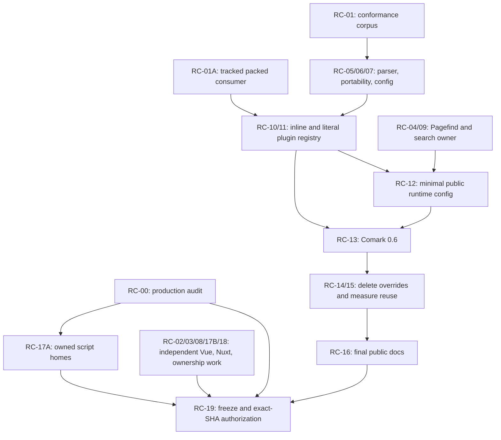

# Ginko Content 0.4 release-candidate refactor plan

> Status: approved for execution
> Target: `@lupinum/ginko-content@0.4.0-rc.1`, followed by `0.4.0`
> Repository baseline: `main` at `76138818462c66afcf95c1db91b69f10ec5f05da`
> Current package version: `0.3.6`
> Scope: Vue, Nuxt, Vite, Comark, public-contract, release, and navigability alignment
> Release authority: the exact-SHA CI `Release authorization` job described in `MAINTAINING.md`
> Lifecycle: temporary execution document; delete after release once durable decisions are in ADRs and maintained documentation

## 1. Outcome

The `0.4` line must be a release candidate we can recommend without caveats to a
Nuxt developer. The module should follow normal Vue and Nuxt usage patterns,
produce a closed and safe rendering model for every advertised Markdown syntax,
bundle optional integrations in a way Vite can analyze, expose only deliberate
public runtime data, and remain understandable to a maintainer without a
repository-wide search.

The release is successful when:

- copied documentation examples work during SSR, hydration, and client navigation;
- every supported Comark-produced node is normalized and accepted by the exact
  Ginko render policy, or is deliberately rejected with a tested reason;
- no browser receives unresolved bare dynamic imports;
- CMS, portable, filesystem, and inline Markdown profiles have explicit contracts;
- public configuration has one normalizer and one documented meaning;
- server-only module facts do not appear in Nuxt client payloads;
- the package keeps its provider-neutral layered architecture and released export
  subpaths;
- low-risk ownership refactors remove misleading shared folders and embedded
  fixture source without changing behavior;
- the exact packed artifact passes all release lanes on the exact release commit.

This is not a rewrite. Every pull request below is independently reviewable,
keeps the tree green, and has an explicit rollback or hard-cutover rule.

## 2. Baseline and reference pins

The alignment review used source and documentation at fixed commits. These pins
are evidence for this plan, not new runtime dependencies:

| Reference | Commit | Role |
|---|---|---|
| [Vue core](https://github.com/vuejs/core) | `a2b40db9a83b36ed9da3a16403cf8f040262d73f` | Attribute fallthrough, component, and SSR behavior |
| [Vue documentation](https://github.com/vuejs/docs) | `b75d188ab16bf83bd1f364a77dfd2315be8f3fa4` | Canonical public Vue usage |
| [Nuxt](https://github.com/nuxt/nuxt) | `409c27f81be0cbf325def191f25b4c76addf2be2` | Nuxt Kit, pages, runtime config, payload, and module contracts |
| [Vite](https://github.com/vitejs/vite) | `b4d66fee14d970f45b8a6f3d7d6aee73ca9b88ab` | Static import analysis and SSR bundling behavior |
| [Nuxt Content](https://github.com/nuxt/content) | `dc90e9612afbf231196046234c0f4577d9cf7050` | Comparative content-module and renderer patterns |
| [Comark](https://github.com/comarkdown/comark) | `92830342b63eaa86a637823e5d1a5f6a474bdca1` | `0.6.2` parser, plugin, Vue, and Nuxt contracts |
| [Nuxt I18n](https://github.com/nuxt-modules/i18n) | `6a72568fc38d601214eee8a04f2d0298a81fdda4` | Comparative module integration |
| [Nuxt Sitemap](https://github.com/nuxt-modules/sitemap) | `e37a2ca773ea5b3d0159ed8c0ba973ef6fa081b1` | Comparative module integration |
| [Nuxt Color Mode](https://github.com/nuxt-modules/color-mode) | `1ad69d2507cbbc8e1b8510eac1005aab1ccc3d35` | Small Nuxt module conventions |
| [Nuxt OG Image](https://github.com/nuxt-modules/og-image) | `f8308f5a4e1db7d60d3f6ba22b575e2b67ccd213` | Build/runtime separation patterns |
| [Nuxt UI](https://github.com/nuxt/ui) | `80cad107e4e9e7bb69b98407984fa4048948f5c4` | Vue/Nuxt component API comparison |

Normative priority is:

1. Ginko's documented public contract and active ADRs;
2. the installed dependency versions and their types/runtime behavior;
3. official Vue, Nuxt, Vite, and Comark source and documentation at the pins above;
4. other Nuxt repositories as comparative implementation examples only.

If `main` moves before execution starts, rebase this plan's baseline and rerun the
Phase 0 inventory. Do not carry a finding forward when the owning code has changed.

## 3. Non-negotiable architecture constraints

The active layered architecture in `meta/ARCHITECTURE.md` and
`meta/adr/0010-layered-source-architecture.md` remains in force. It explicitly
rejects organizing package source only by product feature because query,
localization, navigation, and Markdown span pure behavior and framework bindings.

All implementation work must obey these boundaries:

- pure Markdown tuple normalization stays in `packages/content/src/core/markdown/`;
- configured parser and plugin resolution stays in `packages/content/src/parsers/`;
- generated Nuxt templates and module setup stay in `packages/content/src/module/`;
- Vue loading and lifecycle code stays thin under `packages/content/src/runtime/`;
- portable and CMS behavior stays within its existing dedicated public boundary;
- `core` and `features` remain free of Vue, Nuxt, Nitro, and H3;
- runtime and transport entry points do not become homes for domain policy;
- no new `common`, `services`, top-level `comark`, or generic `utils` folder is added;
- no new package export is created for internal parser or registry machinery;
- Ginko remains CMS-neutral and does not absorb Studio, CMS workflow, MCP, or
  provider-specific product behavior;
- public export subpaths in `packages/content/package.json` remain compatibility
  commitments;
- external examples, playgrounds, and packed fixtures import package exports only;
  same-domain unit tests may deep-import their implementation;
- public documentation route paths remain stable; their numeric and reader-journey
  structure is a URL contract, not a candidate for verticalization;
- playground workspaces stay directly below `playground/` because
  `pnpm-workspace.yaml` selects `playground/*`;
- test moves update `vitest.config.ts`, `nodeContractTests`, package scripts, and
  `scripts/check-test-selection.mjs` in the same pull request.

## 4. Decisions locked by this plan

These decisions do not require another design round during implementation:

1. **Release line.** Behavior and documented configuration changes ship as
   `0.4.0-rc.1`, not a `0.3.x` patch. Stable `0.4.0` follows an RC soak.
2. **Renderer ownership.** Ginko keeps its object AST, renderer, component policy,
   and provider-neutral inert-node model. We do not replace them with Comark's Vue
   renderer.
3. **Dependencies.** `comark` and `@comark/vue` remain paired direct dependencies.
   We do not install `@comark/nuxt` or `@comark/vue/vite`.
4. **Typed MDC props.** The component-frontmatter shim stays until an upstream
   release passes Ginko's boolean, number, array, and object parity contract.
5. **Markdown profiles.** There are exactly three named behaviors:
   - filesystem ingestion uses the application-configured build-time profile;
   - CMS and portability use the fixed portable baseline governed by package semver
     and the conformance corpus;
   - `ContentRendererInline` uses a fixed client-safe baseline and does not promise
     arbitrary build-time plugin parity.
6. **No extra public profile token.** The existing CMS contract version identifies
   its JSON wire schema, not a separately negotiable parser implementation version.
   A second public parser-profile token is not added unless an external negotiation
   requirement is demonstrated.
7. **Plugin defaults.** `markdown.plugins` defaults to `[]`. The hidden `toc` and
   `summary` fallback is deleted; examples that need either plugin opt in explicitly.
8. **Shiki naming.** After the Comark upgrade, `shiki` is canonical. The released
   Ginko `highlight` name remains a setup-time deprecated alias for the `0.4.x`
   line; the implementation resolves exactly one plugin.
9. **Invalid options.** Known invalid `theme` and `langs` keys fail setup with a
   migration message. We do not add adapters for spellings that never worked.
10. **Optional integrations.** Math and Mermaid remain supported. Their parser and
    Vue imports are generated as literal imports only when enabled.
11. **Exact safety allowances.** Task inputs, named slots, table alignment, code
    metadata, Math, and Mermaid are allowed only in their exact parser-owned shapes.
    Arbitrary inputs, styles, templates, SVG/MathML, bindings, events, directives,
    and colon-prefixed authored props stay rejected.
12. **Comments.** Recognized summary behavior is consumed by the summary plugin;
    all remaining comment tuples are removed at canonical normalization and never
    become rendered or agent-visible text.
13. **Cache version.** The normalized AST correction bumps `CACHE_VERSION` from
    `3` to `4`. Any further normalized-AST change after an RC publication bumps it
    again. Portable file/manifest versions stay at `1` unless their structural
    schema changes.
14. **Query API.** Unified query verbs and the two public composables remain.
    Documentation calls client reads “one-shot async Nuxt query functions,” not
    “pure functions.” No alias or wrapper is added.
15. **Route policy.** `useContentPage()` stays policy-neutral. Catch-all pages own
    their 404 policy using normal Nuxt page keying and `createError` behavior.
16. **Runtime config.** Client payloads receive a deliberate minimal projection.
    Server/build/provider details stay in private `runtimeConfig.content`; no dual
    public/private compatibility copy is retained.
17. **Build integrity.** The per-build content cache buster remains. Replacing it
    with Nuxt `buildId` is out of scope until content-only rebuild invalidation is
    proven equivalent.
18. **Source layout.** Package source remains dependency-layered. Domain-first
    ownership improvements apply to false-shared scripts, fixtures, tests, and
    public facades without a source-tree big bang.

Durable Markdown-profile and safety decisions belong in one new ADR. The ADR must
record decisions, not this task list or implementation history.

## 5. Definition of done

The candidate is not done until every item is true:

- [ ] `pnpm audit:prod` is green with no expired exception silently extended.
- [ ] Every pull request below is merged or explicitly removed from scope with a
  written reason approved before RC freeze.
- [ ] `ContentRenderer` forwards Vue fallthrough attributes exactly once.
- [ ] Direct and client-navigated missing content routes produce a Nuxt 404.
- [ ] A non-empty initial Pagefind query performs no browser-only work during SSR.
- [ ] The Comark conformance matrix covers all default and advertised syntax.
- [ ] Supported raw AST normalizes into a public-policy-valid AST.
- [ ] Comments never leak through renderer, search, summary, portable, or agent paths.
- [ ] Typed portable MDC values survive asset rewrite and reparse.
- [ ] Inline SSR, hydration, and reactive updates use one documented safe profile.
- [ ] Math and Mermaid work in a production browser with no bare package imports.
- [ ] `comark` and `@comark/vue` resolve one matched `0.6.x` line.
- [ ] No documented option is silently ignored.
- [ ] Search defaults and required fields have one framework-light owner.
- [ ] Ginko production code no longer reads Nuxt's private `_layers` field.
- [ ] Nuxt module detection uses the supported Nuxt Kit helper.
- [ ] Stale `payloadExtraction ??= false` setup code is deleted and a real fixture
  proves Nuxt's effective generated payload behavior.
- [ ] Public runtime config contains no provider specifiers, filesystem globs, CMS
  settings, agent definitions, schema inventories, or other server-only metadata.
- [ ] Comark bundling overrides are removed only after the full optional-plugin
  artifact matrix passes without them.
- [ ] Parser reuse is retained only if it is configuration-isolated and measurably
  improves representative multi-document ingestion.
- [ ] Package export documentation classifies every manifest export.
- [ ] False-shared scripts and fixtures have clear owners and no new common dump.
- [ ] Public docs, examples, migration notes, README, changelog, and generated API
  reference agree with the shipped behavior.
- [ ] `pnpm verify` passes on the frozen release commit.
- [ ] The exact release-metadata commit has a green CI `Release authorization` job.
- [ ] The downloaded tarball checksum matches its certification manifests, the
  worktree is clean, and no live publish command was run by an agent.

## 6. Dependency graph



RC-00 is a release blocker, not a prerequisite for unrelated read/test/code work.
Independent branches should proceed in parallel when owners are available. The
explicit `Depends on` field controls code order; phase placement also reduces merge
conflicts but must not create artificial serialization. Do not upgrade Comark before
the corpus exists, remove bundling overrides before literal imports exist, minimize
public Markdown config before renderer loading is explicit, or mix behavior fixes
with ownership-only moves.

## 7. Execution rules

- Status values are `not started`, `in progress`, `blocked`, and `complete`.
- A work item becomes complete only after its acceptance criteria and escalation
  gate pass; a code merge alone is insufficient.
- Start with the focused commands listed for the item. Run the escalation gate
  once before handoff, following the ladder in `AGENTS.md`.
- For every code or public-behavior PR, run `pnpm verify` once after its focused
  checks pass and before handoff. Do not use that broad gate as the edit loop.
- Never keep old and new internal implementations side by side. Hard-cut the old
  unreleased path once the replacement passes.
- Released behavior changes require version, changelog, migration, docs, examples,
  and package/type contracts in the same release line.
- Snapshot changes are reviewed row by row. Bulk snapshot acceptance is forbidden.
- A failed simplification experiment is reverted in its own PR; do not patch it
  with a second abstraction.
- The authoritative release gate is CI on the exact SHA. Local
  `pnpm run release:verify` is not an iterative development command.

## 8. Pull-request sequence

### Phase 0 — Release baseline

#### RC-00 — Resolve the expired production-audit decision

- **Status:** blocked on a consumer-valid patched Nitro/Archiver graph
- **Depends on:** none
- **Risk:** high release risk; low-to-medium code risk
- **Change type:** supply-chain judgment
- **Public impact:** none unless an upstream dependency floor changes
- **Paths:** `scripts/lib/production-audit.mjs`, `scripts/audit-production.mjs`,
  `test/unit/production-audit.test.ts`, `MAINTAINING.md`, `package.json`,
  `pnpm-lock.yaml`, and only the manifest owning an affected dependency

Implementation:

1. Run `pnpm audit:prod` against the committed lockfile and retain the report in
   PR evidence. The current result is unknown; do not claim the graph is clean or
   vulnerable without the registry result.
2. If the graph is clean, delete the expired exception and its special maintainer
   text. Keep only the general zero-unreviewed-production-advisories policy.
3. If it is not clean, update or override the exact Nitro/Archiver dependency path
   to a patched version after provenance review. Do not regenerate the lockfile
   blindly and do not extend the expired `2026-08-02` waiver.
4. If no patched compatible graph exists, stop the RC and require a new explicit
   security decision; this plan does not authorize another time waiver.

Acceptance criteria:

- `pnpm audit:prod` exits zero from a fresh install using the committed lockfile.
- The evaluator contains no expired dead branch.
- Unit tests cover a clean report and rejection of any unexpected advisory.
- `MAINTAINING.md` describes the actual policy, not historical temporary state.

Validation:

```bash
pnpm audit:prod
pnpm exec vitest run --config vitest.config.ts --project unit test/unit/production-audit.test.ts
pnpm lint
```

**Cutover/rollback:** delete the exception when clean. If a dependency update
breaks a runtime lane, revert the update and keep the RC blocked; never restore an
expired automatic acceptance.

Execution note (2026-08-11): the installed production graph still resolves
`nitropack@2.13.4` → `archiver@7.0.1` → `brace-expansion@2.1.0`. The reviewed
advisory marks versions through `5.0.7` affected and identifies `5.0.8` as the
patched release, while Nitro's published dependency range remains
`archiver@^7.0.1`. A workspace-only override would not protect npm consumers and
is therefore not an acceptable release fix. The registry audit did not return a
report during this execution and was stopped; no clean result is claimed. Amend
this stack layer when Nitro adopts a compatible patched graph or an upstream
backport is published, then rebase the upstack. The expired waiver remains
unextended and the RC remains blocked.

### Phase 1 — Durable contract and corpus

#### RC-01 — Record Markdown profiles and freeze a conformance corpus

- **Status:** complete
- **Depends on:** none
- **Risk:** low
- **Change type:** domain judgment and test infrastructure
- **Public impact:** clarifies existing and corrected contracts
- **Paths:** new `meta/adr/0020-markdown-profiles-and-render-safety.md`,
  `meta/adr/README.md`, new
  `test/contracts/comark-conformance-contracts.test.ts`, a small
  `test/fixtures/markdown-conformance/` corpus, `vitest.config.ts`,
  `scripts/check-test-selection.mjs`, `test/unit/architecture-boundaries.test.ts`

Implementation:

- Record the three profiles and locked decisions from Section 4.
- Build one table-driven corpus covering raw parse, canonical normalization,
  public validation, portable validation, Vue SSR, and agent serialization.
- Include frontmatter, headings/IDs, HTML, comments and summary delimiter,
  components, typed props, default/named slots, alerts, tasks, aligned tables,
  code metadata/highlights, TOC, summary, footnotes, Shiki, Math, Mermaid,
  malformed input, and portability stringify/reparse.
- Initially capture raw Comark `0.4` behavior and current intentional Ginko
  behavior without skipped or expected-failing tests. Add each corrected invariant
  in the PR that implements it.
- Add the pure/isolate conformance file to `nodeContractTests`. It must run under
  plain Node exactly once, not in both the Node and Nuxt contract projects.

Acceptance criteria:

- Every row names its owning profile and expected support status.
- Raw parser snapshots are separate from normalized/policy assertions, so the
  later Comark upgrade can distinguish upstream changes from Ginko changes.
- The corpus contains no provider, Nuxt, or Vue dependency in pure normalization
  helpers.
- Test selection proves the corpus executes exactly once.

Validation:

```bash
pnpm check:test-selection
pnpm exec vitest run --config vitest.config.ts --project contracts-node test/contracts/comark-conformance-contracts.test.ts
pnpm test
```

**Cutover/rollback:** the ADR is retained as the durable decision. The fixture
remains deliberately small; remove any row that does not protect a supported
contract rather than growing a syntax museum.

Execution note (2026-08-11): ADR-0020 records the three profiles and closed
parser-to-render policy. Nine behavior-owned fixtures execute under plain Node
exactly once and produce separately reviewed raw-Comark and Ginko-pipeline
snapshots. The corpus covers every syntax named above, records current gaps as
explicit rejected stages, and exercises portable reparse, Vue SSR, and agent
serialization. KaTeX is installed only as workspace test infrastructure so the
configured Math parser contract can execute; the package-level optional-peer and
browser-bundling contract remains owned by RC-11.

#### RC-01A — Extract the packed consumer before adding new artifact cases

- **Status:** complete
- **Depends on:** none
- **Risk:** low-to-medium because the lane is release-critical
- **Change type:** mechanical fixture extraction
- **Public impact:** none
- **Paths:** `scripts/test-packed-consumer.mjs`, new
  `test/consumer-fixtures/packed-app/`, package-consumer tests/scripts,
  `pnpm-workspace.yaml`, `scripts/check-test-selection.mjs`,
  `scripts/docs-drift.mjs`

Implementation:

- Move the 937-line embedded Nuxt consumer source into tracked, behavior-named
  TS/Vue files under `test/consumer-fixtures/packed-app/`.
- Keep this directory outside `test/fixtures/*`, so it is not a workspace package
  and cannot link the source package by accident.
- Reduce the script to copy/orchestrate the fixture, write only the
  tarball-dependent package manifest, run the gates, and inspect results.
- Preserve byte-for-byte equivalent pnpm and npm scenarios before adding any new
  behavior to the fixture.
- Add `test/consumer-fixtures/` to the public-import roots in
  `scripts/docs-drift.mjs`; the new location must not create an enforcement gap.

Acceptance criteria:

- The fixture source is directly navigable and lintable instead of embedded strings.
- pnpm and npm lanes install the exact packed tarball and cannot resolve a workspace
  copy of `@lupinum/ginko-content`.
- All prior consumer assertions still execute and pass under both package managers.
- The orchestrator contains no embedded application TS or Vue source.
- A deep/non-exported package import in the tracked consumer fixture makes
  `pnpm docs-drift` fail.

Validation:

```bash
pnpm check:test-selection
pnpm lint
pnpm docs-drift
pnpm release:pack
pnpm test:package-consumer
pnpm test:package-consumer:npm
```

**Cutover/rollback:** extract in one hard cut with no string-based fallback. If
workspace selection includes the fixture, fix its location before merging rather
than adding install exceptions.

Execution note (2026-08-11): the packed application and Pagefind package probe
now live as 21 directly lintable files under `test/consumer-fixtures/`; the
orchestrator only copies them, writes the exact-tarball manifest, executes the
lanes, and inspects results. The new root is covered by `docs-drift` and remains
outside every workspace selector. The first Nuxt 4.5 packed run also exposed a
pre-existing top-level `await` in the renderer's generated-component helper;
deleting its unreachable fallback in favor of the always-generated Nuxt module
made the production target compatible without adding a build override. The
deterministic tarball (`sha256
7c771623f5f12665acd6cc6ce2bb215691b9500adf6042273fbbc588d1d1286e`) passed
the complete pnpm/Nuxt 4.5 and npm/Nuxt 4.4 consumer lanes.

### Phase 2 — Current correctness before dependency migration

#### RC-02 — Restore Vue fallthrough semantics in `ContentRenderer`

- **Status:** complete
- **Depends on:** none
- **Risk:** low
- **Change type:** mechanical Vue alignment
- **Public impact:** fixes a documented component prop/attribute
- **Paths:** `packages/content/src/runtime/app/components/ContentRenderer.vue`,
  `packages/content/src/runtime/app/components/internal/ContentRendererMarkdown.vue`,
  `test/contracts/render-components-contracts.test.ts`, generated web types if changed

Implementation:

- Remove `class` from declared component props so Vue treats it as fallthrough.
- Disable implicit inheritance on the wrapper and forward `$attrs` exactly once to
  the rendered child or slot scope.
- Keep `value`, `excerpt`, `tag`, `prose`, and `unwrap` as actual props.
- Do not add a class normalizer; Vue already owns string, array, and object class
  semantics.

Acceptance criteria:

- `class` and `id` reach the rendered root once.
- String, array, and object class bindings follow Vue semantics and never become
  `[object Object]`.
- Default and empty slots receive the same fallthrough attrs.
- Unsupported-value warnings and render policy remain unchanged.

Validation:

```bash
pnpm exec vitest run --config vitest.config.ts --project nuxt test/contracts/render-components-contracts.test.ts
pnpm typecheck
```

**Cutover/rollback:** remove the consumed prop in one cut. Do not retain a second
class-forwarding path.

Execution note (2026-08-11): removed the consumed `class` prop, disabled implicit
attribute inheritance on both renderer wrapper layers, and covered string, array,
object, default-slot, and empty-slot forwarding. The focused Nuxt contract,
source/fixture typecheck, and changed-file ESLint checks pass. `pnpm verify` was
run and reached the static policy gate; it is locally blocked only because an
ignored `.claude/worktrees/` checkout contains a forbidden private-consumer name.
That ignored checkout is not part of this branch or its diff.

#### RC-03 — Make the canonical catch-all recipe correct on client navigation

- **Status:** complete
- **Depends on:** none
- **Risk:** medium
- **Change type:** Nuxt usage-pattern correction
- **Public impact:** changes copy-paste page recipes, not the composable API
- **Paths:** catch-all examples in `README.md`, `packages/content/README.md`,
  `docs/content/docs/1.get-started/1.quickstart.md`,
  `docs/content/docs/2.build/1.documentation-site.md`,
  `docs/content/docs/2.build/2.blog.md`,
  `docs/content/docs/4.guides/6.routes-links-and-redirects.md`,
  `docs/content/docs/5.reference/5.composables.md`, both migration guides,
  relevant `examples/*/*/pages/[...slug].vue`, playground pages,
  `test/fixtures/quickstart/pages/[...slug].vue`, and a browser route test

Implementation:

- Keep `useContentPage()` policy-neutral.
- Make each general catch-all page use `definePageMeta({ key: route => route.path })`
  so a path-param change reruns setup without remounting for query/hash changes.
- After `await useContentPage(...)`, throw `createError` with status `404`, a short
  status text, and client-fatal behavior when no page exists.
- Remove server-only guards and `setResponseStatus` recipes that become a blank page
  after client navigation.
- Preserve a deliberately local 200 fallback only where a fixture explicitly tests
  that product policy, and label it as noncanonical.

Acceptance criteria:

- Direct missing request returns HTTP 404.
- Valid-to-missing client navigation shows Nuxt's error page, not blank/stale content.
- Valid-to-valid catch-all navigation reruns the content read and succeeds.
- A recovery navigation from the error page reaches valid content.
- Every beginner-facing recipe uses the same tested pattern.

Validation:

```bash
pnpm exec vitest run --config vitest.config.ts --project nuxt test/contracts/use-content-page-contracts.test.ts
pnpm test:e2e
pnpm test:e2e:browser
pnpm docs:build
pnpm docs:smoke
pnpm docs-drift
```

**Cutover/rollback:** if the route-key pattern fails in the real browser fixture,
stop and use a route-owned immediate `showError` policy proven by the same matrix;
do not move 404 policy into Ginko or ship an untested watcher recipe.

Execution note (2026-08-11): all canonical catch-all recipes now key the page by
`route.path` and throw a fatal Nuxt 404 after the awaited content read. The two
fixtures that intentionally render a local HTTP-200 fallback remain explicit and
are labelled noncanonical. The production browser matrix proves direct 404,
valid-to-valid navigation, valid-to-missing error rendering without stale content,
and recovery to a valid page. Quickstart typecheck/build, the `useContentPage`
contracts (10/10), Nuxt e2e (15/15), production browser tests (6/6), docs build,
docs smoke, docs drift, and test-selection checks pass. The aggregate examples
build exposed an unrelated unused `@nuxt/ui` dependency in the hello-world example;
that deletion is isolated into a follow-up stack item rather than mixed into this
route-policy change. `pnpm verify` completed the package build, workspace prepare,
and docs-drift stages, then stopped only because `check:repo-policies` scans an
ignored `.claude/worktrees/` checkout containing a forbidden private-consumer name;
that user-owned checkout is outside this branch and its diff.

#### RC-04 — Make Pagefind explicitly client-owned

- **Status:** complete
- **Depends on:** none
- **Risk:** medium
- **Change type:** SSR lifecycle correction
- **Public impact:** correctness only
- **Paths:** `packages/content/src/runtime/app/composables/search.ts`,
  `packages/content/src/runtime/app/pagefind-client.ts`,
  `test/client/pagefind-search.test.ts`, `test/client/search-composables.test.ts`,
  `test/e2e/search-matrix.test.ts`, the static-generation fixture/assertions, and a
  browser fixture with non-empty initial query

Implementation:

- Do not start Pagefind manifest fetches or generated-module imports during SSR.
- Register the Pagefind reactive effect only in the client build/lifecycle.
- Return deterministic SSR state: empty results, not pending, and no error. Hydration
  performs the search when the query is non-empty.
- Preserve cancellation, locale switching, cached manifest/module loading, and
  base-URL resolution.
- Keep Pagefind URL imports as browser asset URLs; they are not the bare-package
  import defect addressed by RC-11.

Acceptance criteria:

- SSR/prerender with `initialQuery` never calls a relative native `fetch` in Node.
- Hydration has no mismatch and performs one first client search.
- Query/locale changes cannot commit stale results.
- Base-path deployments load the correct manifest and locale module.
- MiniSearch and provider engines do not change.
- Static generation with a non-empty initial query completes without a Node URL or
  browser-global error.

Validation:

```bash
pnpm exec vitest run --config vitest.config.ts --project client test/client/pagefind-search.test.ts test/client/search-composables.test.ts
pnpm exec vitest run --config vitest.config.ts --project e2e test/e2e/search-matrix.test.ts
pnpm test:e2e:browser
pnpm test:generate:static
```

**Cutover/rollback:** keep the server branch inert; do not introduce a second SSR
Pagefind loader or hide the failure with absolute URL construction.

Execution note (2026-08-11): Pagefind now creates its browser-asset client and
registers its reactive search effect only from `onMounted` in a client build. SSR
therefore returns stable empty results with `pending: false` and no error, without
calling native `fetch`; the existing cancellation cleanup, locale keying, manifest
and module caches, base URL, and result normalization stay on the sole client path.
A real `nuxi generate` fixture with a non-empty initial query proves inert SSR HTML
and emitted Pagefind assets. A production Chrome fixture proves hydration performs
the search, fetches the locale manifest once, resolves the expected result, and
reports no hydration, console, page, or request failures. Focused client tests pass
14/14, the four-engine production search matrix passes 4/4, the complete browser
lane passes 5/5, source typecheck and changed-file ESLint pass, and the full core
suite passes 119 files/1,206 tests.

#### RC-05 — Close Comark's default AST under Ginko's safety policy

- **Status:** complete
- **Depends on:** RC-01
- **Risk:** medium-high
- **Change type:** domain and security-policy judgment
- **Public impact:** fixes advertised/default Markdown behavior; invalidates caches
- **Paths:** `packages/content/src/core/markdown/normalize-comark.ts`,
  `packages/content/src/core/markdown/tree.ts`,
  `packages/content/src/cms-contract/mdc.ts`,
  `packages/content/src/cms-contract/index.ts`,
  `packages/content/src/cms-contract/render-policy.ts`,
  `packages/content/src/portability/mdc.ts`,
  `packages/content/src/features/agent/walker.ts`, `packages/content/src/utils.ts`,
  conformance, render, portability, storage, alert, and agent tests

Implementation:

- Make the existing `normalizeComarkNodes` boundary mandatory before Comark tuples
  become Ginko object AST. Do not add a second parser adapter.
- Drop comment tuples. Defensively ignore tagless elements in the agent walker.
- Normalize exact Comark task metadata into an inert, disabled checkbox shape.
- Allow only `text-align:left|center|right` on `th`/`td`.
- Validate fenced-code metadata as bounded parser-owned data: string `meta` and a
  bounded array of positive safe integers for highlight ranges.
- Canonicalize named-slot tuples, then allow `template { name }` only as a direct
  child of a declared component and only for a slot declared by that component.
- Normalize GFM alerts before validation.
- Define `parseMdcBody` as the fixed portable baseline in code comments and
  contracts. Remove the inaccurate promise that it always produces the same
  enriched AST as filesystem parsing with application plugins. Do not put Nuxt
  plugin specifiers into the isolate-safe CMS contract.
- Reserve exact internal Math/Mermaid nodes for RC-11; never permit broad native
  active tags to prepare for them.
- Bump `CACHE_VERSION` from `3` to `4` and update cache/storage invariants.

Acceptance criteria:

- The matrix passes across filesystem, CMS, portable, public validation, Vue SSR,
  and agent output for comments, summary, tasks, tables, code metadata, alerts,
  typed props, and named slots.
- Comment text appears in no HTML, search text, summary, or agent Markdown.
- Task checkboxes render; authored arbitrary inputs remain rejected.
- Unsafe styles and undeclared/misplaced slots remain rejected.
- Every supported normalized row passes `validatePublicMarkdownAst`.
- Baseline syntax normalizes identically in filesystem and portable profiles, while
  a configured filesystem-only feature such as footnotes is explicitly different.
- Runtime and storage tests assert `CACHE_VERSION === 4`.

Validation:

```bash
pnpm exec vitest run --config vitest.config.ts --project contracts-node --project nuxt --project unit test/contracts/comark-conformance-contracts.test.ts test/contracts/cms-render-policy.test.ts test/contracts/render-components-contracts.test.ts test/contracts/portability-contracts.test.ts test/unit/agent-markdown.test.ts
pnpm test
```

**Cutover/rollback:** exact parser-owned allowances land together. If one syntax
cannot be made inert, mark it unsupported and document the rejection; never widen
the global policy to make a test pass.

Execution note (2026-08-11): the existing normalizer is now mandatory for every
tuple-to-object path, including inline rendering. It drops comment tuples,
canonicalizes Comark task checkboxes, and remains the single owner of exact table
alignment and code-highlight predicates used by both public and portable
validators. Named slots are accepted only beneath a declared component/slot;
arbitrary inputs, active tags, unsafe styles, and Math/Mermaid remain closed. The
reviewed corpus now records CMS portable-baseline output separately and proves
declared slots through a real Vue SSR component. `CACHE_VERSION` is `4`. The full
suite passes 119 files/1,198 tests; `pnpm verify` reaches `verify:static` and then
fails only because the ignored local `.claude/worktrees/` checkout contains a
forbidden private-name fixture already recorded under RC-02.

#### RC-06 — Preserve typed props during portable asset rewriting

- **Status:** complete
- **Depends on:** RC-05
- **Risk:** low
- **Change type:** mechanical correctness
- **Public impact:** corrects lossy portability behavior; no format-version bump
- **Paths:** `packages/content/src/portability/assets.ts`,
  `test/contracts/portability-contracts.test.ts`,
  `test/contracts/portability-directory-contracts.test.ts`

Implementation:

- Define one private portability stringify option constant using block
  frontmatter and no inline attributes.
- Pass the same options to every portable asset rewrite/stringify path.
- Keep one serializer; do not add a post-stringify type repair.

Acceptance criteria:

- An asset-bearing component round-trips a boolean, number, array, and object with
  their types intact.
- Two rewrites are deterministic and semantically equal.
- Portable manifest/document and `PortableMdcAstV1` versions remain `1` because
  their structural schemas do not change.

Validation:

```bash
pnpm exec vitest run --config vitest.config.ts --project contracts-node test/contracts/portability-contracts.test.ts test/contracts/portability-directory-contracts.test.ts
pnpm test
```

**Cutover/rollback:** replace the current stringify options directly. Do not keep
an old lossy path for compatibility.

Execution note (2026-08-11): both portable-to-public and stored-to-portable
rewrites now use one private Comark render option constant with block frontmatter
and zero inline attributes. A single asset-bearing fixture proves boolean, number,
array, and nested object props survive public rewrite, storage rewrite, restoration,
and a deterministic second rewrite. The portable MDC AST remains version `1`;
manifest and document schemas are unchanged. Focused portability contracts pass
21/21 and the full suite passes 119 files/1,199 tests.

### Phase 3 — Nuxt and configuration boundaries

#### RC-07 — Make Markdown configuration truthful and typed

- **Status:** complete
- **Depends on:** RC-01
- **Risk:** medium
- **Change type:** configuration and documentation judgment
- **Public impact:** default plugins are removed; invalid options now fail early
- **Paths:** `packages/content/src/module/defaults.ts`, `packages/content/src/utils.ts`,
  `packages/content/src/types/content.ts`, `packages/content/src/types/module.ts`,
  `packages/content/src/module/validation.ts`,
  `packages/content/src/parsers/markdown-plugins.ts`, module/plugin contract tests,
  Markdown docs, `examples/mdc/components/nuxt.config.ts`,
  `playground/shared/nuxt.config.ts`, `scripts/docs-drift.mjs`

Implementation:

- Keep `plugins: []` as the single truthful module default and delete the hidden
  `toc`/`summary` fallback from `processMarkdownOptions`.
- Make omitted and explicit-empty configuration resolve identically. Examples that
  demonstrate TOC or excerpt behavior declare those plugins explicitly.
- Replace generic option records with useful built-in option shapes where the
  public API can type them without blocking custom plugins.
- Reject known invalid Shiki keys `theme` and `langs` with messages pointing to
  `themes` and `languages`.
- Correct every example. Prefer zero-config Shiki when importing theme/language
  registration objects would distract from the example.
- Document supported built-ins, optional peers, build-time custom plugin behavior,
  inert AST requirements, and the intentional rejection of bindings/directives.

Acceptance criteria:

- Tests prove omitted and explicit empty both install no plugins, while an explicit
  custom list installs exactly that list.
- Invalid option names fail at setup instead of silently selecting Material defaults.
- Valid `themes`/`languages` reach Comark unchanged.
- Docs drift protects canonical spelling and examples build.

Validation:

```bash
pnpm exec vitest run --config vitest.config.ts --project unit test/unit/markdown-plugins.test.ts
pnpm exec vitest run --config vitest.config.ts --project contracts-node test/contracts/module-contracts.test.ts test/contracts/transformers-contracts.test.ts
pnpm typecheck
pnpm docs:build
pnpm docs:smoke
pnpm docs-drift
pnpm examples:build
```

**Cutover/rollback:** one resolver replaces implicit fallback behavior. Do not
silently translate invalid options or create parallel default lists.

Execution note (2026-08-11): omitted and explicit-empty plugin configuration now
both resolve to no plugins; the hidden `toc`/`summary` fallback is deleted. Public
types describe the built-in Highlight and TOC options without closing the custom
plugin tuple, while setup rejects the known non-options `theme` and `langs` with
their canonical `themes` and `languages` replacements. Docs, examples, and the
shared playground use truthful zero-config Highlight or explicit TOC/Summary
configuration, and docs drift prevents the invalid spellings from returning. The
MDC example also uses Comark's canonical kebab-case named-slot key and no longer
misregisters structural `template` nodes as a component. Focused unit and module
contracts pass 60/60, typecheck and docs drift pass, docs build/package and smoke
pass with 173 prerendered routes, all four examples build, and the full suite
passes 119 files/1,204 tests.

#### RC-08 — Use supported Nuxt Kit module and layer APIs

- **Status:** complete
- **Depends on:** none
- **Risk:** medium
- **Change type:** Nuxt alignment
- **Public impact:** fixes module/layer edge cases
- **Paths:** `packages/content/src/module.ts`, `packages/content/src/module/options.ts`,
  `packages/content/src/module/runtime-assets.ts`,
  `packages/content/src/module/validation-assets.ts`, module/runtime-assets tests,
  validation-public-assets tests, and a real two-layer Nuxt fixture

Implementation:

- Replace the local scanner with Nuxt Kit
  `hasNuxtModule(moduleName, nuxt)` for I18n and Sitemap detection.
- Replace direct `_layers` reads with `getLayerDirectories(nuxt)`.
- Resolve content-component directories from each returned `app` directory and
  validation assets from returned `public` directories.
- Preserve returned priority: application/root first, base layers later. Register
  component directories once without a repeated `unshift` that reverses order.
- Delete `nuxt.options.experimental.payloadExtraction ??= false`; it is ineffective
  after Nuxt schema resolution and misleading.
- Add a real generate assertion for effective Nuxt payload extraction. Do not rely
  only on a partial module mock.

Acceptance criteria:

- No production module code reads `_layers`.
- Root content components override same-named base-layer components.
- Custom `srcDir` and `dir.public` resolve correctly.
- Detection covers string, tuple, function/object metadata, and installed modules.
- Normal Nuxt 4 generation emits its expected payload files and no Ginko code claims
  to disable them.

Validation:

```bash
pnpm exec vitest run --config vitest.config.ts --project contracts-node test/contracts/module-contracts.test.ts test/contracts/runtime-assets-contracts.test.ts
pnpm exec vitest run --config vitest.config.ts --project unit test/unit/validation-public-assets.test.ts
pnpm test:e2e
pnpm test:generate:static
```

**Cutover/rollback:** delete local detection and private-layer logic in the same PR.
Do not wrap the supported helpers behind another generic compatibility utility.

Execution note (2026-08-11): module detection now delegates directly to Nuxt
Kit's `hasNuxtModule`, including configured object metadata and installed-module
records. Layer-owned component and public directories come from
`getLayerDirectories`; one registration hook preserves Nuxt's application-first
ordering, and no production module code reads `_layers`. The renderer now consumes
the generated lazy loader catalog for non-global authored content components, so a
real two-layer generation proves the application component renders in SSR while
the same-named base component does not. The stale payload-extraction assignment is
deleted, and the same generated fixture proves Nuxt 4 emits `_payload.json`.
Focused module/runtime-assets/validation contracts pass 42/42, renderer contracts
pass 14/14, the real generate assertion passes, source typecheck and changed-file
ESLint pass, test-lane selection remains isolated, and the warm full suite passes
119 files/1,205 tests. Four unrelated runtime tests exceeded their shared five-
second limit on the first parallel run; the exact 28 tests passed in isolation and
the complete lane then passed without code changes.

#### RC-09 — Give search defaults and normalization one owner

- **Status:** complete
- **Depends on:** RC-04
- **Risk:** medium
- **Change type:** domain consolidation within layered architecture
- **Public impact:** prevents divergent search result/config behavior
- **Paths:** new `packages/content/src/features/search/options.ts`,
  `packages/content/src/module/options.ts`,
  `packages/content/src/module/runtime-config.ts`,
  `packages/content/src/runtime/shared/search.ts`,
  `packages/content/src/runtime/app/composables/search.ts`,
  `packages/content/src/types/search.ts`, search tests across unit/runtime/client/contracts

Implementation:

- Move framework-light MiniSearch defaults, required stored fields, validation, and
  normalization into one feature-owned module.
- Delete the independent module, shared-runtime, and client copies.
- Include `collection` and every field required to construct
  `ContentSearchResult` in the canonical required set.
- Make module config, index creation, runtime config, and client fallback resolution
  consume the same normalized output.
- Keep URL derivation in the Nuxt module layer.

Acceptance criteria:

- Identical input yields identical module, server, browser, and generated runtime
  options.
- User `storeFields` cannot remove a required result field.
- Disabled, MiniSearch, Pagefind, and provider modes retain documented outputs.
- One parity contract compares all consumers to the canonical object.

Validation:

```bash
pnpm exec vitest run --config vitest.config.ts --project unit test/unit/search-behavior.test.ts
pnpm exec vitest run --config vitest.config.ts --project runtime test/runtime/api-search-boundaries.test.ts test/runtime/search-collection-defaults.test.ts
pnpm exec vitest run --config vitest.config.ts --project client test/client/search-composables.test.ts
pnpm exec vitest run --config vitest.config.ts --project nuxt test/contracts/runtime-config-contracts.test.ts
pnpm test
```

**Cutover/rollback:** delete duplicated constants as each consumer moves. Do not
leave re-exported legacy owners.

Execution note (2026-08-11): `features/search/options.ts` is now the sole owner
of MiniSearch defaults, required stored result fields, input validation, and
normalization. Module setup, generated public runtime config, server index
construction, and the browser composable all consume it directly; the three
copied default/normalizer implementations are deleted. `collection` joins `path`,
`title`, and `excerpt` in the required set, while duplicate/empty field names,
non-finite boosts, and non-finite fuzzy values normalize deterministically. The
public reference documents the same canonical order and required set. Focused
module/server/browser/runtime-config parity and behavior contracts pass 41/41,
source typecheck and changed-file ESLint pass, docs drift/build/smoke pass with
173 prerendered routes, and the freshly built full suite passes 119 files/1,208
tests.

### Phase 4 — Inline contract and bundle-safe optional integrations

#### RC-10 — Give `ContentRendererInline` one honest safe contract

- **Status:** complete
- **Depends on:** RC-05, RC-07
- **Risk:** medium
- **Change type:** public component behavior
- **Public impact:** narrows an inaccurately documented parity promise
- **Paths:** `packages/content/src/runtime/app/components/ContentRendererInline.vue`,
  `packages/content/src/runtime/markdown/plugins.ts`,
  `packages/content/src/module/runtime-config.ts`,
  `packages/content/src/module/augmentations.ts`, component/runtime-config/alert tests,
  `docs/content/docs/5.reference/7.components.md`

Implementation:

- Parse inline input with the fixed baseline parser, call canonical normalization,
  convert once to `MarkdownRoot`, unwrap, and validate/render under the fixed safe
  baseline policy.
- Remove configured build-time parser plugin resolution from the inline component.
- Keep `components` only as render overrides for already-authorized safe tags; it
  does not authorize arbitrary MDC components or syntax.
- Remove plugin options/themes/transformers from inline state keys and watchers.
- Keep SSR payload state and reactive `value`/`unwrap` updates deterministic.

Acceptance criteria:

- Inline alerts, comments, and task lists follow the same baseline normalization.
- SSR markup equals hydrated markup.
- Changing `value` after hydration reparses without stale writes.
- Build-time footnotes, Shiki, custom plugins, Math, and Mermaid are not claimed as
  inline features.
- Docs precisely list the fixed supported subset and override boundary.

Validation:

```bash
pnpm exec vitest run --config vitest.config.ts --project nuxt test/contracts/render-components-contracts.test.ts test/contracts/mdc-alert-contracts.test.ts
pnpm exec vitest run --config vitest.config.ts --project nuxt test/contracts/runtime-config-contracts.test.ts
pnpm test:e2e:browser
```

**Cutover/rollback:** remove the misleading configured-inline path; do not preserve
it behind a flag or add a public `renderPolicy` escape hatch.

Execution note (2026-08-11): `ContentRendererInline` now parses only Comark's
fixed baseline, runs the canonical normalization once, converts once, unwraps,
and relies on `MarkdownRenderer`'s fixed empty component policy. It no longer
reads public runtime plugin/tag config, loads build-time parser plugins, installs
plugin renderer components, or includes unrelated config in its payload key and
watchers. The `components` prop remains a renderer override for already-safe tags
only. A monotonically increasing refresh id makes rapid reactive updates
latest-write-wins. Focused baseline/alert/runtime-config contracts pass 38/38; a
real generate proves normalized alert SSR with comments removed, and production
Chrome proves hydration without errors plus a rapid two-value update committing
only the final task list. Source typecheck and changed-file ESLint pass, and the
docs drift/build/smoke pass with 173 prerendered routes. The full core suite
passes 119 files/1,209 tests.

#### RC-11 — Generate bundle-safe optional and custom plugin imports

- **Status:** complete
- **Depends on:** RC-01A, RC-05, RC-07, RC-10
- **Risk:** high behavior risk; medium implementation risk
- **Change type:** Nuxt/Vite build integration and exact render policy
- **Public impact:** makes documented optional/custom integrations actually work
- **Paths:** a focused template helper under `packages/content/src/module/`,
  `packages/content/src/module.ts`, `packages/content/src/module/virtual.ts`,
  `packages/content/src/parsers/markdown-plugins.ts`,
  `packages/content/src/runtime/markdown/plugins.ts`, normalization/render policy,
  a virtual-module mock, a small `test/fixtures/markdown-plugins/` workspace, new
  production/browser tests, the tracked packed-consumer fixture,
  `packages/content/package.json`, package/peer contracts,
  `scripts/prepare-deps-canary.mjs`, `vitest.config.ts`, and `pnpm-lock.yaml`

Implementation:

- From one setup-time registry, generate two dependency-direction-specific modules:
  a server/build parser module with literal imports for every configured built-in or
  custom specifier, and a client renderer module with literal Vue companion imports
  only for enabled known built-ins. Apps without an integration do not resolve its
  optional peer packages.
- Resolve and validate custom module specifiers during module setup. Custom parser
  plugins remain build/server-only; their module code or options never enter a
  browser payload. Their normalized AST must still pass Ginko's inert policy.
- Delete variable `import(/* @vite-ignore */ specifier)` calls for package names and
  configured module specifiers.
- Let Vite see and chunk every enabled literal import.
- Make the generated registry the one owner of enabled renderer companions so
  public runtime config needs no plugin descriptors.
- Normalize Math and Mermaid output to reserved internal tags and merge exact
  plugin-owned prop policies only when enabled. Do not allow arbitrary SVG, MathML,
  active tags, or authored equivalents.
- Fail setup clearly when an enabled integration's optional peer is absent.
- Declare `katex` and `beautiful-mermaid` as optional peers of Ginko using ranges
  compatible with the selected Comark line, and cover their metadata in package
  contracts and the dependency canary. Do not rely on a transitive peer warning as
  the public installation contract.
- Use one deliberately small fixture with both peers. Do not build a kitchen-sink
  workspace.
- Add a narrow equivalent case to the packed consumer so literal template imports
  and optional companion files are proven present in the exact tarball, not only
  through a workspace source build.

Acceptance criteria:

- Default, Shiki, Math, and Mermaid production builds, SSR, and prerender succeed.
- Generated browser chunks contain resolved chunks/URLs, not bare
  `import('comark/...')` or `import('@comark/vue/...')`.
- Hydration, client navigation, and component loading have no console, page,
  request, or resolution error.
- The base app builds without optional peers when integrations are disabled.
- Missing selected peers fail during module setup.
- A local/package custom parser plugin loads in SSR and prerender, produces
  policy-valid AST, and contributes no custom module import to client chunks.
- Client bundle inspection proves the renderer virtual module has no import edge to
  the server/parser virtual module or an arbitrary custom plugin.
- Packed manifest tests prove the optional peer declarations and matched Comark
  dependency pair.
- KaTeX CSS setup is documented.

Validation:

```bash
pnpm exec vitest run --config vitest.config.ts --project contracts-node test/contracts/markdown-plugin-template-contracts.test.ts test/contracts/module-contracts.test.ts
pnpm test:e2e
pnpm test:e2e:browser
pnpm test:generate:static
pnpm release:pack
pnpm test:package-consumer
pnpm test:package-consumer:npm
```

**Cutover/rollback:** literal generated imports replace variable imports completely.
If one integration cannot satisfy the artifact/browser matrix, remove it from the
documented supported list for the RC rather than retaining a server-only illusion.

Execution note (2026-08-11): Nuxt setup now resolves one registry and emits a
server/build parser template with static imports plus a client renderer template
with literal async Math/Mermaid companion imports. All variable package/specifier
`@vite-ignore` imports were deleted. Enabled Math/Mermaid nodes normalize to exact
reserved tags and receive plugin-owned prop policies; missing optional peers and
invalid Shiki option names fail during setup. Parser descriptors, including custom
module specifiers and options, now remain private instead of being serialized in
`runtimeConfig.public.content`. The package declares matched optional KaTeX and
Beautiful Mermaid peers and documents KaTeX CSS.

One tracked packed-consumer fixture covers Math, Mermaid, and a local server-only
custom parser; a duplicate workspace fixture was intentionally not added. The base
consumer first builds with both optional peers absent, installs them only for the
selected integrations, then proves SSR, prerender, chunk resolution, real Chromium
hydration, and absence of the custom module from browser chunks. Deterministic pack
SHA `cdb7a9f1f37666722aaacb1a7f5d3844b2121ef50fde89df6906f45f0adb0faa`
passed pnpm/Nuxt 4.5 and npm/Nuxt 4.4 consumers. Focused contracts pass 156/156;
Nuxt e2e passes 15/15, browser e2e 5/5, static generation 5/5, source typecheck and
changed-file ESLint pass, the full core suite passes 120 files/1,214 tests, and docs
build/smoke/drift pass with 173 prerendered routes.
`pnpm verify` completed workspace preparation and docs drift, then stopped only at
the previously recorded ignored `.claude/worktrees/` repository-policy
contamination; all downstream owning lanes were run directly above.

#### RC-12 — Minimize `runtimeConfig.public.content`

- **Status:** complete
- **Depends on:** RC-09, RC-10, RC-11
- **Risk:** medium-high
- **Change type:** public runtime boundary hard cut
- **Public impact:** removes undocumented/overexposed public config fields
- **Paths:** `packages/content/src/module/context-finalization.ts`,
  `packages/content/src/module/runtime-config.ts`,
  `packages/content/src/module/augmentations.ts`, query locale/context helpers,
  runtime server sitemap/navigation/provider readers,
  `test/contracts/runtime-config-contracts.test.ts`, affected runtime/e2e tests,
  `test/consumer-fixtures/packed-app/`, migration docs and changelog

Implementation:

1. Inventory every app and server read before changing the projection; record it in
   the PR description, not a permanent duplicate table.
2. Migrate server readers to private `runtimeConfig.content` first.
3. Construct public config explicitly. Keep only browser/SSR Vue requirements such
   as API base/integrity, client locale facts and per-collection locale policy,
   references/link mappings, render policies, custom tag mappings, and resolved
   search config.
4. Keep provider selection/specifiers, filesystem source/exclude, strict parsing,
   CMS settings, agent config, schema inventories, sitemap/navigation build config,
   cache/revalidation facts, and server-only site/path policy private.
5. Use one locale-policy representation; do not keep parallel public `i18n` and
   `localePolicy` sources.
6. Let RC-11's generated registry own enabled renderer companions. Copy no plugin
   specifier, option, function, transformer, theme, language, or redundant enabled
   name list into page payloads.

Acceptance criteria:

- Contract tests assert the exact public key set and explicit forbidden keys.
- A packed fixture's serialized Nuxt public config contains no module specifier,
  filesystem pattern, CMS setting, agent definition, or schema inventory.
- Private config retains everything required by query, provider, sitemap,
  navigation, cache, and agent server tests.
- Public types match the projection exactly; no compatibility duplicate remains.

Validation:

```bash
pnpm exec vitest run --config vitest.config.ts --project contracts-node test/contracts/runtime-config-contracts.test.ts
pnpm exec vitest run --config vitest.config.ts --project runtime test/runtime/api-search-boundaries.test.ts test/runtime/api-auxiliary-boundaries.test.ts test/runtime/api-provider-boundary.test.ts
pnpm test
pnpm test:e2e
pnpm release:pack
pnpm test:package-consumer
pnpm test:package-consumer:npm
```

**Cutover/rollback:** move each server reader before deleting its public field. If a
client requirement is proven, add only that explicit serializable fact; never spread
the full context or preserve the old projection.

Execution note (2026-08-11): module setup now constructs the public projection
explicitly from nine client-owned keys: API base, collection locale/reference
facts, default/global locales, integrity, links, Markdown tag/image mappings,
render policies, and resolved search config. Per-collection public data contains
only the canonical `localePolicy` plus optional relation metadata. Provider names
and module specifiers, source/exclude globs, strict/type/route/sitemap facts, CMS
settings, agent definitions, schema inventories, navigation/sitemap/site policy,
cache/revalidation state, parser descriptors, and every other resolved module fact
remain private. Server navigation and sitemap readers now consume
`runtimeConfig.content`; resolved `site.url` is emitted only there. The released
legacy public site-URL inputs remain accepted as inputs but are not copied into the
content payload. Runtime types match the explicit projection, with no parallel
public `i18n` representation or compatibility output.

An exact-key contract verifies the projection and forbidden collection internals,
while the packed consumer rejects provider specifiers, filesystem patterns, and
agent/provider configuration in serialized SSR HTML. Source typecheck and
changed-file ESLint pass; the full core suite passes 120 files/1,215 tests, Nuxt
e2e passes 15/15, and deterministic release pack SHA
`ad201d2b707ef9e4883f0e9bfda7d1b1dc88d758a377323496be895e93b65574`
passes the exact pnpm/Nuxt 4.5 and npm/Nuxt 4.4 consumer lanes, including private
navigation/sitemap/agent/provider behavior and the public-payload leakage gate.

### Phase 5 — Comark migration and measured simplification

#### RC-13 — Upgrade `comark` and `@comark/vue` together to `0.6.x`

- **Status:** complete
- **Depends on:** RC-06, RC-07, RC-11, RC-12
- **Risk:** high
- **Change type:** dependency/API migration
- **Public impact:** centerpiece of `0.4`; deprecated plugin name retained
- **Paths:** `packages/content/package.json`, `pnpm-lock.yaml`,
  `packages/content/src/core/markdown/parse-comark.ts`, parser validation/template
  code, `scripts/prepare-deps-canary.mjs`, conformance and production tests,
  docs/examples using `highlight`

Implementation:

- Upgrade both direct dependencies atomically to a compatible `^0.6.2` floor.
- Migrate `createParse` to `createMarkdownParser`.
- Import canonical `comark/plugins/shiki`; resolve Ginko's `highlight` alias to it
  once at module setup with a deprecation warning. Never run both.
- Keep the typed component-frontmatter shim; current upstream behavior still needs
  the parity restoration.
- Update the dependency canary's minimum/latest-supported Comark line and assert a
  single matched Comark/Comark Vue pair.
- Compare every RC-01 row between `0.4` and `0.6` manually before accepting output.
- Run `pnpm dedupe` only after the intentional manifest update, then inspect the
  lock diff and resolved graph.

Acceptance criteria:

- No `createParse` import remains.
- No canonical implementation imports `comark/plugins/highlight`.
- `highlight` is only Ginko's documented `0.4.x` deprecation alias.
- Every conformance row is reviewed and render-safe.
- Typed component values remain typed.
- Packed consumers resolve one matched dependency pair.
- Pure runtimes and optional-plugin production fixtures pass.

Validation:

```bash
pnpm test
pnpm typecheck
pnpm verify
pnpm release:pack
pnpm test:pure-runtimes
pnpm test:package-consumer
pnpm test:package-consumer:npm
```

**Cutover/rollback:** the dependency pair moves together. Revert both on failure;
never support `0.4` and `0.6` through parallel parser branches.

Execution note (2026-08-11): `comark` and `@comark/vue` now resolve one matched
`0.6.2` line, with Shiki `4.3.1` and KaTeX `0.17.0`. The parser uses
`createMarkdownParser`; first-party configuration and generated registries use
the canonical `shiki` plugin. The released `highlight` spelling is normalized
once during module setup, warns once, and cannot be combined with `shiki`; no
parallel parser path remains. The typed component-frontmatter restoration stays
because Comark `0.6.2` still stringifies typed YAML values upstream.

All nine raw and Ginko-pipeline conformance rows were compared manually. Basic,
comments/summary, components, GFM, inline, malformed, math, and Mermaid are
unchanged. In the Shiki row, Comark `0.6.2` removes only `tabindex="0"` from the
two generated `<pre>` tuples; the normalized AST remains render-safe and the SSR
hash changed only for that reviewed markup difference. `pnpm dedupe` was run
after the manifest cutover and its lock diff was inspected: obsolete duplicate
Comark/Shiki/KaTeX and workspace peer snapshots were consolidated, while the
resolved release graph contains exactly one intended dependency line.

The full core suite passes 120 files/1,217 tests; source and generated typechecks,
changed-file ESLint, test-selection, generated API docs, docs build/smoke/drift,
Nuxt e2e 15/15, production browser 5/5, and static generation 5/5 pass. Exact
tarball `c6f57946641042992203d61131b9fafe3ca049c5a387801c0a4f2851b7c49949`
passes pure Node/worker/browser probes plus pnpm/Nuxt 4.5 and npm/Nuxt 4.4
consumers with optional math and Mermaid peers. `pnpm verify` reaches the static
policy lane after preparing every workspace, then stops only on the pre-existing
ignored `.claude/worktrees/` policy-scan contamination; the equivalent owned
checks pass independently.

#### RC-14 — Remove obsolete Comark bundling overrides

- **Status:** complete
- **Depends on:** RC-11, RC-13
- **Risk:** medium
- **Change type:** deletion and build simplification
- **Public impact:** none when artifact behavior is preserved
- **Paths:** `packages/content/src/module.ts`,
  `packages/content/src/module/nitro-config.ts`, module/Nitro-template tests,
  optional-plugin production test, packed consumer output inspection

Implementation:

- Remove Comark and `@comark/vue` from Ginko-added `build.transpile`, Vite
  `ssr.noExternal`, and Nitro `externals.inline`, one category at a time in local A/B
  evidence and together in the final small deletion PR once all rows pass.
- Delete the `runtimeInlineDependencies` plumbing.
- Preserve package-root/virtual-template rules and existing user-authored values.
- Do not replace removed flags with another blanket externalization rule.

Acceptance criteria:

- Default, Shiki, Math, and Mermaid pass SSR, prerender, hydration, pnpm/npm packed
  consumers, pure runtimes, minimum Node, and Node 26 without the flags.
- Contracts assert Ginko preserves user config and adds no Comark override.
- Output inspection shows optional imports are bundled/resolved as designed.

Validation:

```bash
pnpm test:pr-e2e-smoke
pnpm test:e2e
pnpm test:e2e:browser
pnpm test:generate:static
pnpm release:pack
pnpm test:pure-runtimes
pnpm test:package-consumer
pnpm test:package-consumer:npm
```

**Cutover/rollback:** if one flag is still proven necessary for a supported matrix
row, retain only that exact flag with the failing artifact test and rationale. Do
not keep all three defensively.

Execution note (2026-08-11): the module no longer adds `comark` or
`@comark/vue` to Nuxt `build.transpile`, Vite `ssr.noExternal`, or Nitro
`externals.inline`; the `runtimeInlineDependencies` plumbing and its `defu`
configuration were deleted rather than replaced. Nitro still bundles the package
root and generated content-template directory for their separately proven
TypeScript/alias requirements, and contracts prove user-authored transpile,
Vite, and Nitro inline entries remain byte-for-byte owned by the application.

PR e2e smoke, the full core suite (120 files/1,217 tests), Nuxt e2e 15/15,
production browser 5/5, and static generation 5/5 pass with all three override
categories absent. Deterministic tarball
`adb783e4f87d34d18a642aedf0a79ffe9d2552efea790e7d9fd68665008b6925`
passes pure Node/worker/browser probes and both pnpm/Nuxt 4.5 and npm/Nuxt 4.4
consumers. The packed optional-plugin fixture proves Shiki, KaTeX SSR/hydration,
Mermaid SVG rendering, and a server-only custom plugin; its output inspection
rejects unresolved browser imports for both `comark/*` and `@comark/vue/*`.

#### RC-15 — Reuse parsers within an explicit configuration lifecycle

- **Status:** complete
- **Depends on:** RC-13
- **Risk:** medium
- **Change type:** measured performance optimization
- **Public impact:** none
- **Paths:** `packages/content/src/core/markdown/parse-comark.ts`,
  `packages/content/src/parsers/markdown.ts`, parser/plugin resolution,
  new `test/unit/comark-parser-lifecycle.test.ts`, an owned benchmark only if kept

Implementation:

- Expose an internal parser factory and create the configured parser once in the
  owning resolved ingestion lifecycle, then pass/use it for documents in that
  lifecycle.
- Keep one immutable baseline parser for fixed CMS/portable/inline use if Comark's
  concurrency contract and tests prove it safe.
- Prefer explicit ownership over a cache. Use a `WeakMap` keyed by resolved config
  identity only if the call graph cannot own the parser directly.
- Never use a process-global “current parser,” a hash of function-bearing options,
  or Comark streaming state.
- Retain the change only if the representative multi-document benchmark shows a
  material improvement with byte-identical output.

Acceptance criteria:

- Two Nuxt apps/configurations in one process cannot share plugins/themes.
- Concurrent parses return isolated trees.
- A rejected construction does not poison a corrected configuration.
- Dev/HMR rebuild uses new configuration identity.
- Conformance output is byte-for-byte identical.
- Benchmark evidence is attached; if improvement is not material, the optimization
  is deleted and the correctness-only implementation remains.

Validation:

```bash
pnpm exec vitest run --config vitest.config.ts --project unit test/unit/comark-parser-lifecycle.test.ts
pnpm test
pnpm test:e2e
```

**Cutover/rollback:** no dual cached/uncached path or feature flag. Revert the
optimization if isolation or measured benefit is uncertain.

Execution note (2026-08-11): fixed-profile CMS, portability, and inline parsing
now share one baseline parser. Configured filesystem ingestion stores the parser
initialization promise in a `WeakMap` keyed by the resolved Markdown-options
object identity; this prevents duplicate construction during concurrent calls
without introducing a mutable current profile, a lossy option hash, or streaming
state. Rejected initialization is evicted so a corrected development/HMR profile
can retry, while a new options identity always receives a new parser.

Lifecycle contracts prove concurrent reuse, separation between two configuration
identities, byte-identical concurrent baseline/configured results, and recovery
after a rejected profile. The unchanged conformance snapshots and full core suite
(121 files/1,221 tests) prove output parity; Nuxt e2e passes 15/15. A representative
1,500-document configured-TOC benchmark measured 406.2 ms when constructing a
parser per document and 21.8 ms with lifecycle reuse (18.66x faster), with
byte-identical output. The benchmark result is recorded here rather than adding
permanent benchmark infrastructure for this isolated construction cost.

### Phase 6 — Public navigation and repository navigability

#### RC-16 — Correct public terminology and export documentation

- **Status:** complete
- **Depends on:** RC-07, RC-12, RC-13
- **Risk:** low
- **Change type:** public documentation and generated metadata
- **Public impact:** clearer API/runtime expectations
- **Paths:** `meta/adr/0016-unified-query-api.md`, `README.md`,
  `packages/content/README.md`, query/composable/module/component references,
  `packages/content/docs/CMS_CONTRACT.md`,
  `packages/content/src/cms-contract/index.ts`,
  `docs/content/docs/5.reference/11.package-exports.md`,
  `docs/content/docs/6.migration/4.ginko-version-upgrades.md`,
  `scripts/generate-public-api-docs.mjs`, package export contracts

Implementation:

- Replace “pure” for Nuxt-context-dependent query calls with “one-shot async Nuxt
  query functions” or “snapshot promises.” Reserve “pure” for framework-free
  derivations.
- Explain composition with `useAsyncData` for payload transfer, cache, and reactive
  state; do not add composables.
- Document the portable CMS baseline and its intentional difference from the
  application-configured filesystem profile without adding another public token.
- Generate a manifest-derived table for every export subpath with purpose,
  execution environment, declaration target, and focused guide link.
- Use one small exhaustive metadata map only for facts not represented in
  `package.json`; fail generation when an export is unclassified.
- Do not generate a duplicate symbol ledger from source regexes. Ensure re-exported
  functions such as data-source error helpers are discoverable through linked API
  material or emitted-declaration generation.
- Publish/link the data-source guide instead of pointing at an unlinked repo-only path.

Acceptance criteria:

- No public material calls a Nuxt-context network operation pure.
- Every manifest export appears exactly once with an environment and purpose.
- A new unclassified export makes `api-docs:check` fail.
- The generated page and package export contract agree.

Validation:

```bash
pnpm api-docs:generate
pnpm api-docs:check
pnpm docs:build
pnpm docs:smoke
pnpm docs-drift
```

**Cutover/rollback:** generated docs remain manifest-led. Do not hand-maintain a
second public export list or broaden package exports for documentation convenience.

Execution note (2026-08-11): the generated export reference now derives all 18
subpaths and declaration targets from `packages/content/package.json` and keeps
one exhaustive metadata map only for environment, purpose, and focused guide.
Missing or stale classifications fail generation, and a contract proves every
manifest specifier occurs exactly once. The former source-regex symbol table was
deleted; it missed re-exports. The public data-source guide now directly explains
`createContentDataSourceError`, `ContentDataSourceErrorCode`, and the deliberate
fixed portable CMS profile versus application-configured filesystem parsing.

Public README, module-option, composable, migration, and facade language now calls
Nuxt-context reads one-shot async query functions/snapshot promises and reserves
“pure” for framework-free derivations or JSON-pure wire values. Focused export and
documentation contracts pass 25/25; API generation/check, docs build, docs smoke,
and all 10 docs-drift checks pass. The required integrated `pnpm verify` completed
package/workspace preparation and docs drift, then stopped only because the
user-owned ignored `.claude/worktrees/nervous-dubinsky-1ffc48/` copy triggers the
repository policy scanner; no release code or documentation failure preceded it.

#### RC-16A — Delete unused Nuxt UI dependencies from focused examples

- **Status:** complete
- **Depends on:** none
- **Risk:** low
- **Change type:** dependency and example-build cleanup
- **Public impact:** none; no example used a Nuxt UI component or composable
- **Paths:** `examples/essentials/hello-world`, `examples/mdc/components`,
  `examples/queries/querying`, `pnpm-lock.yaml`

Implementation:

- Remove `@nuxt/ui` from the three focused examples that register it but use no
  Nuxt UI API.
- Regenerate the lockfile so the unused UI/editor graph is no longer installed
  solely for those examples.
- Do not add a Tiptap override for dependencies that the examples do not need.

Acceptance criteria:

- A repository search finds no Nuxt UI API usage in the affected examples.
- All focused example production builds pass with only their required modules.
- A frozen lockfile install accepts the regenerated graph.

Validation:

```bash
pnpm install --frozen-lockfile
pnpm examples:build
```

Execution note (2026-08-11): the aggregate examples build exposed an incompatible
Tiptap peer graph pulled only by unused `@nuxt/ui` registrations. Repository-wide
search confirmed the hello-world, MDC-components, and query examples use no Nuxt
UI component or composable. Removing those three manifest and Nuxt-module entries
deleted the unnecessary graph; all four example production builds now pass. No
override, compatibility shim, or behavior change was introduced.

#### RC-17A — Replace the false-shared script library with owned homes

- **Status:** not started
- **Depends on:** RC-00
- **Risk:** low-to-medium
- **Change type:** mechanical navigability refactor
- **Public impact:** none
- **Paths:** `scripts/lib/`, `scripts/benchmark-search.mjs`, `benchmarks/search/`,
  owning script tests, `package.json`, `vitest.config.ts`,
  `scripts/check-test-selection.mjs`

Implementation:

- Move the search benchmark runner/support to `benchmarks/search/`, with its test at
  `test/unit/search/search-benchmark.test.ts`.
- Move docs asset/link support to `scripts/docs/`, with tests under
  `test/unit/docs/`.
- Move release/audit/artifact/pure-runtime support to `scripts/release/`, with tests
  under `test/unit/release/`.
- Keep behavior-named top-level command entrypoints where they improve command
  discoverability, update their direct imports, and delete `scripts/lib/` when empty.
- Do not create `scripts/common/` or bridge re-exports.

Acceptance criteria:

- Search, docs, and release support is discoverable from its owning behavior.
- Every top-level command remains a direct entrypoint with no generic library hop.
- `scripts/lib/` is deleted and no replacement dumping ground exists.
- Moved tests run exactly once in their existing technical lane.

Validation:

```bash
pnpm check:test-selection
pnpm lint
pnpm test
pnpm docs:build
pnpm docs:smoke
pnpm release:pack
pnpm test:pure-runtimes
```

**Cutover/rollback:** use direct moves/import updates in one owner at a time. Do not
leave compatibility files at old paths.

#### RC-17B — Give shared test support explicit domain owners

- **Status:** not started
- **Depends on:** none
- **Risk:** low
- **Change type:** mechanical test navigability refactor
- **Public impact:** none
- **Paths:** `test/helpers/fixture-server.ts`,
  `test/helpers/production-fixture.ts`, `test/harness/`,
  `test/contracts/_utils.ts`, all consumers, `vitest.config.ts`,
  `scripts/check-test-selection.mjs`

Implementation:

- Delete `test/helpers/fixture-server.ts` and import
  `test/helpers/production-fixture.ts` directly from its five consumers.
- Move `test/harness/` to `test/support/provider-scenarios/`.
- Replace the simple contract event stub with the existing `createTestEvent`; move
  document factories to `test/support/content-documents.ts` and the memory store to
  `test/support/memory-storage.ts`.
- Delete `test/contracts/_utils.ts`; do not copy its mixed exports into another
  aggregate file.
- If any path changes lanes, update every selector in the same change and prove each
  test runs once.

Acceptance criteria:

- No pass-through fixture server or mixed `_utils.ts` remains.
- Provider scenarios, content documents, events, and memory storage have obvious
  owners and no duplicate factories.
- No Vitest project silently loses or duplicates a moved test.

Validation:

```bash
pnpm check:test-selection
pnpm lint
pnpm test
pnpm test:e2e
pnpm test:e2e:browser
```

**Cutover/rollback:** direct imports replace old paths; no bridge exports or generic
replacement support index.

#### RC-18 — Remove accidental sharing in playground and docs-app fixtures

- **Status:** not started
- **Depends on:** none
- **Risk:** low
- **Change type:** fixture ownership and deletion
- **Public impact:** none; improves examples as executable guidance
- **Paths:** `playground/shared/components/PageNav.vue`,
  `playground/shared/components/NavItem.vue`,
  `playground/ginko-i18n/components/NavItem.vue`, shared/i18n layouts,
  `docs/app/utils/index.ts`, `docs/app/utils/pm.ts`, `docs/app/utils/docs.ts`,
  playground builds and browser navigation tests

Implementation:

- Remove the hard-coded docs navigation from the generic shared layout. Move
  `PageNav.vue` into `playground/ginko-i18n/components/`, where the docs/i18n
  assumption is exercised, and use that fixture's `NavItem.vue`. Delete the shared
  `NavItem.vue` when it has no remaining consumer. If another fixture genuinely
  needs navigation, keep a small local component there rather than rebuilding a
  configurable generic navigation framework.
- Remove unused docs-app utility auto-imports on a branch and run the docs gates.
  If an external docs layer demonstrably imports one by auto-import name, retain
  only that file and document the contract; otherwise delete all dead files.
- Keep top-level playground workspace locations and public docs URL paths unchanged.

Acceptance criteria:

- The generic shared Nuxt layer contains only a neutral shell/module defaults.
- Basic, search, i18n, and search-i18n playgrounds build and navigate correctly.
- No duplicate `NavItem` exists without a behavioral reason.
- Docs build/smoke prove whether each utility was dead; generated declarations alone
  are not treated as usage evidence.

Validation:

```bash
pnpm prepare:workspace
pnpm examples:build
pnpm docs:build
pnpm docs:smoke
pnpm docs-drift
pnpm test:e2e:browser
```

**Cutover/rollback:** delete dead files or move fixture-owned UI directly. Do not
add compatibility imports or a generic shared navigation abstraction.

### Phase 7 — Release candidate freeze

#### RC-19 — Final documentation, metadata, and exact-artifact authorization

- **Status:** not started
- **Depends on:** every preceding item, including RC-01A, RC-17A, and RC-17B
- **Risk:** high release consequence; low implementation risk
- **Change type:** release metadata and verification
- **Public impact:** publishes the complete `0.4` migration contract
- **Paths:** `packages/content/package.json`, `CHANGELOG.md`, `README.md`,
  `packages/content/README.md`, public reference/migration/support docs,
  generated API reference, compatibility matrices, release workflow metadata

Implementation:

- Set version `0.4.0-rc.1` and use npm/GitHub prerelease semantics.
- Curate changelog and migration notes by hand. Include the zero-plugin default and
  explicit `toc`/`summary` opt-in, `highlight` deprecation, valid Shiki options,
  inline fixed profile,
  custom-plugin AST restrictions, portable/CMS profile semantics, Math/Mermaid
  peers and CSS, public runtime-config reduction, cache rebuild, and no portable
  file-format migration.
- Rebuild generated API docs and validate every maintained example/playground.
- Freeze code. Run the broad local gate once, then let CI authorize the exact
  release metadata SHA.
- Follow `MAINTAINING.md` for artifact inspection. This task and its agents do not
  run live publish commands.

Acceptance criteria:

- No placeholder, stale option, private source import, or `0.3.6` release metadata
  remains where `0.4.0-rc.1` is required.
- `pnpm verify` and the nonduplicated local artifact checks pass.
- CI `Release authorization` is green for the exact metadata commit.
- Two reproducible packs match; the downloaded tarball and certification manifest
  agree; pnpm/npm consumers test that exact tarball.
- The RC is published only by a human maintainer following the protected runbook.

Validation before pushing the frozen SHA:

```bash
pnpm verify
pnpm test:e2e:browser
pnpm test:generate:static
pnpm audit:prod
pnpm release:pack
pnpm test:pure-runtimes
pnpm test:package-consumer
pnpm test:package-consumer:npm
```

`pnpm run release:verify` may be used once after freeze as local confidence, but it
does not authorize tagging. CI `Release authorization` on the exact final SHA is
authoritative.

**Cutover/rollback:** if any release lane fails, unfreeze, fix the owning work item,
increment the prerelease when needed, and rerun authorization. Never tag a nearby
SHA or repack locally after authorization.

## 9. Validation matrix

| Change area | Focused validation | PR escalation | Exact-release evidence |
|---|---|---|---|
| Production dependency audit | `pnpm audit:prod`; production-audit unit test | `pnpm lint` | Audit lane on exact lockfile |
| Pure Markdown normalization | Comark conformance, policy, alert, agent tests | `pnpm test` | Core contracts |
| Vue renderer | Render-component contract and typecheck | `pnpm test`; affected browser test | Core and browser lanes |
| Catch-all route behavior | Page/composable contract | Server and browser e2e; docs gates | Server/browser/docs lanes |
| Pagefind lifecycle | Client search and search matrix | Browser e2e | Browser and generation lanes |
| Portable typed props | Portability contracts | `pnpm test`; pure runtimes after pack | Exact artifact and Windows portability |
| Module layers/detection | Module/runtime-assets contracts | Server e2e and generation | Core/server/generation lanes |
| Search options | Unit/runtime/client/config parity | `pnpm test` | Core and server lanes |
| Public runtime config | Exact key contract and server readers | `pnpm test`, e2e, pack | Exact artifact inspection |
| Optional Markdown plugins | Template contract and focused fixture | Server/browser/generate/consumers | Browser, generation, exact artifact |
| Comark `0.6.x` | Full corpus, types, dependency pair | `pnpm verify`, pack, consumers | Dependency canary and runtime matrix |
| Remove build overrides | A/B module and artifact matrix | All production/consumer lanes | Exact artifact lanes |
| Parser reuse | Lifecycle tests plus benchmark | `pnpm test`, server e2e | Attached nonregression evidence |
| Docs/API exports | Generate/check, build, smoke, drift | `pnpm verify` | Docs/examples lane |
| File/test moves | Selection check and owning tests | `pnpm verify` if broad | Static/core/artifact lanes |
| Release metadata | Repo policies and reviewed diff | frozen local gate once | Exact-SHA authorization |

`pnpm verify` already builds/prepares the package and fixtures, checks policies,
builds docs/examples, runs core tests and typecheck, quickstart, and server e2e.
Do not duplicate those steps casually inside the same local sequence. The explicit
commands above are listed where a release-only lane is not included in `verify`.

## 10. Compatibility, migration, and versioning

### Version policy

- First candidate: `0.4.0-rc.1` on npm tag `next` and a GitHub prerelease.
- Stable: `0.4.0` only after RC use confirms no contract regression.
- Stable promotion uses a new version/changelog metadata commit and therefore a
  new exact-SHA CI authorization and certified tarball. If implementation or
  semantics change after `rc.1`, publish and soak `rc.2` before stable rather than
  hiding code changes in the stable metadata commit.
- Preserve all existing package export subpaths.
- Do not introduce compatibility shims for internal files or old deep imports.
- Keep only the deliberate released `highlight` to `shiki` alias during `0.4.x`.

### Required migration notes

The `0.4` guide must explain:

- the new zero-plugin default and explicit opt-in for `toc`/`summary`;
- `highlight` deprecation and canonical `shiki` naming;
- `themes` and `languages` replacing invalid `theme` and `langs` examples;
- the fixed client-safe `ContentRendererInline` profile;
- exact inert AST requirements for custom build-time plugins;
- fixed CMS/portable profile versus application filesystem profile;
- Math/Mermaid optional peers, production bundling, and KaTeX CSS;
- public runtime config fields that moved to private server config;
- query functions as one-shot Nuxt operations and composition with `useAsyncData`;
- `CACHE_VERSION` rebuild/invalidation;
- no portable manifest/document schema migration.

### Cache and format rules

- RC-05 changes normalized stored AST, so `CACHE_VERSION` becomes `4`.
- Static/generated snapshots are rebuilt from canonical source.
- Portable versions change only if tuple/document/manifest structure changes, not
  because the serializer becomes type-preserving or formatting becomes canonical.
- `RESOLVED_CONTENT_CONTRACT_VERSION` identifies the JSON contract wire schema and
  changes only when that schema/consumer wire behavior changes. `parseMdcBody`
  normalization follows package semver and the conformance corpus; no second parser
  version is implied by contract version `1`.
- If a post-`rc.1` fix changes normalized cached output, increment the cache version
  again before `rc.2`; never reuse a version for two semantics.

## 11. Boundary enforcement after the refactor

Use existing checks before adding heavy tooling:

- extend `test/unit/architecture-boundaries.test.ts` for any new import edge;
- keep package exports and explicit public facades as the external boundary;
- keep `scripts/docs-drift.mjs` blocking deep package imports in docs, examples,
  playgrounds, and consumer fixtures;
- enforce exhaustive export classification in API-doc generation;
- keep domain unit tests allowed to deep-import their own implementation;
- prohibit one domain's tests from deep-importing another domain's test support
  except through an explicitly owned `test/support/` module;
- add a simple ESLint restricted-import rule only if existing architecture tests
  cannot express a concrete recurring violation;
- use CODEOWNERS only when real team ownership is known. Do not invent owners in
  this plan.

Allowed examples:

```ts
import { one } from '@lupinum/ginko-content/client'
import { defineContentConfig } from '@lupinum/ginko-content/config'
import { normalizeComarkNodes } from '../../packages/content/src/core/markdown/normalize-comark' // same-domain contract test
```

Disallowed examples:

```ts
import { one } from '@lupinum/ginko-content/dist/runtime/app/composables/query-api'
import { normalizeComarkNodes } from '@lupinum/ginko-content/src/core/markdown/normalize-comark'
import { createInMemoryProvider } from '../some-other-domain/private-test-helper'
```

Do not add `eslint-plugin-boundaries` merely to restate the already executable
layer tests. Reconsider it only if the package grows beyond those tests or repeated
violations demonstrate a gap.

## 12. Deferred work and explicit non-goals

The following are intentionally not part of `0.4`:

- a feature-only reorganization of `packages/content/src`;
- a generic shared/common folder or package;
- replacing Ginko's renderer with Comark Vue or Nuxt integration;
- Comark binding semantics, arbitrary Vue directives, or authored active nodes;
- a public arbitrary `renderPolicy` escape hatch for inline content;
- making CMS/portable parsing execute application Nuxt plugin specifiers;
- new query composables, query aliases, or auto-importing ordinary query functions;
- changing public documentation URLs for folder aesthetics;
- nesting playground workspaces by domain;
- copying Nuxt Content internals;
- replacing the content build cache buster with Nuxt `buildId` without a proven
  content-only invalidation story;
- speculative Comark `next` dependency lanes;
- permanent benchmark infrastructure if the parser-reuse optimization is deleted;
- CODEOWNERS assignments without actual team ownership data;
- live publishing from an agent session.

## 13. Completion ledger

Update this table in the same PR that completes a work item. Link the PR and record
only the decisive verification result, not a full command log.

| ID | Status | PR | Decisive evidence | Notes |
|---|---|---|---|---|
| RC-00 | blocked | `codex/rc-production-audit` | Installed graph resolves vulnerable `brace-expansion@2.1.0`; official patched line is `5.0.8` | Await consumer-valid Nitro/Archiver remediation; no waiver extension |
| RC-01 | complete | `codex/rc-markdown-contract` | Corpus 27/27; architecture 8/8; test selection isolated; full suite 118 files/1192 tests | Raw and pipeline snapshots reviewed separately |
| RC-01A | complete | `codex/rc-packed-consumer-fixture` | Deterministic pack plus exact-tarball pnpm/Nuxt 4.5 and npm/Nuxt 4.4 lanes passed; source typecheck; fixture ESLint; docs drift and selection checks | 21 tracked fixture files; orchestrator has no embedded app source; generated-component helper no longer emits top-level `await` |
| RC-02 | complete | `codex/rc-vue-fallthrough` | Nuxt contract 14/14; `pnpm typecheck`; changed-file ESLint | Full verify is locally contaminated by ignored `.claude/worktrees/` content |
| RC-03 | complete | `codex/rc-client-404` | Direct and client-navigation 404 matrix; production browser 6/6; Nuxt e2e 15/15; quickstart typecheck/build; docs build/smoke/drift | One tested route-key and fatal-error recipe; deliberate local-200 fixtures remain explicit |
| RC-04 | complete | `codex/rc-pagefind-ssr` | Non-empty-query generate; production browser 5/5; search matrix 4/4; full suite 119 files/1,206 tests | Pagefind is client-lifecycle-owned; SSR is inert |
| RC-05 | complete | `codex/rc-markdown-policy` | Focused matrix 112/112; full suite 119 files/1,198 tests; source typecheck and changed-file ESLint | Reviewed CMS/raw/pipeline snapshots; verify locally contaminated by ignored `.claude/worktrees/` content |
| RC-06 | complete | `codex/rc-portable-typed-props` | Portability 21/21; source typecheck; full suite 119 files/1,199 tests | One serializer/options source; portable formats remain v1 |
| RC-07 | complete | `codex/rc-markdown-config` | Focused contracts 60/60; docs build/smoke/drift; four examples; full suite 119 files/1,204 tests | Explicit plugin list; invalid Shiki keys fail setup |
| RC-08 | complete | `codex/rc-nuxt-kit` | Real layered generate and payload assertion; focused contracts 56/56; full suite 119 files/1,205 tests | Supported Kit APIs; application component wins in SSR |
| RC-09 | complete | `codex/rc-search-options` | Consumer parity 41/41; docs build/smoke/drift; full suite 119 files/1,208 tests | One feature-owned normalizer; required result fields cannot be removed |
| RC-10 | complete | `codex/rc-inline-contract` | Baseline contracts 38/38; real generate/browser; docs build/smoke/drift; full suite 119 files/1,209 tests | Fixed safe profile; render overrides cannot authorize syntax |
| RC-11 | complete | `codex/rc-markdown-plugin-registry` | Exact tarball `cdb7a9f1…` passed pnpm/Nuxt 4.5 and npm/Nuxt 4.4 with absent-base-peer, SSR, prerender, Chromium, chunk, and server-only custom-plugin proofs; full core 120 files/1,214 tests; e2e 15/15; browser 5/5; generate 5/5 | One generated registry; parser descriptors private; no variable package imports or duplicate workspace fixture |
| RC-12 | complete | `codex/rc-public-runtime-config` | Exact nine-key public projection; full core 120 files/1,215 tests; e2e 15/15; exact tarball `ad201d2b…` passed pnpm/Nuxt 4.5 and npm/Nuxt 4.4 with SSR payload leakage checks | Server navigation/sitemap/site policy moved private; legacy site URL remains input-only |
| RC-13 | complete | `codex/rc-comark-06` | Matched Comark `0.6.2` graph; corpus 27/27 reviewed; full core 120 files/1,217 tests; e2e 15/15; browser/static 5/5 each; exact tarball `c6f57946…` passed pure runtimes and both consumers | Canonical `shiki`; `highlight` is warning-only alias; verify locally contaminated by ignored `.claude/worktrees/` content |
| RC-14 | complete | `codex/rc-comark-build-cleanup` | Full core 120 files/1,217 tests; e2e 15/15; browser/static 5/5 each; exact tarball `adb783e4…` passed pure runtimes and both optional-plugin consumers | Deleted all three blanket Comark override categories; user bundling config remains untouched |
| RC-15 | complete | `codex/rc-parser-lifecycle` | Lifecycle isolation/retry contracts; full core 121 files/1,221 tests; e2e 15/15; 1,500-document configured-parser benchmark improved 406.2 ms to 21.8 ms with byte-identical output | One baseline parser plus configuration-identity-owned `WeakMap`; no mutable current profile or permanent benchmark harness |
| RC-16 | complete | `codex/rc-public-docs-exports` | Every one of 18 manifest exports occurs once; focused contracts 25/25; API docs check, docs build/smoke, and docs drift 10/10 pass | Deleted regex symbol ledger; published one canonical data-source guide; integrated verify locally contaminated only by ignored `.claude/worktrees/` content |
| RC-16A | complete | `codex/rc-example-dependency-cleanup` | All four focused example production builds pass; frozen lockfile install accepts the pruned graph | Deleted three unused Nuxt UI registrations and their unnecessary UI/editor dependency graph; no override |
| RC-17A | not started | — | — | Script ownership |
| RC-17B | not started | — | — | Test-support ownership |
| RC-18 | not started | — | — | Fixture sharing cleanup |
| RC-19 | not started | — | — | RC authorization |

## 14. Stop conditions

Stop the release-candidate sequence and escalate the owning decision when:

- the production audit cannot be made green without a new risk acceptance;
- a supported Comark shape cannot be represented as inert, exactly validated AST;
- Math or Mermaid only works in Node but not in a production browser;
- public runtime-config removal breaks a demonstrated client contract that the
  explicit projection cannot represent safely;
- Comark `0.6.x` corpus differences cannot be explained row by row;
- a required bundling override cannot be removed and its necessity cannot be
  reproduced in the packed fixture;
- a test move causes lane ambiguity or a consumer fixture workspace-links the
  package under test;
- release metadata and the exact authorized artifact refer to different commits.

A stop condition is not permission to add a compatibility layer. First prefer
deleting the unsupported claim, reverting the isolated change, or narrowing the
public contract.

## 15. Plan retirement

Keep this file through `0.4.0-rc.1` authorization and the stable `0.4.0` release.
Before deleting it:

1. move durable Markdown-profile/safety decisions into the accepted ADR;
2. ensure architecture, support policy, public references, migration guide, and
   `MAINTAINING.md` describe the final state;
3. ensure the completion ledger points to the decisive PRs and exact release SHA;
4. delete this temporary plan in the first post-release maintenance PR.

The repository should end with maintained contracts and tests, not a permanent
historical roadmap that can drift from them.
